### Day 1 出發日 (2/3)

原先預定早上八點的飛機，突然延到十點才飛，多了奢持的兩個小時可以睡到早上六點，非常的滿足。在出發前匆匆忙忙的時段竟然還在想，是不是可以來申請個加拿大公民。準備了一千多天的公民申請，竟然在十分鐘內就被我送出申請了。交出申請之後馬上就上了 Uber 飛奔機場。

上飛機之後窗外開始飄雪，飛機要噴上 deicing 的液體才能起飛，先噴上一層粉紅色的，再一層綠色的，在化學藥劑添上顏色是要幫堆高機上面的操作人員防呆。不然一直在做重複的動作真的會忘記自己噴到哪裡了。

如預期的飛機 delay，新的到達時間離我要搭的巴士只有 10 分鐘，我和機組人員商量是否可以讓我早下飛機，他們說沒辦法，理由是很多人都要轉機為什麼妳的可以特別優先，我認為依轉機的時間可以判斷哪些乘客有早下飛機的需求，但他們沒有改變想法的意願，我也只能心理嘆氣。果真差了五分鐘，錯過了長途巴士，下班一直要到三小時候 (還請 Gintas 和 Ginger 從遠端幫忙改票)。

還沒降落 USA 就對飛機上的缺乏人情味感到灰心。

而後在巴士上巧遇了 Francesco Riva，來自瑞士的物理學家，一樣要到 Santa Barbara 開會，後來才知道同個地點也在舉辦粒子物理的會議。我們從物理聊到台灣、從台灣聊到台大、才發現我們有共同認識的人啊!而且我竟然是從別人的口中才知道原來我的同學在他的領域有多 established。Fransesco 一樣也是 audio book 的愛好者，他推薦了我幾本書:

- The right chose mind
- Solarids
- The ministry of the future
- The wager
- The spy and the traitor
- The immortal life of Henrietta Lacks
- Educated
- Bad blood

Santa Barbara 下車的停車場一片漆黑，幸好 Uber 很快就來，安穩的安頓下來。

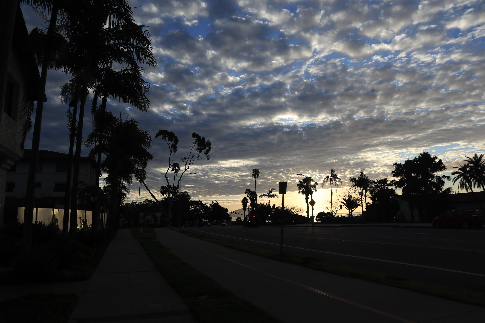

---
### Day 2 小組專題 (2/4)

在第一天的議程開始之前，提早了一個半小時出門到會場附近走走，這次的會議場地就在沙灘旁邊，走路五分鐘就是廣大的海灘，長長的海灘有人在跑步、做瑜珈、遛狗、散步、還有沙灘排球的場地。和溫哥華的海灘很不一樣，這裡的浪特別凶猛。在潮間帶可以完全的沉浸於浪淘的聲音中，雖然車道就在沙灘上方，卻完全聽不到的車聲，只有海浪、海鷗、烏鴉。是小小的聲音秘境。

這次的 Ecological Data Science Summit 和以往很不同，沒有一系列的報告，而是像黑克松一樣，小組間合作在三天內完成有趣的 project，第一場 keynote，強調人性與故事的重要性，相比於資料一樣的重要。

今年的行程，主要都是由參與者合作演出這場 summit，可以看見主辦單位很用心地想要讓這場大型討論順利，像是 packman rule 可以增加討論度、用 1、2、4、all rule 來激發討稐，並且不停強調這不是一定要從頭到尾嚴肅完成的 project，著實讓人非常安心。

我們的小組提出的主題是 "Environmental and emotional impact of AI"，其他的主題像是統一 AI 的用詞、寫出 AI 的運用手冊、列出各個 AI 的"認證標章"、還有找出對環境衝擊較小的 data center 等等。

晚餐時遇到來自墨西哥的 Anesette，提到我將要到墨西哥旅行，相談甚歡，她給我一長串在墨西哥一定要試試看的食物。遇到了同樣來自 rOpenSci 的夥伴，還有來自 NEON 的 Sam，說他對鳥類的聲音資料庫很有興趣。

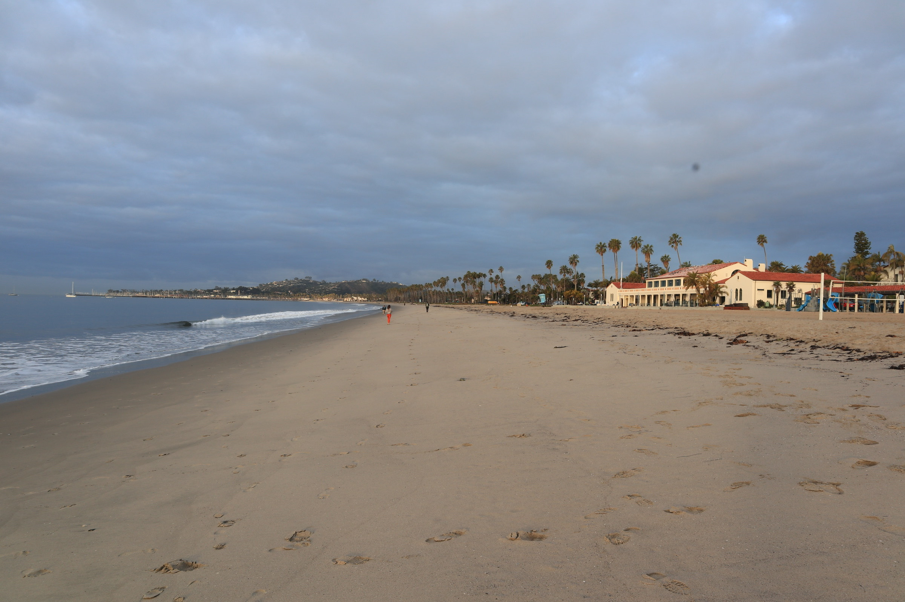

---
### Day 3 海洋遊戲與美國的震撼彈 (2/5)

一早的 keynote 是海洋科學的研究學者，住在夏威夷 (這幾天遇到了好多夏威夷的居民)，利用 AI 的技術來分析在深海拍到的影像，用以尋找深海生物。她從太空科學轉行到海洋，並想要利用在太空科學上激發 citizen science 的興奮複製到海洋，在近期利用"尋找海洋裡的所有生物"來吸引研究經費及興趣，並開發了 FathomVerse 的遊戲來吸引一般大眾協助標記，總開發經費超過 1M 並找了專業的 Video game studio 來共同開發，獲得了巨大的成功，非常非常的驚豔。

早上 keynote 結束之後有人站起來向大家宣布，今天稍早美國政府決定要減少各部門 (NSF, NIH) 的研究經費，並且任命 Elon Musk 進到政府部門，介入全球氣候相關的資料庫管理。整個會議自此之後都變得有點嚴肅與沉重，多數我有互動到的與會者，不論所處國家，都對於美國的政治現況感到氣憤與無奈。

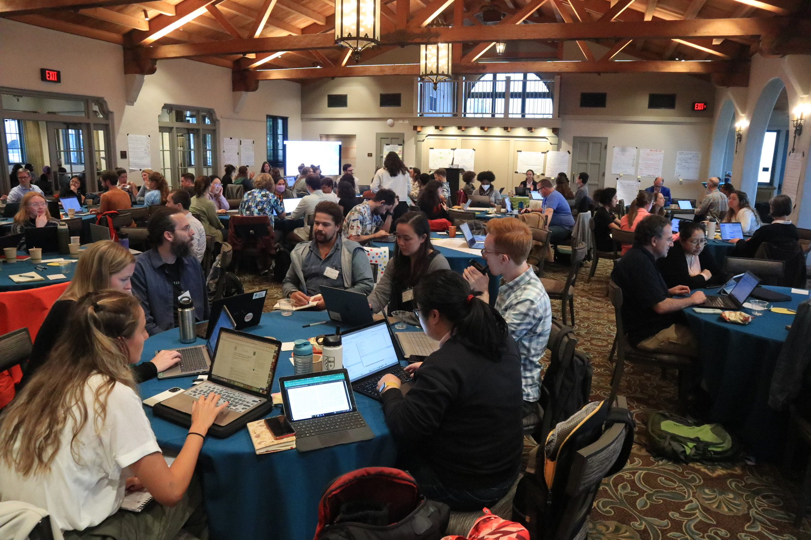

中午有個 mid presentation，我們的 project 基本上沒有甚麼改變，反倒是看到其他組別有許多其他的想法。蠻有趣的，我提議的 project 程度就跟我的個性一樣保守，要確定自己可以 90% 做到才會安心。

晚上和一群女孩去了 Hotel 的戶外 hot tub，天氣很冷但 hottub 裡面非常溫暖，真的是有夠青春，泳池和 hottub 都照著光，簡直像在電影裡面。女孩們討論著感情上的疑惑，並給相識數天的對面的女孩感情上的建議。還說相約明年的今天這裡再見。

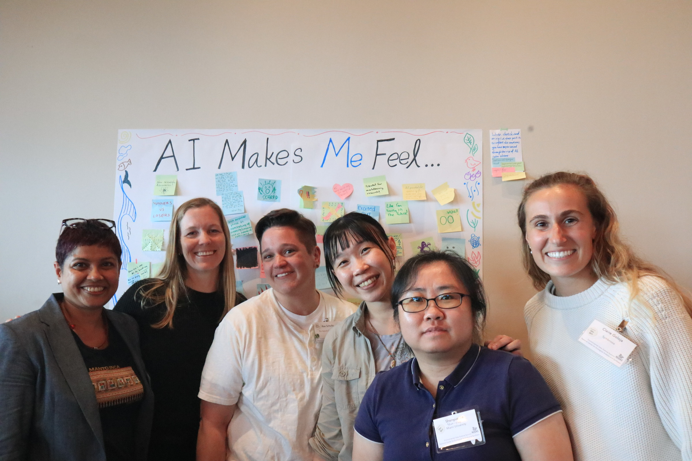

---
### Day 4 發表日 (2/6)

最後一天的議程，全部都用來發表每個小組的 project 成果。除了我們自己的成品之外，最讓我驚豔的是 Asenette 她們那組的題目，利用 ArcGIS dashboard 呈現出美國各地 data center 的分布，並詳列出了能源來源的比例: 

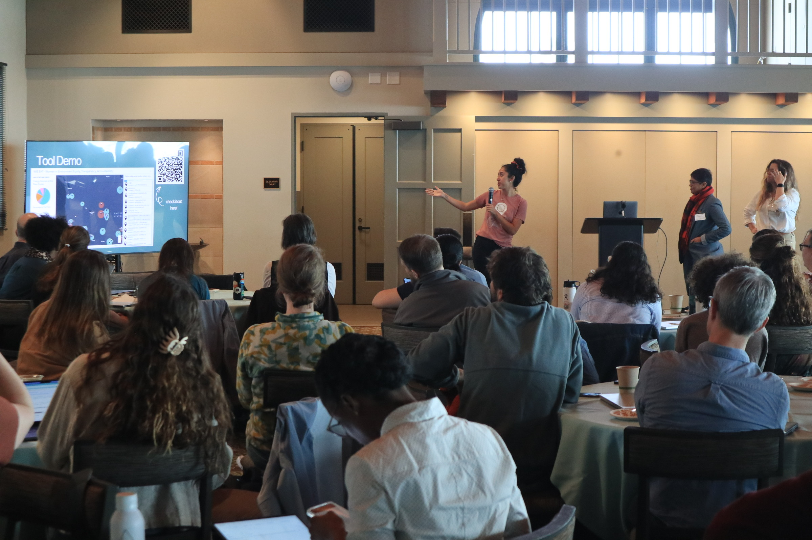

我在 project 提案中提議了 Emotional Impact of AI，利用互動式藝術的方式，來調查大家對於 AI 的感受 (我們大概是最跳脫框架的 project)。利用不同顏色的便利貼來代表不同情緒 (從憤怒、無力、厭倦、焦慮、擔憂，一直到喜悅、興奮、充滿希望、有前景的)。參與者可以書寫、圖畫、或是改變便利貼的形狀來表達自己對於 AI 發展的情緒。

如預期的，大多數的情緒都是交雜的，有許多人利用不同的顏色組合，來代表同時興奮卻又焦慮、同時緊張卻又感到 AI 帶來新的科學研究可能性。許多人提到 AI 並沒有良好的使用規範；AI 不過是假借效率之名來創造另一個能源危機；AI 的日新月異就像是亂流，而我們只好在亂流中不停前進；AI 創造的影像和音樂並非藝術；甚至是，我們應該要多將注意力放在真實的人類互動，而非總是依賴 AI。

我則和參與的人們說到，其實當我們共同完成了這件藝術作品時、當我們願意提起筆寫下我們的想法、願意待在海報面前駐足關心他人的感受、願意聊天分享各自的經歷，我們就已經做到了 AI 無法做到的事情。

PS.1 會議上認識的墨西哥女孩 Asenette 給了我一長串的墨西哥料理清單，要我在墨西哥好好吃飯。
PS.2 晚上在 Santa Barbara Hostel 吃的 Butter Chicken 真的超辣。明天一早還要早起搭 Uber 感長途巴士回到 LAX，飛往墨西哥。

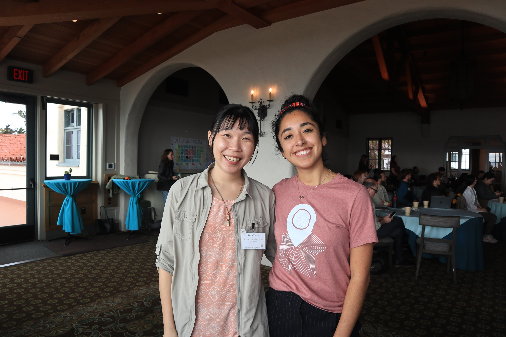

---
### Day 5 到達墨西哥 (2/7)

我真的是個連旅行都要準備 120% 的人，一早四點半起床、搭上高級的 Tesla Uber。司機是祕魯人，在韓國做汽車的出口商，公司倒閉後來到 Santa Barbara，說要等 Uber 賺夠錢之後在美國東山再起。後來在早上六點的公車站遇到一樣在做 Environmental Data Science 的人，世界有沒有這麼小。

機場之間的轉換比預期中的要順利簡單多了。墨西哥機場完全沒有人在檢查 Visitor Tax ，出口處會有非常熱絡的 taxi，熱情如火。在墨西哥購買任何品項之前都需要思考三分，不然很容易就會落入騙局。

負責招攬的人員第一眼就叫出我的名子，他說來這裡的沒有甚麼亞洲人，看到我的名字特別好認。司機 Miguel 一直耳提面命的跟我說千萬不要到河裡游泳，會有鱷魚。而到深海潛水的話則是會有鯊魚，是有沒有這麼危險。他說一年前戒酒了，一部份是因為之前聽說有人喝醉之後會忘記跑到河裡游泳，就會被鱷魚帶走。

傍晚到附近的小攤位，餵飽餓了一天的身軀。這裡給人的感覺真的跟台灣太像了，氣溫，連熱鬧的程度也很像。住宿處後方有個禁止游泳的標示，也是說有鱷魚。

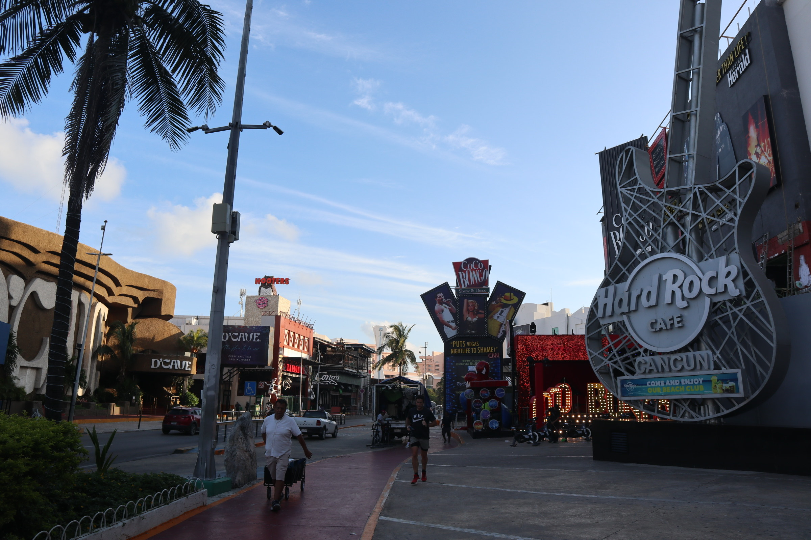

---
### Day 6 湛藍的顏色、追浪、墨西哥家庭 (2/8)

雖說是有三小時的時差，因為早睡的緣故，早上六點半就起床，成為了第一個到櫃檯吃早餐的群眾之一。昨天要睡覺熄燈的時候 (十一點) 房間都空空的，想必大多數女孩都是 party 去了。

早餐非常的豪華，有一整盤水果優格、茶、還有主餐任選，大部分都是我看不懂的西班牙文，只能憑感覺點餐。

早餐後先去了第一輪海灘，竟然就在去海邊的的路上，看到人生第一條鱷魚，路過之後花了 0.5 秒反應，整個人跳起來往前跑了好幾步，看起來小小隻的，應該還不是成體，但也夠讓我驚嚇了。

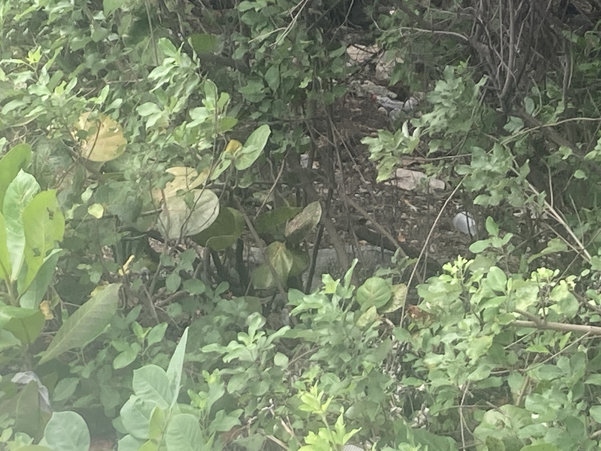

早上的氣溫還需要穿上薄外套，水也是有點冰冷。迂迴了一陣子就趕緊回家換泳衣 (還順道訂了後兩天的行程)，回到海灘的時候找到一位看起來和藹的媽媽，自己一個人在沙灘上，小朋友們不時來找她互動，我問她是否方便讓我把東西放在她旁邊。她說了幾句西班牙文，很可愛的點點頭。

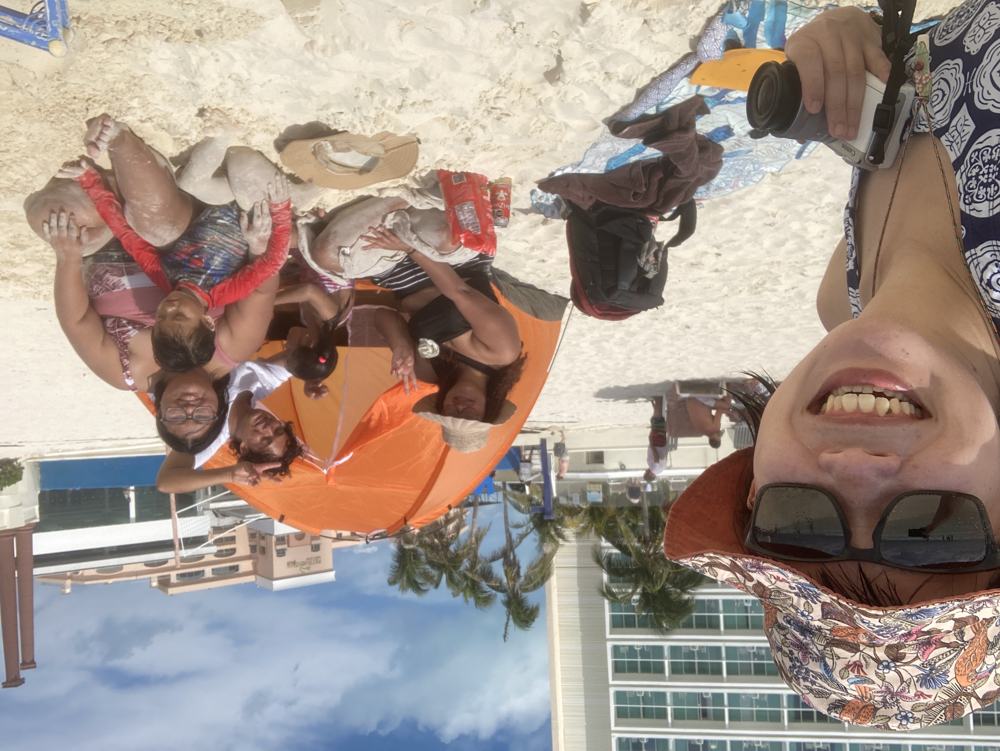

回到沙灘上後聊天，就順道變成好朋友了! 原來她是跟她的妹妹 Natatia、先生、還有兩個小朋友 Miguel 和 Aana 來海邊玩，他們本來就是 Cancún 人，趁著假日來海邊散心。我們一下英文一下西班牙文的聊天，他們很客氣的請我吃了 Ceviche，裡面有番茄、小黃瓜、洋蔥、蝦子，還有神秘的 AriZone 西瓜飲料，成為我後來熱愛、以至於在旅行中囤貨的飲料品牌。

今天學會了如何衝到破浪區的前方，乘著浪上下，並在浪碎開的時候勇敢的跳進浪底。

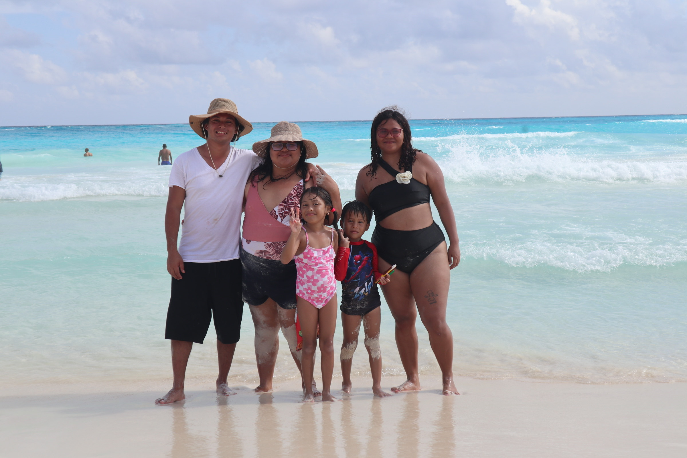

---
### Day 7 Chichén Itzá 奇琴伊察 & Cenote 聖池 (2/9)

說來汗顏，竟然是落地 Cancún 之後才聽說了 Chichén Itzá，身為世界新七大奇景，覺得自己實在是太孤陋寡聞。

前一天在同房的女孩們 Party 到凌晨三點才回來，回來之後不僅開燈，又乒乒梆梆的換泳衣、討論著要出去看海，整個被吵到不能睡，五點多再來一次，早上直接熊貓眼。

從 Cancún 到 Chichén Itzá 大約需要三個小時的車程。導遊解釋著瑪雅文明的特別，大約在西元 900 年前就存在，一直到現在都還有後裔能夠講瑪雅的語言，瑪雅人不僅擅長天文觀測，更是精通算數，甚至還有書寫的文明產生。

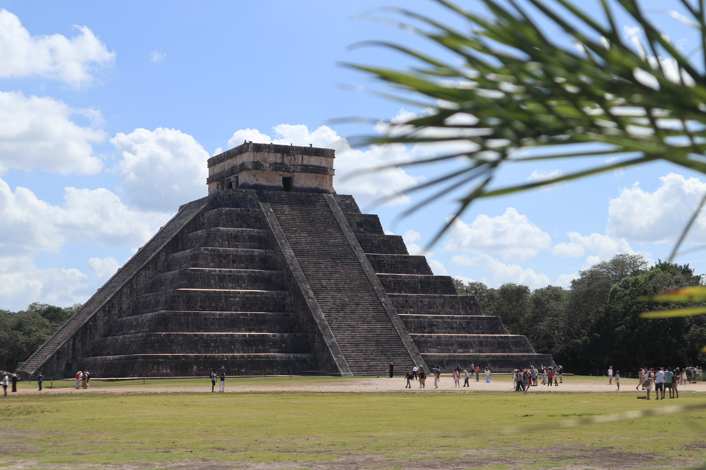

現場之震撼，很難想像一千多年前的人們，怎麼能夠建造出這麼雄偉複雜而又精緻的建築。而十六世紀的西班牙人，來到半島的叢林裡、發現高於樹海之上的金字塔時，又怎能不讚嘆瑪雅文明的蓬勃。

Chichén Itzá 共有 91 個階梯，四個面加起來就是 364 階，加上最頂端的最後一階，代表了一年的 365 天。整座建築正位於四座 Cenote 的中心，在一整年的春秋分，太陽的影子會在階梯上形成蛇的型態，所以建築本身就是一個大型日晷。這座金字塔是用來供俸雨神的，不時會以活人的心臟獻祭，在一旁的球場牆上刻著遊戲規則，用球賽來決定祭祀的人員。而且提供獻祭的大部分都是貴族 (發現獻祭的人的頭骨都有後腦杓拉長，是貴族的特徵)。

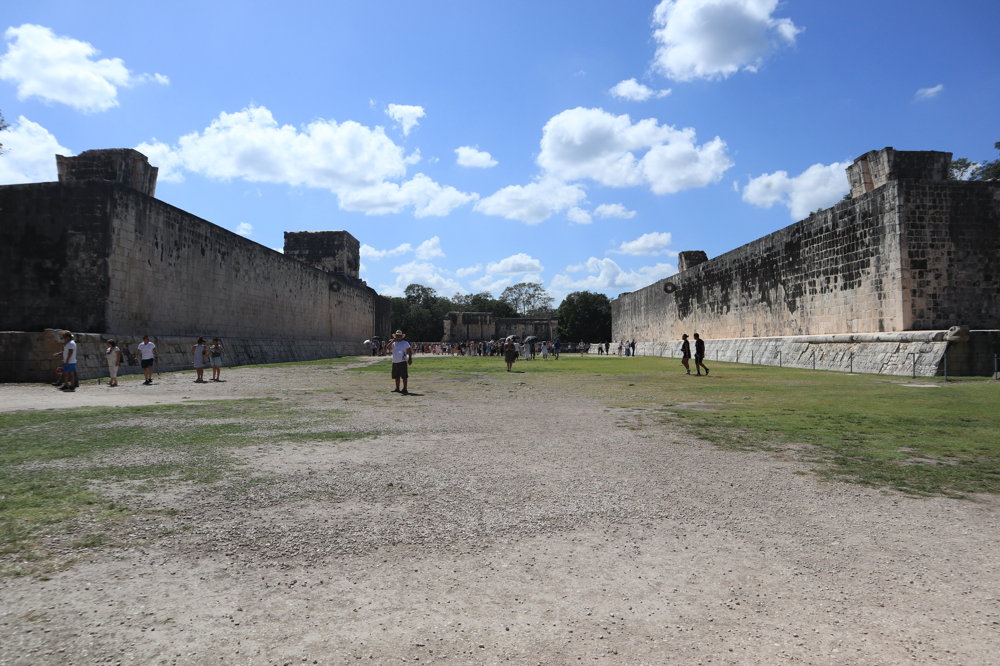

在這裡的建築，聲響結構也是經過精密設計的，在 Chichén Itzá 正下方發出聲響時，階梯會反射 (干涉?) 音波，在階梯下方收到的聲音頻率變高，聽起來就像當地的鳥叫聲，代表著雨季的來臨，是祈雨的象徵。而在球場的四面牆因為完美的平行對稱，在一端的聲音輕易的就可以傳遍全場。有點可惜的是沒有辦法待久一些好好的享受一下和世界七大奇景相處的感受...而且還有周遭非常多的攤販，販賣著廉價 (他們聲稱 1 Maya dollar) 的紀念品。沒有辦法好好留給這樣的古蹟一點清淨。

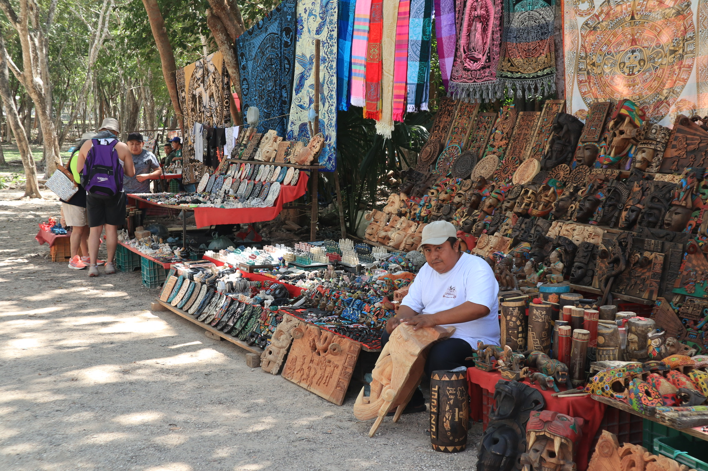

至於 Cenote，Yucatán Peninsula 上有至少 6,000 多座 Cenote。而 Cenote 的成因，目前的科學證據相信，是在中生代末期的彗星撞擊、隕石墜落時形成，直通地下水層而形成的自然水井。在瑪雅時期被用來當作獻祭 (祈雨、以及作物豐收) 的管道，或是在過世的時候作為通往另一個世界的通道，會有此一說是因為研究人員在 Chichén Itzá 的 Cenote 裡找到了許多珠寶、銀飾、甚至是大量的骸骨。現在某些 Cenote 開放給研究人員潛水調查，也有開放給一般民眾下水。我沒有要獻祭我自己的意思。

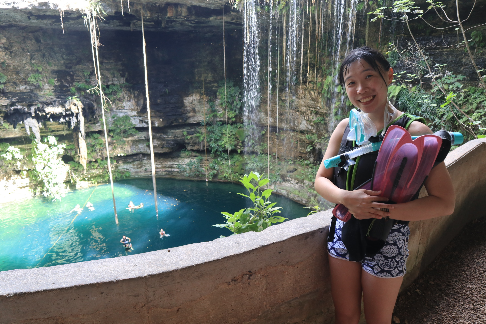

---
### Day 8 浮潛，真的潛下去 (2/10)

帶著 Gintas 的聖誕禮物，加上內著泳裝，今天正式下海。發現新的器具真的非常好用，原來之前浮淺之所以感受不佳有很大的原因是因為呼吸管的構造。

共潛了五個點: coral reef、under water museum、turtle、small ancient ship、shipwreck。光是前兩個潛點就看到了三隻玳瑁 (Hawksbill Turtles)、兩隻魟魚，真的是個海洋資源很豐富的地方，這些潛點都在碼頭船程 10 分鐘之內，竟然就可以有這麼多生物多樣性。

能夠回到在海裡優游的感覺也真的是令人懷念，而且有好用的呼吸管，真的有能在浮潛的當下體驗深潛的感覺，也有找到身體的自由感。我的身體、與海底的魚與生物，依著同樣的頻率擺動著。

在下潛之前也被耳提面命不要擦發曬，覺得深深為當地的潛店感到開心，幸好是有人在意的! 我自己則是早早準備了 ocean friendly 的防曬乳。

---
### Day 9 Museo Maya de Cancún 只看一半的博物館 (2/11)

經過了好幾天熟悉環境後，終於鼓起勇氣搭了當地的巴士 (想說就算迷路，用走的也走得回家)。想要趁著去 Tulum 之前，去一趟 Hotel Zone 南端的 Maya Museum of Cancun，同時讀了沈正柔的《瑪雅金字塔的秘密 - 你所不知道的墨西哥》，一整個相見恨晚，文筆之好，令人沉醉。

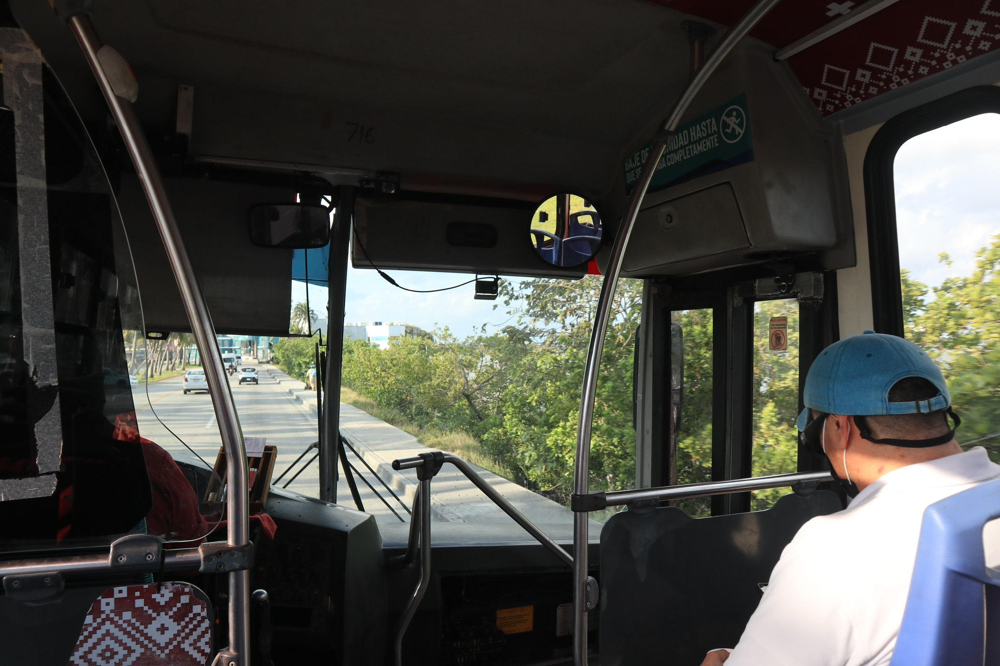

Tulum 是瑪雅文明中唯一靠海的大型城市，當地人稱為 Zama，意思是在"日出的地方"，其興起的年代比 Chichen Itza 較晚，一直到西班牙人，哥倫布發現新大陸之後，才在幾年的時間內遭到毀滅。Tulum 和 Chichen Itza 的建築因區域與年代不同，有不同的設計與構造，的興起是因為靠海鄰近貿易的要道，城鎮裡的人靠著航海可以到附近的其他城鎮貿易，他們利用木棉樹的樹皮寫字、用木棉樹的樹幹為船，木棉樹對他們來說的重要性，就像加拿大的 Red Cedar 之於 first nation。

Chichen Itza 的金字塔供奉的是羽蛇神，主要是為了祈雨而建造的殿堂，而 Tulum 則是供奉著"降落神"，是頭下腳上的一個人物。在西班牙人發現這個地方的時候，甚至驚豔的稱道，Tulum 的文明甚至比西班牙頗有規模的城鎮都還要大 (然後過幾年就把人家趕走了)。

第一艘發現瑪雅文明的西班牙船隊，有兩個人倖存，其中一個在兩年後被另一個西班牙船隊接走、另一個仁則是因為接受了瑪雅文化、和當地女孩相戀，而決定留下來幫助馬雅人與西班牙人對抗。

球戲，其中一隊在贏球(或輸球)後，可以取下對方的首級，並用頭顱排成一列做為獻祭的物品，在石牆的雕刻上，就呈現著犧牲者的血、頭顱、心臟，灌溉大地使作物富饒。

今天，當我站立在一座雕刻面前，看著深刻的紋路，我好像和一千年前的人類有了連結。我好像看到，他一筆一筆的雕刻著，他在想甚麼、當時的太陽很炙熱嗎、當時的生活如何。他一定沒有想過，他的雕刻，會在一千年後被另一個人類細細的觀看著並讚嘆著。

下面這張圖是從網路上找來的。在博物館的時候忘記拍了。

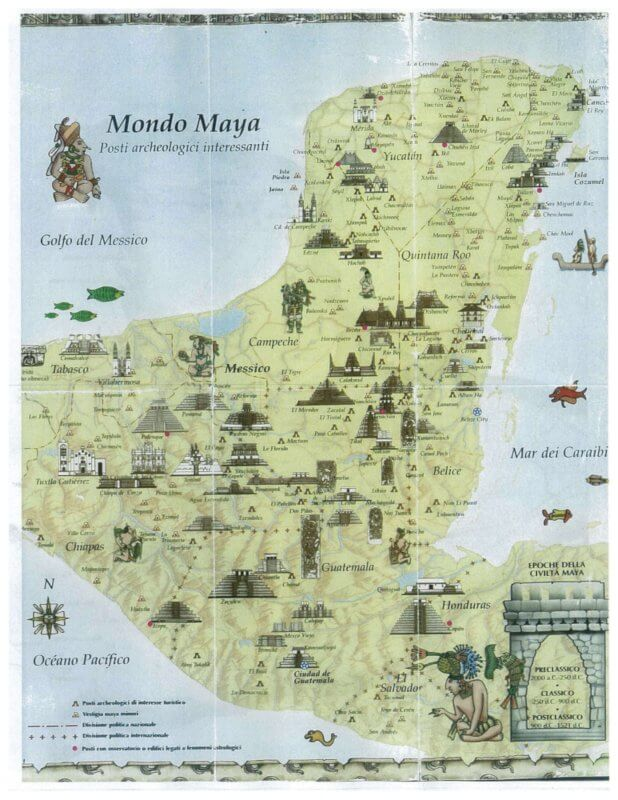

然後又在回家的路邊水溝遇到鱷魚寶寶，是有沒有這麼容易遇到鱷魚。

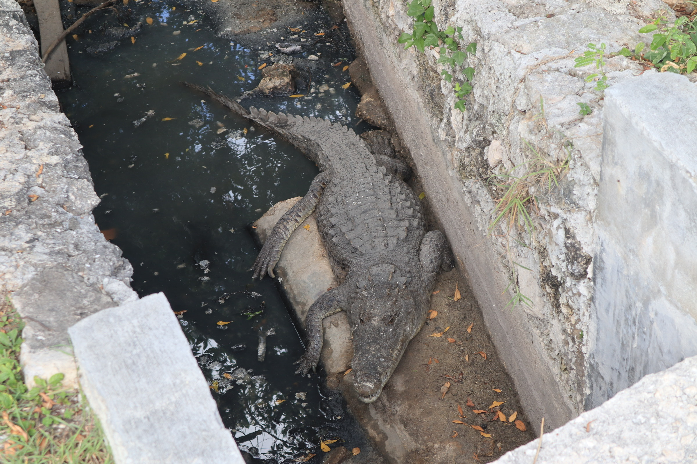

---
### Day 10 Tulum 黎明之地 & Cobá 腳踏車村莊 (2/12)

我曾開玩笑說，瑪雅人中就屬 Tulum 的部落最聰明，選了一個這麼漂亮的地方來建造城鎮 (photo credit: Wikipedia)。

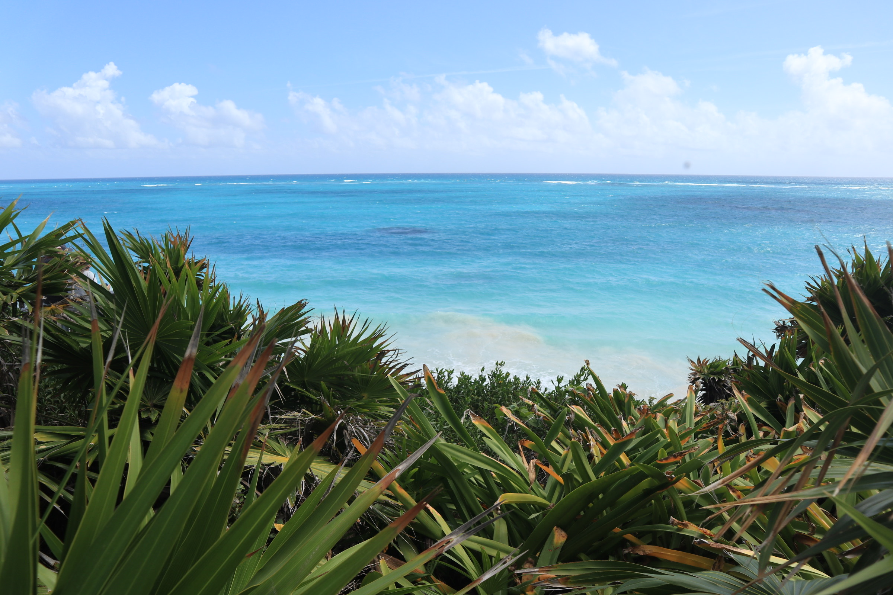

Tulum 意即"城牆"，象徵著他四周被城牆圍繞的建築形式，而他的瑪雅舊名，叫做 Zama，意即"黎明之地"，象徵著這個城鎮在猶加敦半島 (Yucatán Peninsula) 東海岸的特殊地點，迎接每日的朝陽。這個城鎮大約在 1,200 AD 左右建立，並在十六世紀的地理大發現時期 (1518)，被 Juan de Grijalva 帶領的船隊發現，船上一位成員 Juan Díaz 將 Tulum 寫進航海紀錄，他讚歎 Tulum 是"一座規模如此大的城鎮或村落，即使是西班牙的城鎮 Seville 也不會比這裡還大"。一直到西班牙開始殖民統治墨西哥的七十年之後，瑪雅人才離開 Tulum，從此成為無人居住的城鎮。

Tulum 在最北端有座風神殿 (Templo Dios del Viento)，作為整個城鎮港口的守護建築。在 Tulum 最著名的供奉神祇為降落神 (Descending God/Ah Muzen Cab)，常以頭下腳上的形式出現在雕刻中，因而得名。降落神目前相信與與蜜蜂或是金星相關，蜂蜜對於瑪雅人的經濟與信仰至關重要；而金星則與戰爭還有力量有所連結。

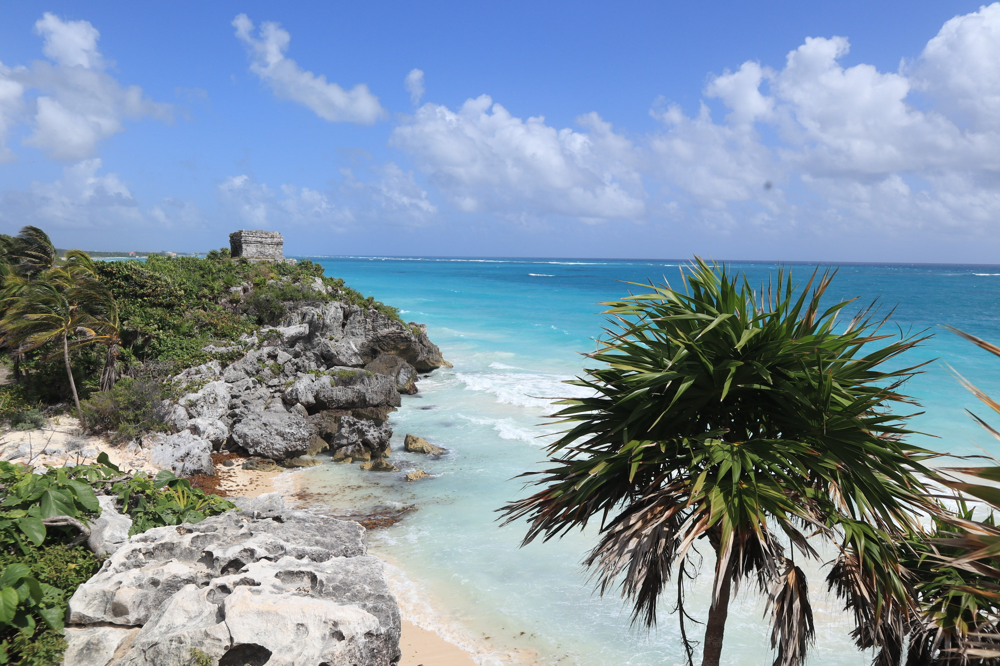

瑪雅人會建造用石灰石建造"白砂路" (sacbéob)，來連結各個重要的城市，其中一條就連接著 Tulum 一路到他的政經中心 Cobá。

Cobá 是在西元六百至九百年之間興起，成為當時最大的瑪雅政經中心之一，在 900 AD 時，與西北方的 Chichén Itzá 開始發生競爭關係，導致自然資源與領地不停地流失，只好將主要的中心轉移至東方的海岸區 (也就是後來 Tulum 興起的區域)。Chichén Itzá 雖然強盛一時，後期也因戰爭而逐漸衰弱，

Cobá 最特別的就是他特別大，在入口的地方就有腳踏車出租的服務，一輛腳踏車 80 peso，也可以租有司機的兩人座三輪車。從入口到最大的金字塔約有兩公里的路程，一路上會經過天文台、祭壇、球場，我在這瑪雅古城裡騎車時，頓時覺得自己像是周末去買菜的村民，一下去拜拜，等等再去打個球 (還是不要好了，打球輸了是需要被犧牲的)。而且在主要道路之外，還可以發現在密林中深藏的石堆。如果要說參訪瑪雅古蹟的體驗，Cobá 絕對是其中最好玩互動性最高的。

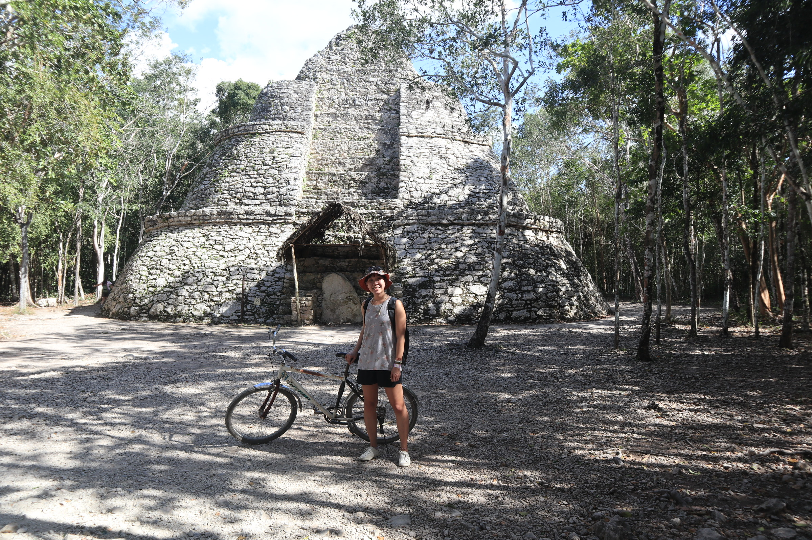

最後當然不免俗的要來跳個 Cenote，體驗一下古代貴族要犧牲時跳進水裡的感覺，只能說有救生衣還有階梯可以爬上岸的感覺真好。瑪雅人民作為主要淡水資源還有與神祇相通的 Cenote，現在已經成為豔陽當中的消暑地。

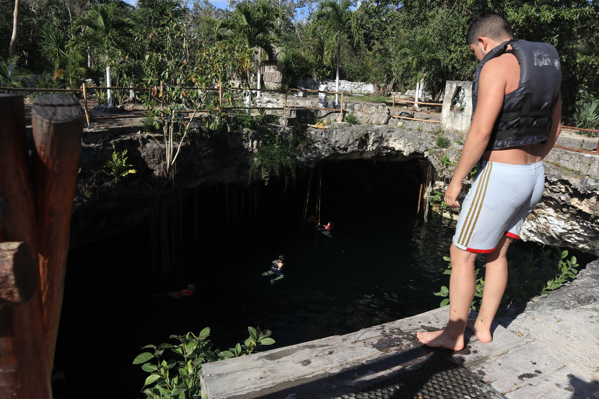

---
### Day 11 El Meco 海邊的小漁村與市集 (2/13)

一早起了個大早，走到海邊看日出，都來這裡住到第七天了，才想到可以到海邊看日出。今天浪特別大，有人在拍像是婚紗照。細砂踩在腳下沒有想像中的昨日的餘溫。光影的變換很朦朧，像是一片暖光灑在海面、沙灘上。

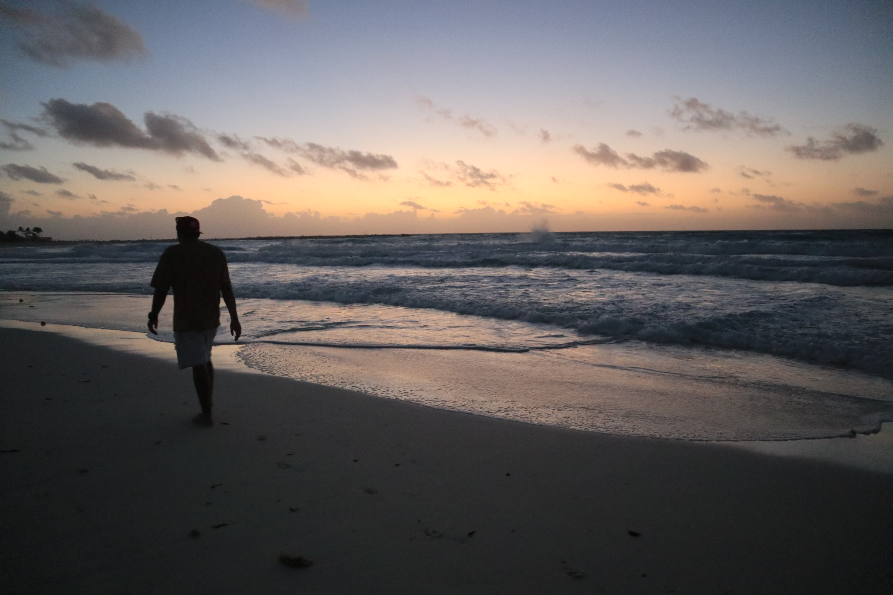

隨後就收到了浮淺活動取消的訊息，海上的活動除了看雨、看雷，最重要的還是看風。小小的失落但也鬆了一口氣，到了旅行的最後幾天已經明顯感受到精神與體力上的疲憊，好像每天都需要精打細算，仔細計畫每個十分鐘。

我還是想在離開前多去看一些瑪雅的遺跡，Dave 推薦我去 El Meco，要搭公車穿越過 downtoan 再繼續往北。搭乘熟悉的 R1 之後，要再接上 Combi，像是小型版的公車，以 Van 來載客，我完全摸不著頭緒，一路問人才找到該搭的車(M1R1)。這種 Combi 只需要 10 peso，但非常的擁擠，要一直調整完美的姿勢，把自己縮到最小，才不會與身邊的人有肌膚的接觸。

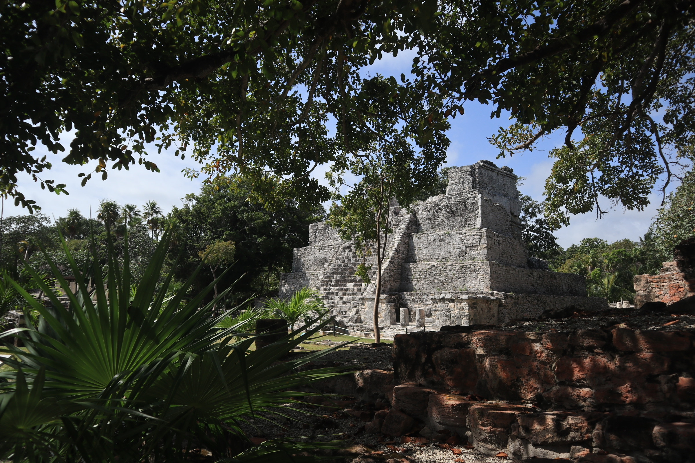

終於到達 El Meco，被管理員熱情的招待，拷問一翻像是 "為什麼要自己一個人旅行" 之類的疑問。El Meco 是一座小漁村，在西元六百年左右興建，以漁業為生，金字塔邊的小井是村莊的主要飲水來源(附近沒有河流或湖)。被留下來的小金字塔，則是整個村莊的宗教信仰中心。這點我覺得跟台灣的小村落很像。

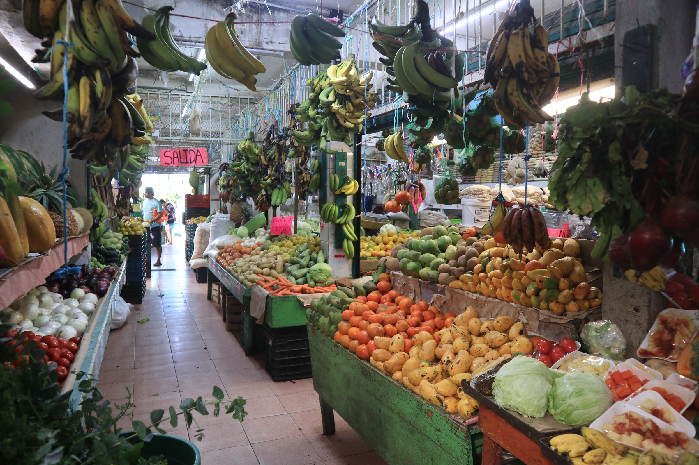

回到 Hotel Zone 之前在鎮上晃了一圈，經過 Punto Frio，像是當地人的菜市場，內層有水果攤、雞肉攤、香菇辣椒麵食玉米粉等等乾貨，比較特別的是看到一攤在販賣仙人掌肉，據說不論煮湯或烤過都很好吃。

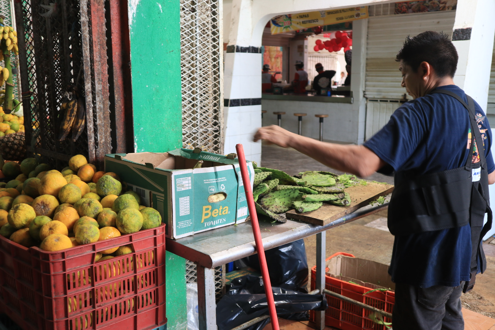

