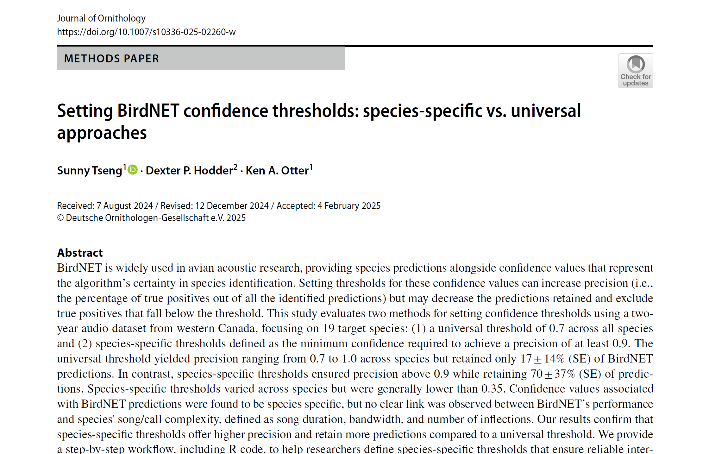

### 整體來說

正式的文章上線日期已經是三周前了，但這幾周被鄰居的總統鬧場，整個世界都翻滾地沸沸揚揚，直到現在才定下心來好好紀念一下這個研究寶寶。

終於出場了! 不論看幾次都還是令人興奮。這篇 BirdNET 研究，從研究提案、分析、寫稿、送出發表、一直到最後審稿，真的都是精采萬分。途中的酸甜苦辣都寫在日記裡了，這裡先來簡單的倒敘。

### 跟水獺先生說 "I can't write something that I don't believe."
一開始跟水獺先生提案，要想做關於 BirdNET 對各物種的表現分析時，研究方法就是抽取幾個物種，每個物種分別看他們的聲音特徵和偵測表現，其實跟最後的分析大同小異。但當初，水獺先生一直說服我不要做這種複雜的 evaluation， 他提出了一個幾乎完全相反的對策，"妳要去看 BirdNET 的表現，就直接用 Audacity 去做 mock up 的音檔，在可控制的狀態下，更可以去看不同場合之間的表現變化，甚至最後，妳還可以提出一個 universal threshold，生態學家都喜歡簡單的方法，這篇文章一定會被大量的引用。"

我當時光聽就知道行不通。第一是 mock up 的音檔想起來是可操控沒錯，但根本沒有任何一種 mock up 的音檔是可以模仿到真實世界的錄音場景，那如果 BirdNET 總是使用在真實的場景，這樣的 evaluation 又有甚麼用。更何況，我真的壓根不相信會有所謂的 universal threshold，可以毫不思考的應用在每個物種上。

就這樣來來回回了好多次，每次講到這個研究我們都會意見不同，有幾次甚至還讓我氣哭了。那次他生病，剛好身體狀況不好，情緒比較不穩定所以說話很重，他說他要直接把這個題目給另一個學生做。我氣得想 "好啊! 那正合我意"。我也撂了狠話 "I can't write something I don't believe."，就是說我非常不認同會有 universal threshold 這種東西。

### 邊玩邊做的研究
從 2022 九月 proposal defense 之後，一直到 2023 年中都在忙貓頭鷹文章，2024 年初回台灣 (Gintas 有來那次)，都在很多 conference 場合上發表了，不論是 2024 CABE、Ecoacoustic Congress、或是在 Peoria 的 SCO-SOC，甚至還在 SCO-SOC 的會議上獲得過 presentation award，到這個時候我大概就知道這篇文章有多重要了。尤其是在 Ecoacoustic Congress 上看到有很多人都還不太清楚 BirdNET confidence 到底是甚麼，就知道這個領域有多新!

參加會議結束後，特別是 Ecoacoustic Congress，見到 BirdNET 的工程師們對於這個方法的好奇，回到家之後趕緊快馬加鞭地趕工投稿。

### 半路殺出程咬金的 BirdNET official paper
這篇文章先是投到 Ornithological Application。還記得是 2024 年八月，當時人在 SCO-SOO，同樣發表的這篇研究獲得了 Presentation Award，還在跟 Jenn 慶祝的時候，就收到了 Ornithological Application 的 rejection。真的是，我當時還超有自信地想，"AOS 眼光欠佳，錯失了一篇好文章"。

說道發表的崎嶇，不得不提一下 (Wood & Kahl 2024) 在講 BirdNET score，他們的方法，跟我的研究步驟超級像，這篇文章在 Journal of Ornithology 發表，時間就在我完稿前兩個月，我在被 AOS 拒絕後，二話不說文章都沒改，就直接投到了一樣的期刊，當時真的是心臟很大，我直接跟 Editor 說這兩篇文章搭在一起會有多適合。沒想到這個看似聰明的舉動，就引發了接下來 review process 的激烈戰況。

### Reviewer No.2 到底是誰

