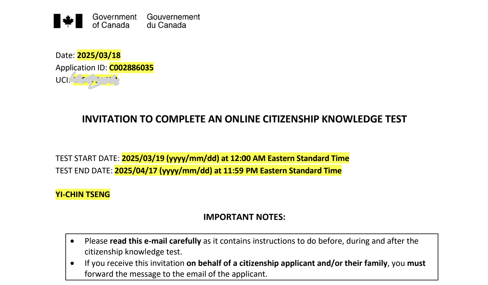
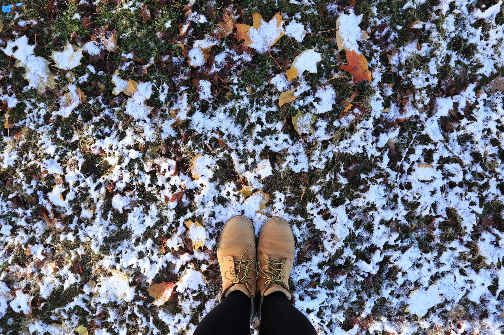

### 申請加拿大公民

回想起與加拿大移民署（IRCC）的交手，從 2017 年 8 月 26 號，落地加拿大的那刻就開始了。學生簽證、學生簽證補發、工作簽證，一路上都覺得能在國外存活的人們都好不可思議。最後是手續繁複到不行的 PR 申請，途中還因為 COVID 回台灣住了一年半。從 2020 二月開始申請，一直到 2022 年 1 月 22 號，才正式成為加拿大永久居民。

轉眼又過了一些時日（時光匆匆不等人），好像昨天才經歷收到楓葉卡的興奮，沒想到就到了申請公民的資格了。申請加拿大公民的資格，本人要是永久公民，並在過去的五年之內，在加拿大境內超過三年以上的時間，如果是在成為永久公民之前的居留，則以 50% 計算。經過繁複的出境入境計算（話說我在成為 PR 之後，離開加拿大的天數超多，大部分都是台灣啦!）。

總之，就在今年年初，出發飛去墨西哥之前送出申請啦! 主要是實在不想再改寫申請，要再多加出境的時間。

- 2025/2/7 線上送出申請
- 2/19 通知確認收到公民申請
- 2/27 通知已經在政府的系統上登錄公民申請，並已經開始審核
- 3/18 通知必須在一個月內完成公民考試

(Bird box cleaning, Italian photographer, T-shirt design, fieldwork preparation)

### Ch1. Rights and responsibilities of citizenship 公民的責任與義務

#### 大憲章 Manga Carta (Great Charter of Freedoms) in 1215
Habeas corpus, the right to challenge unlawful detention by the state, comes from English common law.  
- Conscience and religion
- Thoughts, belief, opinion, expression, speech and press
- Assembly
- Association

#### 加拿大憲章 Canadian Charter of Rights and Freedoms in 1982 
The Constitution of Canada was amended in 1982 to entrench the Canadian Charter of Rights and Freedoms, which begin with the words, "Whereas Canada is founded upon principles that recognize the supremacy of God and the rule of law." 

- Mobility right
- Aboriginal people's right
- Official language rights and minotiry language educational rights
- Multiculturalism

#### Citizenship responsibilities
There is no compulsory millitary services in Canada. However, there are some responsibilities, including:
- Obeying the law
- Taking responsibility for oneself and one's family
- Serving on jury
- Voting in elections
- Helping others in the community
- Protecting and enjoying our heritage and environment

### Ch2. Who we are 我們是誰

We are the only consititutional monarchy in North America. Our institutions uphold a commitment to Peace, Order, and Good Government, a key phrase in Canada's original consititutional document in 1867, the British North America Act. The poets and songwriters have hailed Canada as the "Great Dominion". 

#### Aborigial peoples
The ancestors of Aboriginal peoples are believed to have migrated from Asia many thousands of years ago. From 1800s until the 1980s, the federal government placed many aboriginal children in residential schools to educate and assimilate them into mainstream Canadian culture. Aboriginal languages and cultural practices were mostly prohibited. In 2008, Ottwa formally apologized to the former students. 

Today, the term Aboriginal peoples refers to three distinct groups: 
- Indian/First Nations (65%): who are not Inuit or Metis. 
- Inuit (4%): which means "the people" in the Inuktitut language.  
- Metis (30%): a distinct people of mixed Aboriginal and European ancestry, having their own language, Michif. 

#### English and French
English and French defines the reality of day-to-day life for most people and are the country's official languages. 18 million Anglophones and 7 million Francophones. New Brunswick is the only officially bilingual province. 

- Acadians: the descendants of French colonists who began settling in Maritime provinces and got deported between 1755 - 1763 "Great Upheaval", during the war between Britian and France. 
- Quebecers: the people of Quebec, Anglo-Quebecers.
- Anglophones: English-Canadian.

#### Ch3. Diversity in Canada
Canada is often referred to as a land of immigrants. Since the 1970s, most immigrants have come from Asian countries. Chinese languages are the second most-spoken at home, after English. In Vancouver, 13% of the population speak Chinese languages. 

The largest religious affiliation is Catholic, followed by various Protestant churches. Canada's diversity includes gay and lesbian Canadians, who enjoy the full protection of and equal treatment under the law, including access to civil marriage. 

### Ch4. Canada's history 加拿大歷史

#### Aboriginal peoples
When Europeans explored Canada they found all regions occupied by native peoples they called Indians, because the first explorers thought they had reached the East Indies. Large numbers of Aboriginals died of European diseases to which they lacked immunity. 

#### The first Europeans
The Vikings from Iceland who colonized Greeland also reached Labrador and the island of Newfoundland. John Cabot, in 1497, was the first to draw a map of Canada's East Coast. 

Jacques Cartier claimed the land for King Francis I. Two captured guides speak the Iroquoian word "Kanata", meaning "village". Later the name of "Canada" began appearing on maps. 

#### Royal new France 
In 1604, the first European settlement was established by French explorers Pierre de Monts and Samuel de Champlain, in Maine and Nova Scotia (Acadia). The French and Aboriginal people collaborated in the vast fur-trade economy (beaver pelt). 

#### Struggle for a continent
In 1670s, King Charles II of England granted the Hudson's Bay Company exclusive trading rights over the watershed draining into Hudson Bay. English colonies eventually became richer and more populous than New France. In the 1700s, France and Great Britian battled for control of North America. In 1759, the British defeated the French in the Battle of the Plains of Abraham. 

#### A tradition of accommodation - Quebec Act (1774)
Following the war, Great Britian renamed the colony the "Province of Quebec." The French speaking people, known as habitants or Canadiens, preserve their way of life in the English-speaking British Empire. 

The British Parliament passed the Quebec Act of 1774, one of the constitutional foundations of Canada, to better govern the French majority. The Quebec Act restored French civil law while maintaining British criminal law. 

#### US independence in 1776: united empire loyalists
In 1776, the 13 British colonies to the south of Quebec declared independence and formed the United States. North America was again divided by war. More than 40,000 people loyal to the Crown, called "Loyalists" fled to settle in Nova Scotia and Quebec. 

#### The beginning of democracy - Constitutional Act (1791)
The first representative assembly was elected in Halifax, Nova Scotia, in 1758. Then PEI and New Brunswick. In 1791, The Constitutional Act divided the Province of Quebec to Upper Canada (later Ontario) and Lower Canada (later Quebec). The name Canada became official and collectively known as British North America. 

#### The War of 1812: the fight for Canada
The United States launched an invasion to Canada, which they burned Government House and the Parliament Buildings in York (now Toronto). In retaliation, Robert Ross led an expedition that burned down the White House and other buildings in Washington, D.C. The present-day Canada-USA border is partly an outcome of the War of 1812, which ensured that Canada would remain independent of the US. 

#### Confederation - British North America Act (1867)
In 1840, upper and lower Canada were united as the Province of Canada. The first British North America colony to attain full responsible government was Nova Scotia. 

From 1864 - 1867, representatives of Nova Scotia, New Brunswick and the Province of Canada, with British support, worked together to establish a new country. They created two levels of government: federal and provincial. The Province of Canada was split into two new provinces: Ontario and Quebec. 

The British Parliament passed the British North America Act, and the Dominion of Canada was officially born on July 1, 1867, which is known as Canada Day. The first prime minister is Sir John Alexander Macdonald. 

#### Challenge in the west (1867 - 1871)
After the Metis uprising in Manitoba and Saskatchewan, PM Macdonald established the North West Mounted Police (NWMP) to pacify the West and assist in negotiations with the Indians, with Regina as the headquarters. Toady, the Royal Canadian Mounted Police (RCMP) are the nationa lpolice force and one of Canada's best-known symbols. 

British Columbia joined Canada in 1871 after Ottwa promised to build a railway to the West Coast, Canadian Pacific Railway (CPR). Afterwards the Chinese were subject to discrimination, including the had tax. The government apologized in 2006. 

#### The first world war & women get the vote (1914)
More than 600,000 Canadians served in the first world war in 1914. At the time of Confederation, the vote was limited to proterty-owned adult white males. The women's suffrage movement. Its founder was Dr. Emily Stowe, the first Canadian woman to practise medicine in Canada. In 1916, Manitoba became the first province to grant voting rights to women. In 1921, Agnes Macphail became the first woman MP. 

#### Between the wars 
The British Empire evolved into a free association of states known as the British Coommonwealth of Nations, including India, Australia, New Zealand, and several African and Caribbean countries. 

The stock market crash of 1929, led to the Great Depression or the "Dirty Thirties." Unemployment reached 27% in 1933. The Bank of Canada was created in 1934 to manage the money supply. 

#### The second world war (1939 - 1945)
Canada joined with its democratic allies in the fight to defeat tyranny by force of arms. In the Pacific war, Japan invaded the Aleutian Islands, attached a lighthouse on Vancouver Island. Regrettably, relocation of Canadians of Japanese origin by the federal government was done after Japan surrendered. The government of Canada apologized in 1988. 

### Ch5. Modern Canada 現代加拿大

#### Trade trade economic growth
The world's restrictive trading policies in the Depression era were opened up by such treaties as the General Agreement on Tariffs and Trade (GATT), now the World Trade Organization (WTO). The discovery of oil in Alberta in 1947 began Canada's modern energy industry. The Canada Health Act ensures common elements and a basic standard of coverage. 

#### International engagement
Canada joined with other democratic countries of the West to form the North Atlantic Treaty Organization (NATO), a military alliance, and wit hthe United States in the North American Aerospace Defence Command (NORAD). 

#### Canada and Quebec
Quebec experienced an era of rapid change in the 1960s known as the Wuiet Revolution. Many Quebecers sought to separate from Canada. In 1963, Parliament established the Royal Commission on Bilingualism and Biculturalism. 

After much negotiation, in 1982, the Constitution was amended without the agreement of Quebec. The autonomy of Quebec within Canada remains a lively topic, part of the dynamic that continues to shape our country. 

#### A changing society
Today every citizen over the age of 18 may vote. Canada welcomed throusands of refugees from Communist oppression, including about 37,000 who escaped Soviet tyranny in Hungary in 1956. By the 1960s, one-third of Canadians had origins that were neither British nor French, and took pride in preserving their distinct culture in the Canadian fabric. 

#### Arts and culture in Canada
Emily Carr painted the forests and Aboriginal artifacts of the West Coast. Basketball was invented by Canadian James Naismith in 1891. Many major league sports boast Canadian talent and in the national sport of ice hockey. One of the best hockey players of all time, Wayne Gretzky, played for the Edmonton Oilers from 1979 to 1988. In 1980, Terry Fox, a British Columbian who lost his right leg to cancer at the age of 18, began a cross-country run, the "Marathon of Hope," to raise money for cancer research. 

#### Great Canadian discoveries and inventions
- Telephone (Alexander Graham Bell)
- Snowmobile
- World system of standard time zones
- Electric light bulb
- Wireless voice message
- Cardiac pacemaker
- BlackBerry cellphone

### Ch6. How Canadians Govern 加拿大政府

There are three key facts about Canada's system of government: our country is a federal state, a parliamentary democracy and a constitutional monarchy. 

#### Fedaral state
There are federal, provincial, territorial and municipal governments in Canada. The responsibilities of these levels were defined in 1867 the British North America Act, now known as the Constitution Act. 

Every province has its own elected Legislative Assembly, like the House of Commons in Ottawa. The three northern territories do not have the status of provinces, but their governments and assemblies carry out many of the same functions. 

- Federal: Prime Minister & members of parliament
- Provincial: Primer/Commissioner & members of the legislature

#### Parliamentary democracy
The people elect members to the House of Commons in Ottwa and to the provincial and territorial legislatures. Cabinet ministers are responsible to the elected representatives, which means they must retain the "confidence of the House" and have to resign if they are defeated in a non-confidence vote. 

Parliament has three parts:
1. Sovereign: Queen or King
2. House of Commons (眾議院) -> made up by members of parliament elected by the people (4 years)
3. Senate (參議院) -> made up by senators, appointed by the Governor General on the advice of the Prime Minister (until age 75)

#### Constitutional monarchy
As a constitutional monarchy, Canada's Head of State is Sovereign (Queen or King), who reigns in accordance with the Constitution: the rule of law. As head of the commonwealth, the sovereign links Canada to 53 other nations that cooperate to advance social, economic and cultural progress. 

There is a clear distinction in Canada between the head of state (the sovereign) and the head of government (the prime ministor). 

The sovereign is represented in Canada by the Governor General (5 years), and represented in Provinces by the Lieutenant Governor (5 years), appointed by the Governor General with the advice of the Prime Minister. 

### Ch7. Federal elections
