### 珍重再見了，親愛的藍色裙子 (July 19 Sat.)

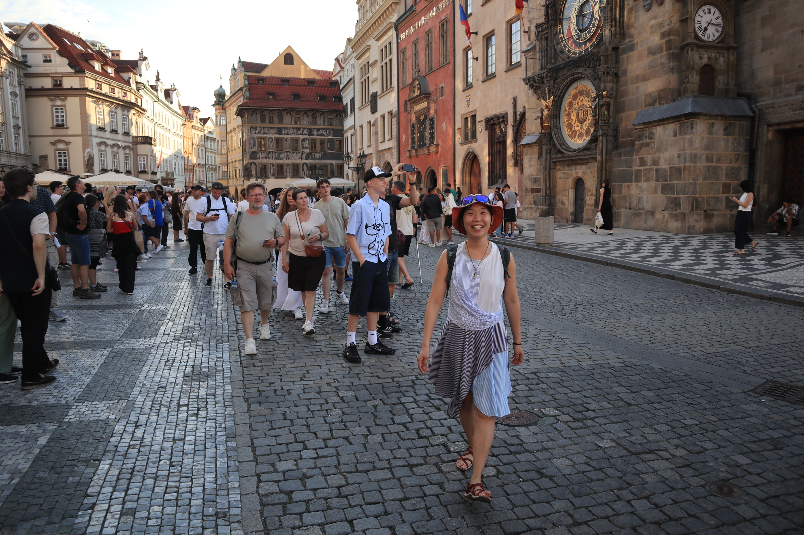

### 皇宮導遊、世界相間的朋友 (July 18 Fri.)

.jpg>)

### 再見 Chemnitz (July 17 Thur.)

在整理房間的時候，把自己推成一堆的發票一張一張疊好，有 EDEKA 的、Decathon、Penny、車票、門票...。想到之前在 EDEKA 買東西的時候一直跟

看到媽媽捲成一團的發票，竟然忍不住哭了，怎麼在這裡的時光會這麼快樂，快樂到捨不得離開。

### Deresden castle 奔跑暴風雨 (July 16 Tue.)

.jpg>)

### Resbenstain 游泳 (July 14 Mon.)

約了 Max 和薇恩，中途又加了 Josef 和 Stefan。明明超冷只有 22 度，但還是要去目前 Chemnitz 還沒去過的 Resbenstain!! 西瓜大餐、游泳跳水，跟這些工程師一起出去玩也太好笑。還有旋轉滑水道，跟小朋友學要怎樣才能滑最快!!

今天是離開前最後見到 Josef、Max 還有 Stefan 了。跟三個人珍重的道別。三個人的背影特別帥氣。

PS. 當天晚上跟 Gintas 兩個人都睡超級好。

### Zwinserg 皇宮瓷器展、地下通道迷宮，Dresden 太誇張的美! 還有 Gintas 終於來了 (July 13 Sun.)

本來想要花一整天重訪 Freiburg 的咖啡廳，好好整理一下心情。跟媽媽通完電話後立馬被說服要去 Dresden 的王宮 (媽媽此行來德國最喜歡的地方)。搭上熟悉的德鐵、趁著大雨的空檔找到 7 號電車。電車開往市中心的路上"那個皇宮也太扯了吧!"，華麗的裝飾、四處林立的教堂、雕像、古老的銅製拱門。

在 Eibe 河邊閒晃時聽到地下道傳來的炮火聲，原來是環繞聲景的導覽，立馬成為目前在德國看到的最華麗的展覽!!回到皇宮後選了 Procelain 瓷器展。原來當初製造瓷器有這麼多恩恩怨怨，一個科學家招搖撞騙的自稱可以煉造黃金，被普魯士國王綁架後輾轉製造出了瓷器 (White gold)，對於瓷器的 formula 還有造窯的技術席捲 Dresden，當地成為中國、日本以外製造瓷器最發達的的方。

其中國王還下令，要把當地的瓷器做的跟中國的一模一樣 (仿製品的意思)。跟 Josef 提到的時候他說 "The time has changed"，我整個笑翻。在瓷器展的時候還跟 Gintas 通話，他說晚分了。媽媽說，如果妳可以通過和 Gintas 旅行的鍛鍊，那妳就到達了人生的另一個 level 了! Philippa 一樣讚賞這個智慧 (笑)。

Gintas 終於來了!! Chemnitz 第六月台，傍晚七點五十五分。晚上在冷冷的天氣開啟溫泉模式。

.jpg>)

### Industrial museum 下雨天的工業博物館 (July 12 Sat.)

再一個周末的下雨天，好像把前幾個月的澎湃，程暫時畫下了休息的記號。那天的 Chemnitz 只有 13 到 16 度，夏天只有這個溫度也真的是很冷，我窩在被窩，簡單整理一下家裡，在微雨的天氣到了工業博物館看媽媽提到的、掉到柏油裡的工人。Chemnitz 有各種礦產、紡織、汽車、電器。其中最好玩的是紡織機，利用轉動的齒輪帶動紡織的線，編織成固定想要的圖案。

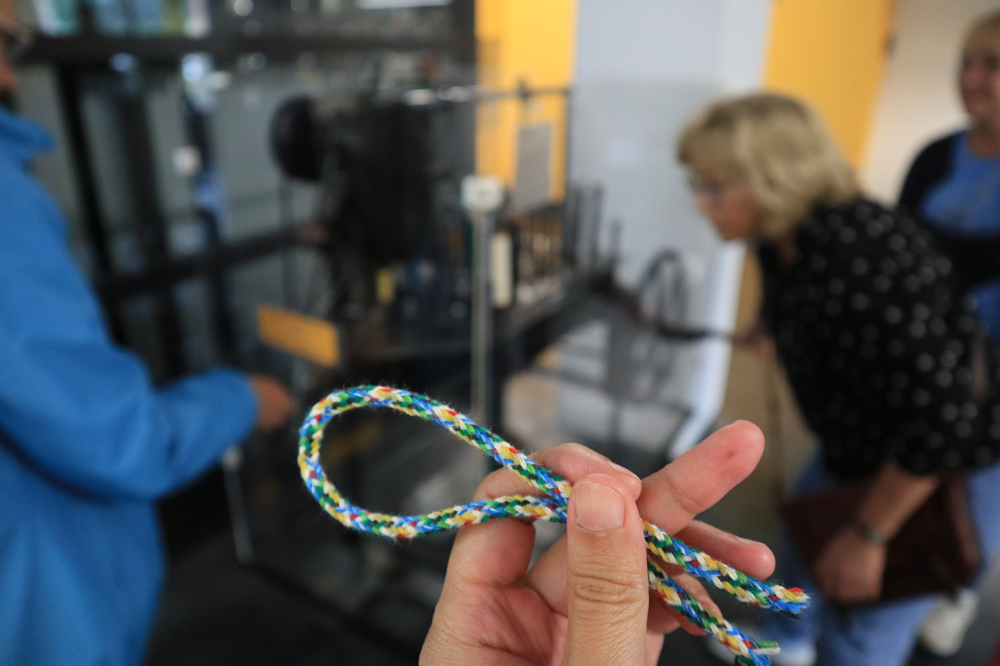

### Erfurt 一個人的旅行 (July 11 Fri.)

不等 Gintas 了。想來 Erfurt 很久了就自己來。一早從 Chemnitz 出發一直錯過火車，有班車是原本誤點，後來不誤點了，就錯過了。早上第一次搭了替代火車的巴士，還蠻迅速的，只是站牌有點難找。一路上還是心神不寧，跟 Gintas 的爭吵到昨天都還沒有結論，邊走都能邊掉淚。

爬上市中心的大教堂廣場，找了個有陰影的板凳坐下來打電話給媽媽，被安慰了一陣，她說完全可以理解阿，很可憐阿，但人家不懂就是人家不好啊，妳自己還是要去自己想去的地方 (我聽媽媽這樣講的時候，好慶幸自己有來 Erfurt)。在電話裡邊講邊哭，也有邊講邊笑，我的陰影板凳剛好在一個大教堂的入口，背後有個告示牌，觀光的人們都會經過我身旁，看到一個亞洲女孩邊講電話邊掉淚的感覺，不知道是怎麼樣。

媽媽還是最好了，她說，衝動的時候不要下決定；但決定了也沒關係啦。有傳訊息去道歉，好好來解決當下的狀況。

Erfurt 最漂亮的地方是大教堂和一旁的一個小山丘，小小 old town 的對面有個超級小的小溪，今天剛好遇到一群大學生在慶祝畢業。小小的溪裡有 Mallard，小 baby Mallard 還會跑給媽媽追，看著看著不禁笑出來。雷陣雨只持續了 10 分鐘；要回火車站時搭到反方向的電車；到 Leipzig 轉車時忍不住買了 KFC，來考賞情緒上奮鬥又放鬆的一天。

### 老闆再見，與 Gintas 很討厭 (July 10 Thur.)

這幾天跟 Gintas 大吵一架，天翻地覆的那種吵架。Gintas 本來是昨天傍晚要到 Chemnitz 的，在從義大利飛的前一天，他說義大利有罷工，不確定飛機能不能飛。我們查了航班都還只是 40 分鐘誤點而已，我自己是覺得很有可能飛 (如果不飛就會直接取消了)。

Gintas 一早傳了訊息來，說把飛機延到周日。過程都沒有跟我討論過，我整個直接爆炸。大爆炸。他是說班機一直延誤，他不想要讓家人送他到機場但是卻沒有飛，所以就直接延到周日了。

啊我說，有這麼多方法你就選了一個最被動的，是不會到機場等嗎? 至少也試試看啊! 阿如果真的取消了你不想讓家人等，那就在附近住下來等隔天的飛機啊! 是有沒有這麼不知變通 (氣炸)。結果最後飛機還是照常飛，只是延個 40 分鐘而已! 備受砲火攻擊的他直接反擊，阿晚幾天是有差這麼多嗎，妳為什麼反應這麼大。這句話下來不得了，直接砲火針鋒相對。

Philippa、媽媽、BirdNET 的人們都知道我會多有 upset，就只有他不知道!! 吵到連分手都說出來了。就這樣花了我 24 小時的時間才慢慢緩和下來，Erfurt 有淨化人心的功能。

其實今天應該是要很感人的一天的，一早去了影印店洗了照片，寫了卡片要送給 Stefan，這是他 vacation 前最後一天到 office。他送了我一本書 Sounds of Life，封面還親手寫了 message (感動到不行嗚嗚)，他說 Computer scientists 很少寫字，他盡力了(笑)。而我則是送給他一隻吃魚的鉛色水鶇，Stefan 真正非常有熱情的物種，是熱帶的花花淡水魚。我們再一次擁抱，上次擁抱是我們第一次見面的時候。會再見的。

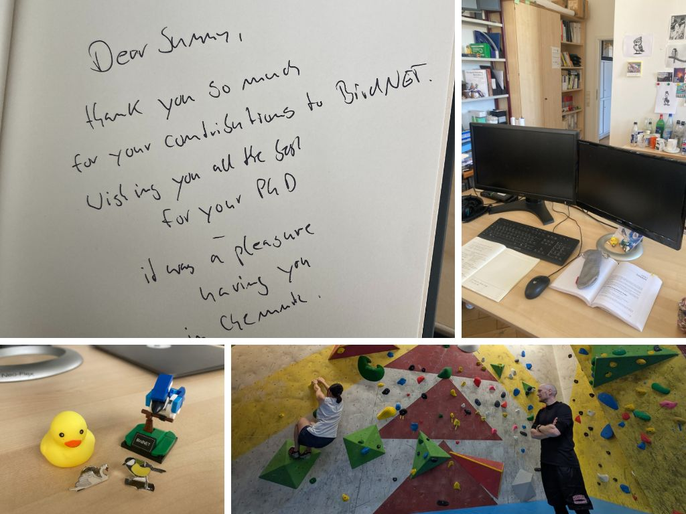

### BirdNET Bodybuilding Club 俗稱 BBC  (July 8 Tue.)

殷殷期盼的 Gathering 終於來到啦! (從 Dublin 回來之後整個無心工作) 剛好今天也是 release birdnetTools v0.1.0、首度發表的一天!!掌聲加尖叫!

跟這群工程師們出去玩真的非常的過癮，尤其是跟 Raja 一起真的有被激勵到的感覺，總覺得她都不在乎困不困難、能不能完成，就馬上去試試看好玩的路線。Stefan 有爬過但我完全不敢確保他哈哈，天啊我才不敢只用雙手確保我的老闆。

翻翻照片的時候還想到，這群有時侯一直講德文都忘記我的工程師們 (德文聽不懂的時後就一直傻笑)，是造就了全世界鳥類學家都在使用的 BirdNET 工具耶，是有沒有這麼厲害。能跟他們一起工作、一起玩、還能在工作跟晚耍上都能夠很自在，真的很不簡單。我好喜歡這個小小的地方、這個小小的團隊。

### 陶藝班畫畫 (July 7 Mon.)

和 Maha、Pajam、還有薇恩來第三次畫畫!

周末自己先來畫了一個下午，所以進度不錯 (大心)，今天和 Maha 還有 Pajam 的一個 session 知道會聊天，所以就只留了兩根羽毛還有背後。最後還是畫到要關門了都還話不完，因為猶豫太久了啦!最後的泡泡技法真的太好玩，把顏料調成泡泡，然後吹到盤子上，等泡泡破掉之後就會化成一圈一圈的效果，非常的美麗。

調成的咖啡色長得太像巧克力，要記得是吹，不是吸 (哈哈哈)。

### 珍貴的緩慢周末 - 貓貓、畫畫、與白色晚餐 (July 6 Sun.)

媽媽 Stuttgart 之後、Dublin 簽證之旅之後、十個小時的火車之旅之後，終於有屬於我自己的週末了(大心)。這個周末慢慢地，穿的漂漂亮亮的去畫畫，直接專心四個小時泡在畫畫店，很多小朋友都害羞地走過來說，"是貓頭鷹，好漂亮"；晚上再去犒賞自己一頓美好的印度料理晚餐。

周日早上在默默地晃晃晃，下午就去了貓咪咖啡廳和一群人一起，本來只有跟薇恩一起，到之後就跟好多人! 到之後剛剛好有一個 Dinner in white，才發現好羨慕薇恩當天有穿白色哈哈!! 太可愛的廣場前聊天。

### 十個小時的回家 Frankfurt to Chemnitz (July 4 Fri.)

再一個搭車搭到怕的一天。來算算至今搭過的長途火車。

- Chemnitz - Stuttgart (普通)
- Stuttgart - Frankfurt - Chemnitz (順)
- Chemnitz - Leipzig (順)
- Chemnitz - Dresden (順)
- Chemnitz - Stuttgart (不順)
- Stuttgart - Frankfurt (超不順)
- Frankfurt - Chemnitz (超不順)

之前似乎是新手運極佳，今天這個從 Frankfurt 到 Chamnitz 真的是太瘋狂了，第一班車好不容易搭到，竟然要停的站就被取消，轉車的那班又大誤點，人擠到站廁所，好不容易撐到終點站，又以兩分鐘之姿完美的錯過轉乘的火車。二選一的過程中選到一個再次誤點又完美錯過的車。最後到 Chemnitz 還搭錯電車方向!!都搭到快哭了，我好想回家。

從愛爾蘭天亮之前就出發，一直到好不容易到家，整整 20 小時耶 (崩潰)。媽媽直說，好可憐，想到就好害怕 (笑)。但我說，搭過這次就真的甚麼都不怕了。

### 快閃愛爾蘭 Dublin (July 3 Thur.)

這次的歐洲之旅有個小小的意外，我在訂來回溫哥華的機票時，不小心把日期算錯，居留時間是 91 天 (台灣的護照在申根區域，在半年內最多只能待 90 天)。因為買的是不能退換的票，當下想到的最佳方法，就是去一個非申根地區的國家玩個兩天，倫敦太平凡，於是我就找上了都柏林。

剛剛好 Ashley 在巴黎待不住，說也要一同來愛爾蘭當旅伴。

第一個印象是好冷，在 Stuttgart 還在後院玩水的熱浪，一查愛爾蘭氣溫竟是 20 度，馬上跟 Philippa 求助，她給了我一件破洞的薄長袖上衣；還有一件褲襪，事後證實真的超級無敵好用(感謝 Philippa)!其實讓 Ashley 幫忙帶上是最簡單的，但她說她行李一點位置都沒有了，要我幫她帶毛巾她才會可能幫我帶長袖，於是作罷。 

Irland 因為之前被英國整整統治八百多年，愛爾蘭語逐漸流失，目前只有大約 30% 的人會說流利的愛爾蘭語，大部分的溝通交流都是以英文為主，只是我看到路上，不論是路標、解說、各種宣告都是雙語。全球的愛爾蘭人大約有七千萬人；但只有七百萬人是居住在愛爾蘭。他們善於遷徙的民族性來自多年以來受到英國的壓迫。(這跟我認識的唯一愛爾蘭人 Laura 很像，她也是一個非常隨興的遷徙人)。

Irland 最早是由維京人開拓，在此有金、銅的貿易，也有精緻的武器，當時的人形容愛爾蘭為 "eternal winter"，是沒有統治者會想要佔領的地方。有趣的是，隨著全球暖化，這裡反倒成為歐洲各國的避暑區，大量的遊客選擇在夏季時來訪。

在買 24h 車票的時候遇到的店員推薦了幾個海邊的景點，我們在 free tour 結束之後去了最北邊的小漁村，吃了好吃的 fish N' chips，之後再晃到最南邊的小碉堡。Ashley 隔天飛巴黎的飛機被取消了，她在火車上心急如焚。最後從我這裡借走了兩歐元說明天要搭車。整個 Dublin 之旅岔然而止。

覺得 Dublin 是個冷冷的城市，一天下來走過最喜歡的地方，是最南邊的碉堡小鎮。

### 再見媽媽，一切都越來越好 (July 2 Wed.)

在 Frankfurt 短短的住了一天，我們的 host Stefan 是個很熱情溫暖的男主人，只是可惜我們來匆匆去匆匆，真的沒有甚麼機會聊到天。一早 6:15 的鬧鐘我真的昏睡，全身肌肉都還沒有醒的那種昏睡；媽媽還是和平常一樣早起、泡了一杯茶、簡單的吃了幾片土司和餅乾，沒幾分鐘就準備好上路了。

昨晚睡前還在跟媽媽聊之前一起旅行的回憶，在 Ashcroft 遇見 Sandy，一起去看她社區的踢踏舞表演、去密室逃脫，還有在麵包店裡的巧遇；我們還在討論究竟她的女兒是在紐西蘭還是在阿根廷。然後我就睡著了。

早上要去公車站的路上，我還忘記帶耳環直奔回 Stefan 家，最後還是提早十分鐘到達，還在跟媽媽賭氣，真的好難練就轉換情緒的技能。在法蘭克福機場跟媽媽一起 check in、drop off 行李然後進海關。我的登機 gate 在 E3、她的在 E9，好靠近好幸運，一起享受了一杯暖暖的抹茶拿鐵還有巧克力馬芬蛋糕。

媽媽說，歐洲有好玩，剛剛好的疲憊就可以回家陪爸爸，"妳的脾氣有越來越好"。很難得的經驗，就這樣和媽媽度過了三個星期，比我想像的還要溫暖許多；吵架當然沒有少(笑) ，但我們都盡量有技巧性的度過他們，用好笑的方式來順順的過，就不會難過。想到媽媽每天在 Chemnitz 陪我，再次一起生活煮飯平平凡凡的感覺，真的好好。

### 再一次的長途遷徙之媽媽說旅行好累 (July 1 Tue.)

今天的行程是從 Stuttgart 到 Frankfurt，Philippa 還是和平常一樣好客，而且非常非常的善待客人，常會想到細節，甚麼時候搭車、我的網路好了嗎、會不會冷、路上要不要帶東西吃等等。午餐煮了一頓超好吃的義大利麵配燉肉；還幫我們帶了西瓜、三明治、跟餅乾。上路!!

下午兩點的車竟然搭到晚上十點才到 XDDDD

"等一下還要轉車嗎?" 我們都有點搭車搭到怕了。其實很疲憊的，幾乎每班車都有狀況，不是列車誤點、就是取消，還有上車後直接不開叫我們下車等下一班的。有沒有這麼多狀況，最後到達家裡我直接累癱。媽媽本來期待要到 Frankfurt 喝牛奶、去主車站看看、最後只要可以躺到床就夠了。媽媽在睡前說，Stuttgart 跟 Frankfurt 不是很近嗎，結果我們搭得還跟從 Frankfurt 到 Chemnitz 一樣久，真的很天才，我也覺得很天才。

睡前偷偷喝了兩小杯冰箱裡的冰牛奶，很幸福。

### 寶寶之旅與兩個媽媽的相見歡 (June 30 Mon.)

午餐、紅包故事、與後院游泳、睡前的聊天

### 長途遷徙到 Stuttgart (June 29 Sun.)

好炎熱的一天。媽媽在 Chemnitz 的最後一個早上，還是早起著做早餐，把整個冰箱清得乾乾淨淨，早餐是烤土司與蛋沙拉，還有少不了的牛奶。

一早大包小包的，不知道是不是因為昨晚熬夜想要完成工作，今天的情緒一直都不是很好，連要出門了都還有肌肉癱軟的感覺 (完全不能熬夜)。

要到 Stuttgart 要轉三趟火車，真的也是辛苦媽媽了，第一趟運氣好還有位置坐；第二趟直接站兩個小時，冷氣又剛好壞掉，兩個人都整個搭到快暈車，幸好及時下車還有好吃的午餐跟水；第三趟一樣運氣好還有位置坐。媽媽直說，"這個比搭飛機還要累 XD"

### 大掃除、好大隻的鹿與再見夏日音樂會 (June 28 Sat.)

媽媽在 Chamnitz 的最後一天啦，安排了一整個早上大掃除，把家裡的地都吸過、拖過一遍，好多、超級多頭髮!!ㄚㄚㄚ，然後洗衣機無限工作，洗一次要三個小時我們直接讓他超時工作。

下午稍微鬥嘴，媽媽生氣直接自己出門，去她一直很想去的野生動物園，我躺了半小時冷靜之後，想想不對，趕緊打電話追上，從 2 號電車轉 1 號，再搭 42 公車，下電車後就獲得媽媽的迎接，阿，原來是媽媽錯過公車了。不過其實我也比較喜歡兩個人出來玩兩個人一起行動的感覺。

這個野生動物園備受媽媽青睞，不僅有山貓、野狼、還有 red deer、roe deer、還有 Eagle Owl 和近距離接觸的區域。我本來以為我已經克服當初 Moose 的創傷，沒想到當 Red Deer 走進我的時候，我還是非常本能的恐懼、想要逃離 "這個怎麼開"，我抓著門問道。但真的是非常有趣舒適的體驗，而且有 100 分的廁所!

下午玩太晚了，回家匆匆吃了飯，又出發去最後一場夏日音樂會，那個氣氛是要不要這麼好 QAQ 全場都是好萊鎢的音樂，有虎眼、神鬼奇航、星際大戰、哈利波特、大白鯊等等各種經典名曲，真的聽的太太過癮了!我整個聽到捨不得走，我們一樣留到最後，回到家已經天黑，晚上十點半。夜晚的 Chemnitz 非常迷人。

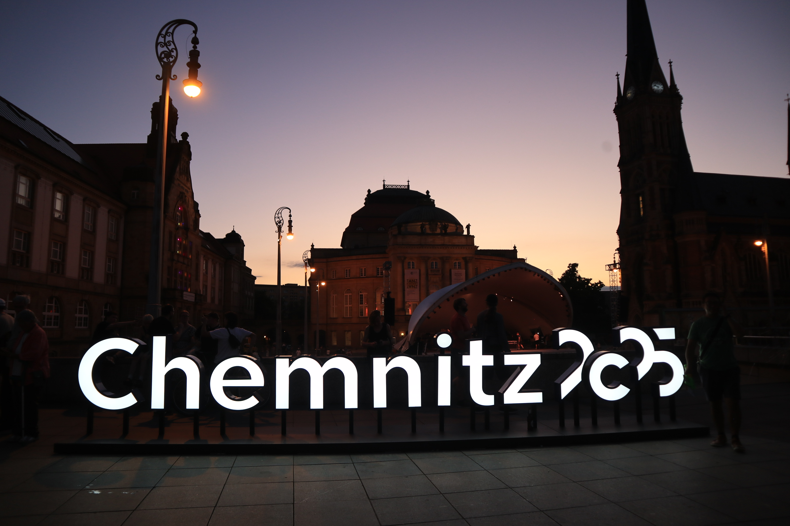

### BirdNET final presentation 與帶毛毯到場的 Jass 音樂演出 (June 27 Fri.)

莫名的就被加入了 Cornell 與 BirdNET team 的 Hands on meeting!! 因為我是幫忙 BirdNET 這邊開發 R package 的緣故。

### 媽媽的茶杯好漂亮 (June 26 Thur.)

### Prague 浪漫布拉格廣場 (June 24 Tue.)

廣場旁有個大教堂，難得的免費參觀但是禁止拍照，媽媽說這裡每一幅都會是名畫，比起德國的教堂又再華麗許多。我則是在辯論為什麼教堂中畫作裡面的女性都必須伴著嬰孩或是男性出現，讓女性的身分很單一，似乎只注意到女行生育的功能與角色。

到車站前先去了一家咖啡廳，木頭桌椅加上小巧便利的座位，老闆手腳俐落的送上兩杯 caffee latte 與覆盆子起司蛋糕，難得有免費的廁所可以使用。

飽餐一頓後，順順利利的回到 Chemnitz 的家，媽媽說，不會捨不得布拉格，因為她也很喜歡 Chemnitz。至於布達佩斯，之後有機會的話很想要跟阿姨再一起來。

### Jewish quarter and old town 一天一公升的牛奶 (June 23 Mon.)

布拉格的歷史繁複到令人暈眩，羅馬帝國、波西米亞王國、查理三世因黑死病從義大利逃離到捷克、Prague 本身就有"涉水之地"的意思，巨大的橋樑，查理大橋，連結起河岸對面的城堡與平民的住宅區。猶太教的迫害、卡夫卡的文學。

其實要寫布拉格真的有好多可以寫的，交通非常方便、天文學的發展 (14 世紀的天文鐘到現在仍然可以使用)、文學 (卡夫卡)、音樂 (莫札特與貝多芬)、還有數不清的教堂宮殿、四十年的共產黨衛星國家、還有在那之前的王國。有歐洲第一座大學 (查理大學)、斯拉夫語系、使用羅馬字母。現代的布拉格有點商業化了，在城區中不乏見到昂貴的食物，也有不少匯率很低的兌換貨幣場所。

猶太區中有個 Lennon Wall 在 John Lennon 過世的時候建立，象徵自由的各種插畫在共產時期中被禁止，但是人民的精神寄託。當時從自由世界傳來的新聞、音樂、文字、書籍，每個都是被嚴格禁止，但人人嚮往的世界。

我跟媽媽在捷克一天要喝一公升的牛奶。

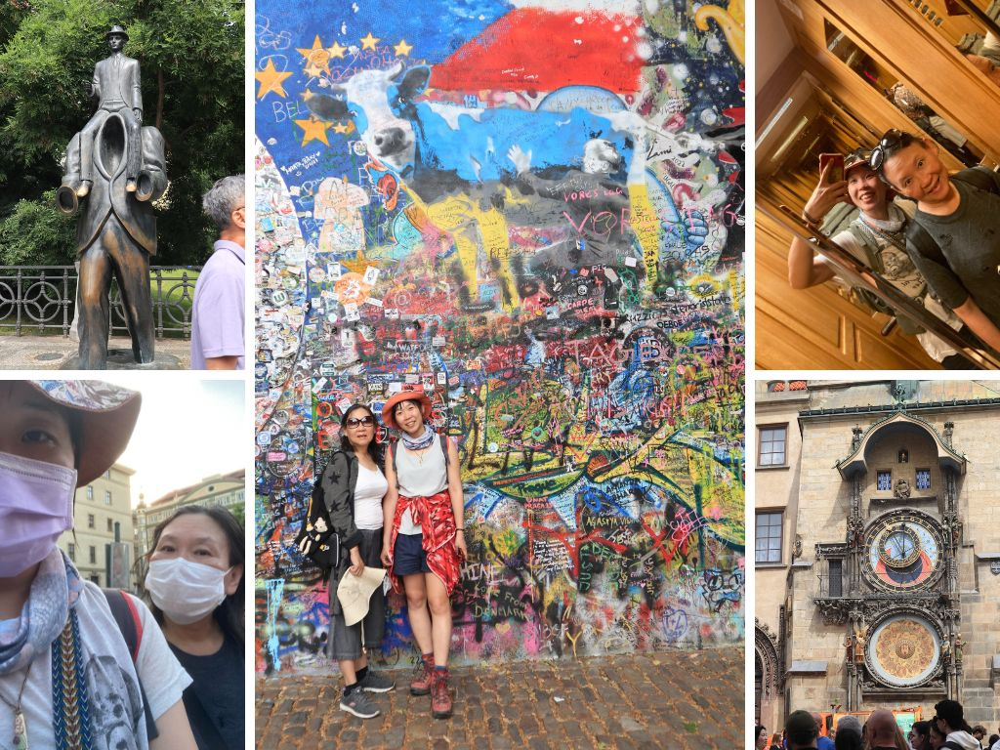

### 布拉格皇宮與共產紀念碑 (June 22 Fri.)

媽媽期待已久的布拉格之旅 (我也是拉) 馬上就到了!從 Chemnitz 搭車不過也 18 歐元、三小時的距離。而車站也不過距離家裡十分鐘 (在 Chamnitz 不論去哪裡都距離十分鐘 XD)。

到達布拉格才下午一點，三點才能 Check-in，先去附近的捷克餐廳小試身手，點了一盤牛舌還有蔬菜湯，才發現我不敢吃牛舌，蔬菜湯偏鹹但好吃。休息一番離開後到車站換錢 (24 捷克幣兌 1 歐元)、買車票，這裡的車票是 24h (120 捷克幣，60 半票) 或是 72h，在公車或電車站都可以打票。

然後我們就心血來潮的來到了小山坡上的皇宮!搭電車可以到山腳下，Google Maps 說 10 分鐘就可以到 Castle，說得原來是爬個小山坡的 10 分鐘，我們背著大包小包一路爬山，媽媽還說，第一個行程就這麼操 XDD 長形的宮殿有一圈教堂，我們闖入一間教堂後還遇到彌薩，實習教士(?)幫忙舉著書讀經。

回到房間後去了 Communist memorial forest 還有查理大橋，短短的 500 公尺我們也可以迷路。查理大橋上面的似顏畫畫家，各個技術精湛。

### 夏至，芭蕾舞畫畫與歌劇院 (June 21 Sat.)

夏至這一天，如預期的行程滿檔，在餐桌上放了好久的節目單，今天共有 Makers United 和 TANZ festival 兩個慶典要參加。話說過到這個星期，已經再也不能明白歐洲人到底要怎麼在夏天工作的，這麼多好玩的慶典與活動。每個周末都是滿滿的行程。

Berlin - Hut festival - Stuttgart - Leipzig/KOSMOS - Dresden/Makers United/TANZ/Prague - Stuttgart - Dublin

非常炎熱的一天，早上十點在 Rotor Tome 廣場有 TANZ 的芭蕾舞教學，和數百人共同在廣場上跳舞。接下來去逛隔壁的 Makers United，包含了許多傳統的手作元素 (繪畫、編織、裁縫、木工、拼圖、印刷、黏土、全像圖投影)，還有許多新興的科技 (3D 列印、機器人、虛擬實境、操作系統、遊戲設計)。其中一個很喜歡的遊戲是 3D 方塊，在立體的空間中要將木盒子放置在相對應的空間上，很挑戰合作與空間概念；還有一個是將所有人的繪畫作品拼成拼圖；棕梠葉的編織作品。最後晚上再去 Theater Plaza 以完美的歌劇作為結尾。每每的夏至、好睡的一晚。

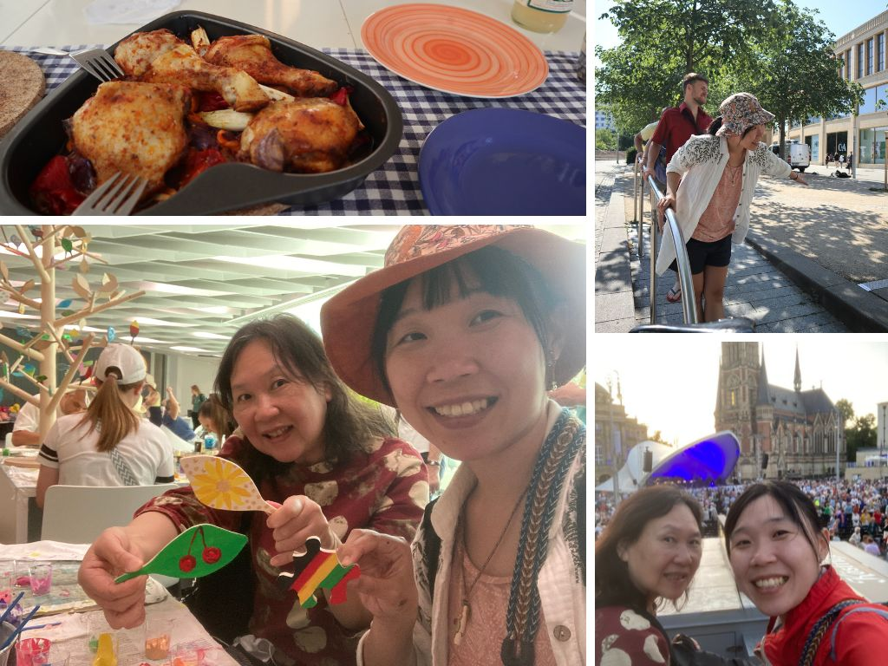

### Saxon Switzerland National Park，一路叮叮叮的行程 (June 20 Fri.)

昨天剛和 Stefan 還有 Felix 開完會，太累太心寒，程式開發這種事情就是沒有完美、沒有做完的一天，真的開完會後讓我下定決心，與其再花一天的時間好好 polish functions 不如把握機會和媽媽去爬山! 

話說有點難過，媽媽的德國之旅就這樣地到了一半了，沒想到時間過得這麼快...下次能和媽媽這樣住在一起旅行，不知道會是甚麼時候了呢。

這趟跟媽媽一起出去非常的快樂!!我們兩個都沒去過 Dresden 的 Saxon Switzerland National Park，是到路上了才在認真查到底要怎麼去，竟然還是在要搭 S1 的路上才了解原來是個 O 行路線。媽媽很認真的做了午餐、早上七點半出門。排隊排到昏頭、真的有覺得媽媽的體力很不錯，這樣爬也不會累，但看到媽媽爬山突然有點小難過，好希望媽媽的體力可以一直都這麼好、一直開心樂觀。

回程還有河邊的櫻桃吃到飽!!回到 Chemnitz 時還看到了免費個歌劇彩排，是有沒有這麼幸福，我跟嬤嬤說，我們真的是一路叮叮叮賺到!!

### 陶藝班 with Maha & Payun (June 19 Thur.)

從剛到辦公室認識 Maha 之後，就一直有約要去陶藝工作室，就在一個月過後(!?) 終於約成功啦! 非常漂亮乾淨的場地，有基本的盤子、杯子、還有更進階的動物、蛋架。我最後選了一個茶包架盤，媽媽選了一個咖啡杯。

媽媽好勇敢我則是甚麼都小心翼翼的。真的太小心畫了反而是甚麼都畫不成功。一直看周圍的人，我是到這時才意識到我已經好久好久沒有畫畫了。真的很需要大膽的畫，再去體驗一下那種畫錯了也沒有關係的感受。

當天竟然還後悔到作惡夢，一直在想下次去還可以畫甚麼，是有沒有這麼想要證明自己 XDD 但至少可以留給媽媽一個漂亮的紀念品，感到非常開心!

### 大大片的草皮與媽媽的天才晚餐 (June 18 Wed.)

可以這樣每天下班後跟媽媽一起度過有好長陽光的傍晚，真的很幸福。

跟加拿大的兩個 ARU 研究生開會開到六點，直接跟媽媽約了要去學校後面的大片森林散步，天才媽媽說"我來準備晚餐"，當媽媽這樣說的時候，就會有最棒的晚餐出現!! 茄子與肉還有馬鈴薯。好吃!

### 學校後面的貓頭鷹 (June 17 Tue.)

媽媽說昨天散步的時候找到了一個 Chemnitz 的植物園，在那邊看到了五隻貓頭鷹! 我利馬說我也要去，因為今天六點要開 SCO-SOC 的會議，於是我們就三點先去散步。

總共有三大兩小的 European Eagle Owl，其中一隻大的，我在猜是爺爺(或奶奶)吧! 行動異常之緩慢。下午剛好是他們的餵食時間，籠舍內有至少五隻小雞，成鳥就負責刁小雞給雛鳥，其中一隻直接一整隻吞下去，還有一隻慢慢撕，肚破腸流。

### 游泳日與一起下廚 (June 16 Mon.)

終於在媽媽到達德國後有比較標準的兩人時間了! 約好了下班一起去游泳 (對的，就是那個讓我驚艷到要帶每個朋友都去的那個世界最漂亮的泳池)。但發現人一多之後就沒有那麼漂亮了 XD 加上昨天沒睡好，一整天都超級累，不是一直被超車就是要超車人家。

媽媽超級強，就算是踩不到地的泳池也可以一次 100 游完來回，是有沒有這麼猛! 回家後一起煮大餐，我答應媽媽要煮 Beat root soup 給她的，結果超級不紅，但非常非常好吃!! 那個 Dill 一次就要買一把花也太好笑；還有無限馬鈴薯大軍。

PS. 之後發現換房間睡後，客廳好睡太多!

### 在音樂節的印刷攤位上，學會後悔 (June 15 Sun.)

跟 Max 一起去音樂節，遇到了這個 Green Peace 印刷的攤位，那時有很多圖樣可以選擇，比較心儀的有 Protect the ocean 加上海豚圖樣，還有 No WAR。另一個必須做的選擇是要印在甚麼媒材上，我當時剛好有帶海龜野餐墊，而他們也有另外提供免費布袋。

猶豫了很久結果拿了會場提供的布袋印了 NO WAR。回來之後超級後悔 XD 想說為什麼不印個海豚在我的野餐墊上，這樣也可以節省很多、非常多的資源與更有紀念價值。然後就在無限循環中，聽到了當天的挖賽心理學，講的就是"後悔" XD 是有沒有這麼巧。

他說會後悔的心情，就是因為你當初有選擇，而你覺得過去的自己選錯了，你再責備那個自己。其實重點不是要強調現在的選擇也很好，而是要意識到當初的你會做那個選擇，是因為那個你有另一個需求，而現在的你在選擇之後，又發現了你有另一個需求，這兩個需求並沒有誰比較重要誰不重要，這個後悔的情緒，只是讓你明白你的需求是變動的。並沒有需要去責怪誰，他可以更幫助我們去了解每個階段的當下，我們最需要的是甚麼。

### Stella & Derek 在 Leipzig (June 14 Sat.)

媽媽到達的第四天我們在早餐就大吵一架，誰都不理誰。她就說為什麼我一直念一直念，好煩好煩。媽媽有一直嘗試找我講話但我都無法，真的會自己過不去。

一方面我真的是真的看到很多

一直到見到 Stella & Derek 才又被溫暖了起來。Derek 說，就算媽媽真的都每天早上六點起床煮飯，也要好好地跟他說~

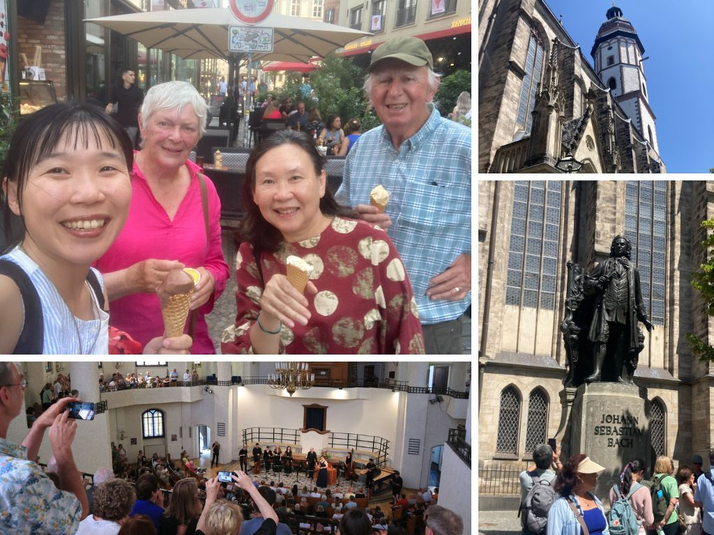

### 鈺婷來啦 - 早到的桌球 Kosmos 音樂節 (June 12 Thur.)

第二次攀岩!!!

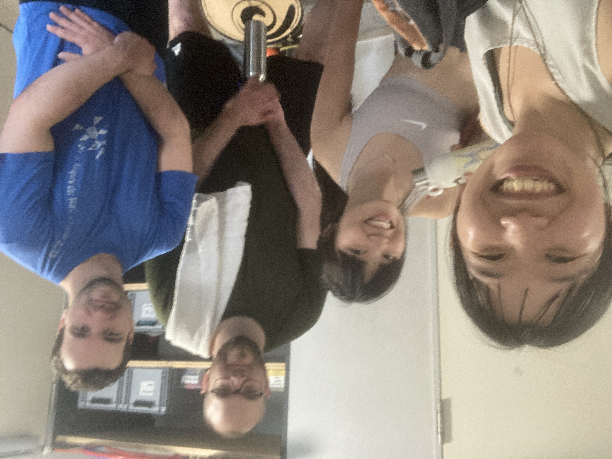

### 市中心廣場散步 (June 11 Wed.)

回家第一餐是媽媽煮的義大利麵(炒青菜加上蘑菇和羊肉)，非常好吃!!從今天開始再也沒有下廚了哈!

### 媽媽來了，搭了十個小時的火車才到家 (June 10 Tue.)

簡單的晚餐、火車上的興奮

隔天早上五點叫我起床!? 說已經 11 點啦!

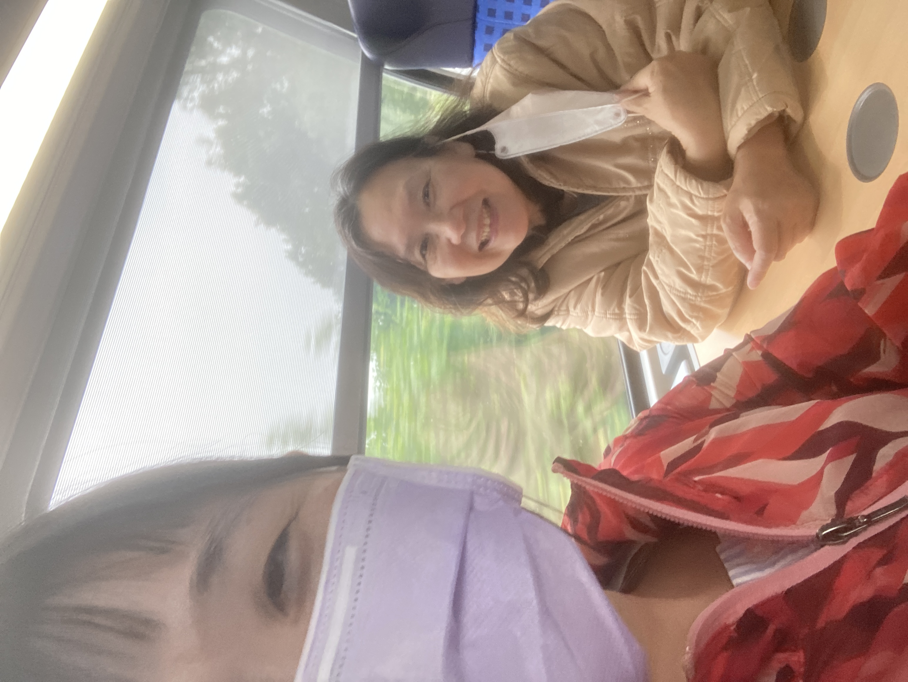

### 生日在 Stuttgart (June 9 Mon.)

birthday morning with rubab cake and tree cake- lunch with dad - afternoon coffee with mom - backyard exploration massage evening (Monday)

### Stuttgart 長周末 (June 5 Thur.)

過了一周一個人的幽幽閒閒的生活，上個周末好不容易將生活打理好，這周就要出遠門，到 Stuttgart 找 Philippa 和 Felicitas! 剛剛好遇到德國的第二個長周末!

搭了好久的車、轉車、三分鐘、還好的 Doner。

後山坡的廢墟、隻隻作響的床、
Gemestic (Friday), 

planting - coffee in the garden - sweet - cook the beet root soup (Saturday)

raining in the morning - wine festival - tennis team and Bea - massage evening (Sunday)

### Chemnitz 學校運動會 (June 2 Wed.)

再度跟台灣人一起行動參加運動會，總共有 11 個關卡，要積分。有室內活動像是穿布袋跳躍、平衡腳踏車、矇眼足球；室外的有真人手足 (好玩)、高爾夫球、平衡木走路、橄欖球、沙灘跑步、丟飛盤、平板式棒球、丟籃球。

結果我到橄欖球整個不想動

打棒球的時候被嫌棄反應慢 (!?)

為什麼沒有桌球。薇恩說她以前是短跑校隊的!

### 在德國的第一次攀岩 (June 3 Tue.)

約到 Max, Josef, Raja 一起去攀岩場小試身手，超級高的屋頂還有超級不可置信的確保機制，竟然是用手拉!

### 藝術小鎮、與暴雨中結束的嘉年華 (June 1 Sun.)

昨天晚上一如往常的，猶豫不決的症頭讓我花了大概一個小時坐在電腦前，決定明天要做甚麼，結果還是把決定丟給明天早上的心情 XD 早上去了小鎮的另一間咖啡廳工作(就是不甘願只待在家工作)，在市中心，稍微貴了一些，Chai Latte 也沒有特別之處。

會留在 Chamnitz 就是為了這個超好玩的 Hut festival! 結果果然不失所望 (大心)，小小的市中心放了八個表演舞台，每半個小時會有一組表演者來表演，音樂種類的有雙人樂團、多人樂團、唱歌、舞蹈、街頭打擊音樂；雜技性質的有體操、彈簧床雜耍、火舞、魔術、皮偶戲等等。除了表演之外還有少不了的攤販，不論是小吃或是文創商品，都有極高的多樣性!! 不論是宣傳、指引、動線規劃、跟攤販安排都非常之專業! 這個嘉年華邀請到的表演者都是 PRO 等級的!

最後一個表演看的是 Trampoline Show by ARAMELO，看了兩次了還是覺得天啊也太厲害!!整個表情、動作、跟熟練度都不是蓋的! 最後大會突然廣播因為發布了 weather warning 所有活動結束，請觀眾馬上離場 (我本來還嚇到，想說是發生甚麼事了)。不到十分鐘內就起大風 (桌椅都被吹翻、玻璃杯碎一地)，還有星球的裝置藝術也差點飛走；大風完直接暴雨就來，又因為交通堵塞的原因 2 號電車一直不來，我跟兩位奶奶在暴雨中相依為命。最後還是平安到家，結束這一生一次體驗的 hut festival。

### Chemnitz Hat festival (May 31 Sat.)

有幸到達 Chemnitz 的第二個周末就是長周末! 連續四天的連假，剛好遇上 Hat festival。

第一天在家好好的休息，花了一整個早上睡覺(?)然後終於有時間把家裡好好地整頓一下，洗了幾趟衣服、丟垃圾、整理環境掃地拖地再把客廳好好打理一番，來了一周了終於可以把行李箱放走，好好整理認識家裡後心裡非常踏實。下午再去市中心旁邊的火車森林走了一回，很可愛的都會公園。

第二天去 Freiberg 的咖啡廳工作 (一直想來這個小鎮很久了)，有個很可愛的舊城區還有老舊的圍牆。非常舒適的咖啡廳，有插座、網路、還有無限的座位。下午回到 Chemnitz 再跟薇恩還有博約一起逛逛 hat festival，那個氣氛之好!! 還有找到一位台灣的火舞表演者，到最後還高舉台灣國旗，是有沒有這麼感動。

第三天在家稍微工作，之後一樣還是去了台灣人的野餐烤肉聚會，這個聚會就沒有前幾天的那麼順心，這次大約有 12 個台灣人，覺得平均年齡都太年輕了(年紀已老)，很多話題都搭不上來，也沒有共同的興趣，一起待了一個下午，就匆匆回家休息。

最後一天，明天再說哈哈，但是應該是要好好工作的，想要去其他城市看看。

### 連假前火鍋小聚 (May 28 Wed.)

才剛來到德國一周，就遇到少有的假期 Ascension Day (聽說德國一年只有 11 個國定假日)，也有人說是父親節。但其實當地人都不太在意，只知道是放假就大家開開心心的聚了一個晚上。跟這裡的台灣人一起吃吃火鍋、唱唱歌、還有聊聊德國當地的政治，真的好久沒有這麼放鬆有趣的飯局。非常的開心。

小鎮的生活很愜意，大家都住在步行可以到達的距離，讓我想念起集集的生活，那個也是走走路就可以到所有人的家的時光。

PS. 今天雨超大又超冷，到達博約家的時候整個人都濕了。

### 小鎮躲避球大賽 (May 27 Tue.)

因為 Stefan 的介紹而認識了博約，之後接連的認識了一群台灣人，之後又在莫名的躲避球六缺一加入了躲避球大賽!! 小鎮生活就是可以這麼有趣哈哈哈!! 

那個心跳加快的感覺好久沒體驗，而且在德國的躲避球規則不一樣，一次有六顆球在場上，看到眼花撩亂 XDD 又害怕又愛玩，在場邊看超刺激的隊伍打都覺得非常的過癮，自己在場上就超抖，那個六顆球同時飛行的刺激真的太難得。

### 台灣人在柏林、與冷戰的三千人地下避難所 (May 25 Sun.)

第二天和 Tammy 還有 Shu (書紋) 參加了一個 walking tour，冷戰時期的柏林有許多地下 bunker，大多是從二戰時期沿用改進而來，只是冷戰時期的防禦主要變成針對核武，像是 Air lock 等等就是針對帶有輻射污染的灰塵，過濾的空氣、沖洗系統還有加厚的水泥牆等等。

我們參觀的第二個 bunker ，是比較新的計畫，而且竟然就是在一個 S bahn 車站裡面! 真的太誇張，有點像是在台北捷運站某站，打開某道密門之後突然出現了一整個防空洞，可以容納三千人之多 (但只有 0.8 的柏林人口)，有床、廚房、醫護室、還有為了防止互相傷害的考量，所以廚房裡沒有刀叉，只有湯匙。防空洞可以維持可居住狀態，兩周的時間。

我們都說，如果到時候真的到了這樣災難性的時刻，我們都寧願成為先離開的那些人，畢竟那種時刻，可能活著才是折磨。

這趟短短的柏林之旅，覺得又多認識了鈺婷一些，每次聊天都有新的認識，還有新認識了書紋，覺得好幸福。

### 進城尋水大戰 (May 24 Sat.)

說起來其實有點好笑，本來在德國的第一周要邀鈺婷來小鎮玩耍，殊不知，我們家竟然停水了! 從上周三就開始斷斷續續，一開始是沒熱水 (本來還以為是我暖氣開太強)，這個還行，就燒個熱水還是可以洗澡；沒想到隔天直接變成冷熱水都沒有。只好馬上打電話給 Tammy (人家還正在包粽子)，改成我周末到她在柏林的家 (一直跟人家改來改去也真的是很不好意思)。

出發前終於取得 Deutschlandticket，一路搭車都搭的非常的順心。到了柏林先去逛了東德博物館，在博物館島走走晃晃、吃了咖哩香腸、再去布蘭登堡門、猶太紀念碑、柏林圍牆、還有超級超級好吃的德國豬腳 (Domke Nino Fleischerei)，是間肉舖!!!

- 小朋友學算術的時候，都會有戰爭的例子，像是士兵的數量、手榴彈的數量、砲彈的速度、角度等等。

- 當年的柏林圍牆擋的不只是人、還有民主的自由。許多人不擇手段的，不論是地下通道、熱氣球、利用體育或特殊身分取得特權，就是想要到西邊的生活。

- 蘇聯的統治就如在各地一樣，利用階級清洗來壓制社會上的多元想法，許多牢房強迫政治犯認罪，也有許多遣送西伯利亞的刑責。

- 蘇聯大量開發工業，使得當時的東德空氣污染極其嚴重，像是 Chemnitz 當地的煙囪就是當時燃煤的重要地點。

### 全世界最漂亮的游泳池 (May 23 Fri.)

週四生理期來，本來想要去游泳的計畫只好暫停到週五，繼週三認識 Stefan，週四有認識了另一位和藹的伊朗人 Maha，她有令人安心的媽媽氣息，馬上就約好兩周後要一起去做陶土工藝(笑)。

雖然剛剛好是生理期的當下，還是忍不住地想要去拜訪這裡的泳池，一身精力需要好好的消耗。果然不讓人失望的，這個歐洲泳池立馬登上目前拜訪過最喜歡的泳池!! 入場只需要 3 歐元，剛進去的時候會拿到一個類似手表的感應器，感應器可以進到更衣室、使用置物櫃，這裡的場地乾溼分明，更衣室過後會有淋浴間，再來就是泳池本人。換洗衣物、毛巾、拖鞋還有淋浴要用到的東西都可以帶進泳池。泳池裡面沒有甚麼氯的味道，而且最重要的是超級乾淨又很少人!

這個真的是太豪華了，有種在羅馬浴場游泳的古代感，百年前建造的泳池，是目前在小鎮最喜歡的地方。

### 上工 - 全世界的 BirdNET 就靠這個房間了 (May 21 Wed.)

來到辦公室的週三，遇到了負責開發 python package 的 Stefan。話說，我目前遇到的所有 BirdNET 成員，Max、Raja、Thomas、Stefan，這幾個人都超好笑的!做 computer science 的是有沒有這麼幽默。

他也是個即將畢業的 PhD，笑起來很爽朗，是整間房間會隨之振動的大笑。我們一起午餐，才發現原來午餐旁邊的小房間放的就是 BirdNET 的主機，吹著冷氣的黑色主機們每個都有自己的名字，像是 Blue Jay、Eagle、Swan，還有 Cardinal 等等。這裡的電腦比我想像的還要小，房間也沒有我想像的黑暗與神秘，看起來就像是鐵櫃裡的電腦主機們。我的想像力都被電影的畫面取代了。

我注意到有台電腦有兩個貼紙。

"為什麼只有這台有兩個名字?" 我問。

"阿，Nicht berühren 是不要碰的意思" 全場大笑。

PS. 沒有拍到小房間的照片，這個房間是大家開會跟午餐的地方，小房間就在旁邊。在這間房間的時光裡，有好多都是全場男生，只有我一個女生；或是全場德文，只有我一個聽不懂。

### Tour of Chemnitz - 狗狗冰淇淋與 Capital of culture (May 20 Tue.)

短暫征服了稍嫌髒亂的新窩，好好的睡了一覺，隔天早上十點 Max 約了在樓下接我。突然有種莫名的溫馨感，一年前在 conference 上見面的夥伴，現在竟然就在他的地盤成為工作夥伴。他帶我一起搭 TRAM、走到 TU 的辦公室。他一路上跟我介紹怎麼搭車、怎麼買食物、怎麼拿到鑰匙。

到了辦公室之後，他指了指我的座位，竟然是跟 Stefan 坐在同個辦公室嗎，整個有靠近偶像之後小鹿亂撞的興奮。我們在雜亂的辦公室裡清空了一張桌面、搬了兩台螢幕接上 docking station。不到幾小時就是有聲有色的 working station 了。中途去開了一場全德文的會議，讓我心想... what did I sign up for. 

下午四點左右 Raja 和 Nala 來辦公室，和 Max 四個人一起逛了 Chemnitz 市中心一圈，小小的市中心，有歌劇廣場、紅塔、燃煤煙囪、城堡湖、還有市政大樓，他們說 Chamnitz 差不多就是這樣了。湖邊的冰淇淋，一人一支，狗狗沒有，開心果冰淇淋滴在右腳的小白鞋，開始記錄在德國的日子們。

PS. 不得不說 Max 真的是個很大喇喇地男孩，會粗心大意 (像是之前的 pick up by train、帶路的時候都帶我走側門之類的)，但總是誠意十足。

### 空降德國小鎮 - we will pick you up (May 19 Mon.)

從 Vilnius 到 Chemnitz 的當天戲劇性十足。前一晚 Ausra 就說好了早上要做 Cottage cheese bun 然後中午來烤 cat fish 跟蕎麥，說是要送行前都要把孩子們餵的飽飽的。她說 "It is really nice to have a kid at home." 我笑著，其實很幸福呢，能被當成孩子一樣照顧著。

然後就停電了。

Ausra 算準十二點要出門，九點半就已經開始切馬鈴薯、烤魚，沒想到一年一次的停電就這樣被我遇到，真的是太好笑了，剛來立陶宛的時候就停電，要離開的時候再停。好巧不巧的，剛剛好 11:45 電又來，"At least the fish?" 她閃爍著雙眼，好像是媽媽有了電、有了廚房，就像有了魔法師的超能力。最後的場景是我忙著吃魚、Rimas 忙著幫我搬行李到車上 (苦笑)。

從立陶宛到達德國一路順暢，降落霧茫茫柏林，最後要到車站前半小時，才發現 Max 和 Raja 說要來車站接我，指的是要一起搭大眾交通運輸工具，最後還是請 Tama 開了大車來(超級幸運的剛剛好)，而因為車載著一道門(真的門)，所以又馬上跟兩人到別。

兩個人氣喘吁吁的搬著行李箱到了五樓 (真的幸好有 Tama 一起)，有點髒亂的床，但也是安心的睡了。

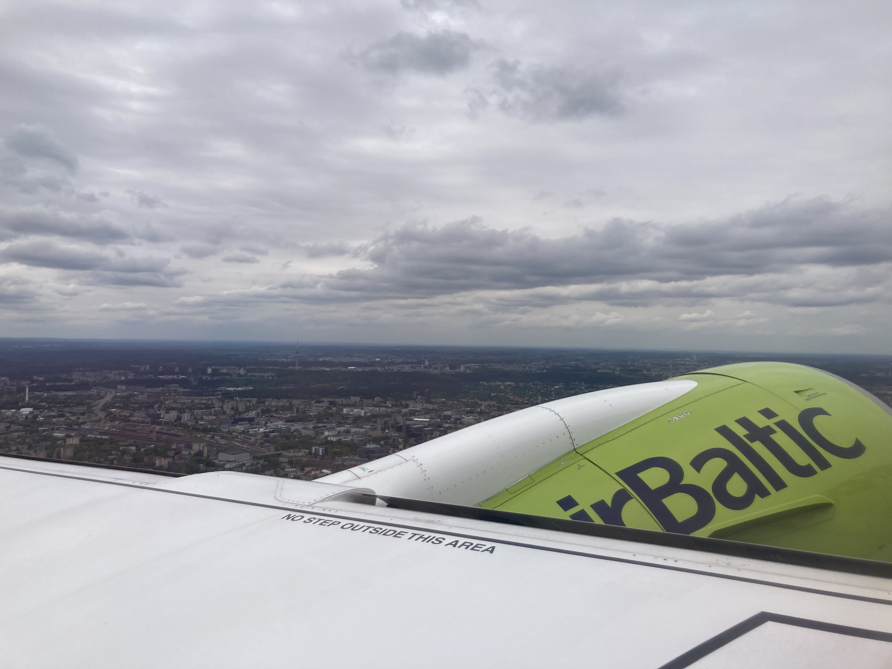

### 再見了，立陶宛的家，再見歐洲 (July 30 Wed.)

### 清菇菇與 Gintas 一直睡覺 (July 29 Tue.)

### 天文台與森林菇菇 (July 28 Mon.)

### 長征歸來的孩子們 (July 27 Sun.)
剪頭髮、去找 Gintas 的朋友

### 回家，Vilnius 的溫暖的家，與離家的孩子 (July 20 Sun.)

### 出發日

今年夏天和 National Geographic 國家地理頻道合作，將到立陶宛的 Zuvintas Biosphere 自然保留區和 Curonian Spit 庫爾斯國家公園，進行立陶宛鳥類錄音的計畫。這次的計畫包含了兩個國家公園、三十四台錄音機的架設，以及個別鳥類物種的聲音採集。

平時聽立陶宛先生聊他的國家；這個對台灣非常友善、同樣與大國為鄰的國家，不論在文化、歷史、飲食、節慶、民族性格等都獨樹一幟。這次的旅行書單，由游堯茹的《走進立陶宛的世界》開始，廣泛的認識立陶宛，之後由歷史的角度切入，包含張明珠的《波羅地海三小國史 - 獨立與自由的交響詩》、與波蘭作家亞當．密茨凱維奇的《塔杜施先生》長篇詩集，最後由提摩希．史奈德的《血色大地》，來看切切實實形塑立陶宛的血淚歷史。

當然還有必備的 Birds of Lithuania。

非常幸運的能有這個機會與國家地理頻道合作，以鳥類研究、鳥音採集的機會來認識這個令人好奇的國家，感謝立陶宛當地的 collaborator Tomas、Modestas、還有 Povilas。感謝立陶宛先生的家人們。感謝 National Geographic Early Career Grant 資助這項研究計劃，並大方地提供需要的研究設備。同時感謝 Birds Canada 提供 SongMini。

期待以鳥兒的聲音為媒介，細細聆聽所有立陶宛將訴說的故事。

PS. 候機櫃台 69 號。Derek 爺爺開著白色的電動新車送我到機場，這兩周的準備期間有著朦朧的感覺，聯絡立陶宛的家人、合作夥伴、安排錄音器材、德國的住宿、工作、還有活動時程。有一直忙到出門的感覺，出了門之後就可以放下一切。

### 只存活了 15 秒的 Tick

在 Zuvintas 做野外調查，儘管是到很原始的森林也不用像在加拿大一樣擔心大型野生動物，在這裡最大的哺乳類動物是 Elk (但他們的 Elk 指的比較像是北美的 Moose，需要再確認物種)，再來就是野豬、山貓、狐狸、野兔，還有很北美很相似的 Beaver 和 Otter。

有趣的是，對人體最危險的生物並不是超大型的哺乳類動物，而是小到超難觀察的Ticks (蜱，中文發音ㄆ一ˊ)。Ticks 是一種吸血的蛛型鋼節肢動物，體型大約像台灣的小黑蚊一樣。蜱蟲主要棲息在草地、樹林中，在數十公尺之外就可以藉由二氧化碳濃度的變化「嗅」到宿主的靠近，在宿主接觸到植披的時候攀附到衣物上，並找尋皮膚較薄，不易被搔動的部位進行吸食。

被吸血並不是主要的危險，而是吸血的過程中會將攜帶著的病毒送到人體內。最著名的大概就是萊姆病 (Lime disease)，還有很致命的埃里希氏體病 (Tick-borne encephalitis)，直接影響人的中樞神經系統。

在出發前我就已經知道 tick 的危險，如果事先打疫苗是可以減緩發病的機率，但是加拿大並沒有提供該 tick 相關的疫苗。所以只能在野外的時候以物理 (穿兩層褲子，並將暴露的皮膚減到最低) 和化學 (防昆蟲噴液) 防治。

不過，在出野外的第一天就被我發現手臂上的 tick，長得跟小黑蚊差不多大，

### 植披氣候帶

### Zuvintas 的演化

### Common Crane 的棲息地

600 多隻年輕的鶴，只會有一隻或是兩隻就比較有可能是 breeding 中的鶴

### White Stork 電線桿

### 開車在立陶宛

### Fieldwork completed in Zuvintas 

突然覺得這張照片裡面的我們好可愛。Arunas 與 Tomas，沒想到完成架設的這天會有這麼強大的滿足感，沒想到 fieldwork 也可以有這麼多 unpredicted situation，但最後也都能開心順利。

一開始在 Vilnius 崩潰，發現原來要在立陶宛買到 200+ 鋰電池是多麼困難的事情、上路之後才發現立陶宛的道路標誌怎麼這麼多不認識的、還有到樣區才發現原來當地也會有人偷研究設備 (但最後我們還藏到擔心自己找不到)! 因為語言的關係，一開始還在想他們是真的了解我想要做的事情嗎。

Arunas 就這樣帶著我走了兩天，一開始見面他就告訴我，他對聲音監測沒有興趣 (後來才知道原來 2023 年他們就設過錄音機想要找 Blue Throat，但當時沒有人會大量的分析資料，所以那時候收的資料都沒有人用，他覺得很可惜)。到後來，我介紹了他 BirdNET 讓他看了我過去用聲音做的有趣研究，他每到樣區都會熱情地跟我說故事，鳥的故事、他的故事、立陶宛的故事、Zuvintas 的故事。Tomas 就是很率直又好笑，最後竟然還問我，妳是真的可以付全額的住宿費嗎(笑)。

再滿足不過了! 好朋友們兩個月後見啦! 

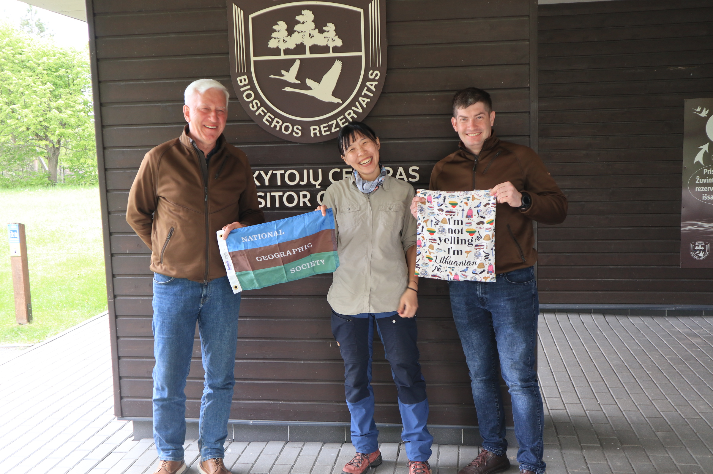

