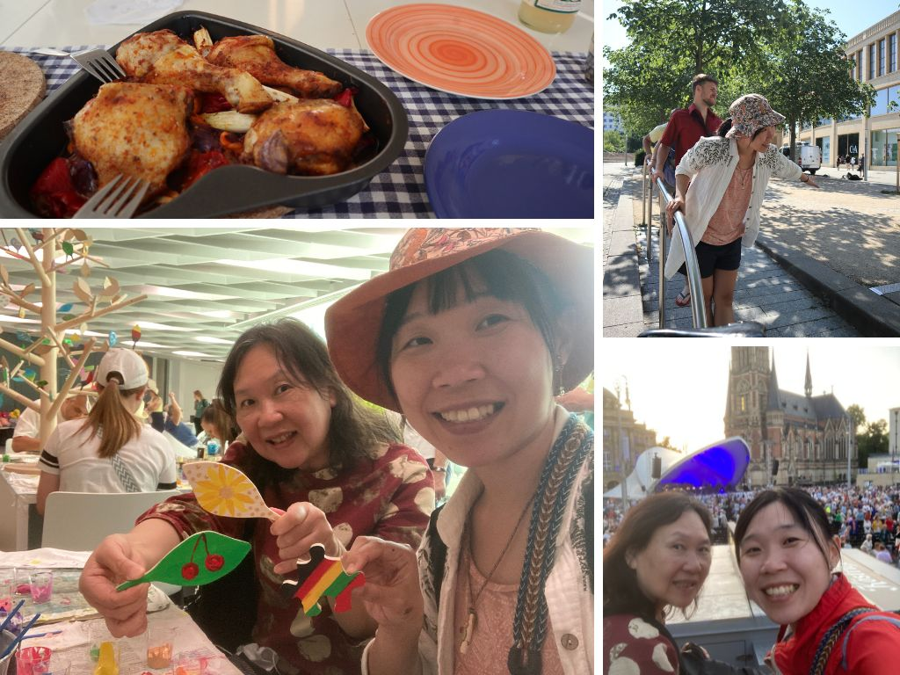
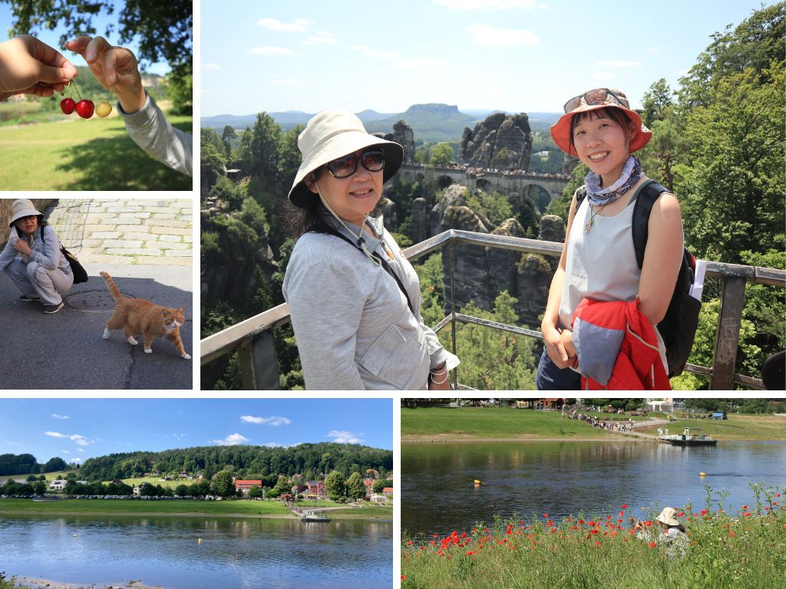
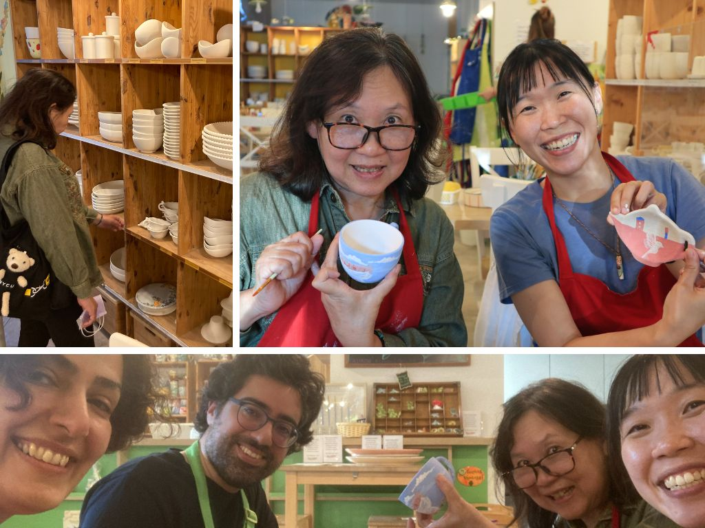
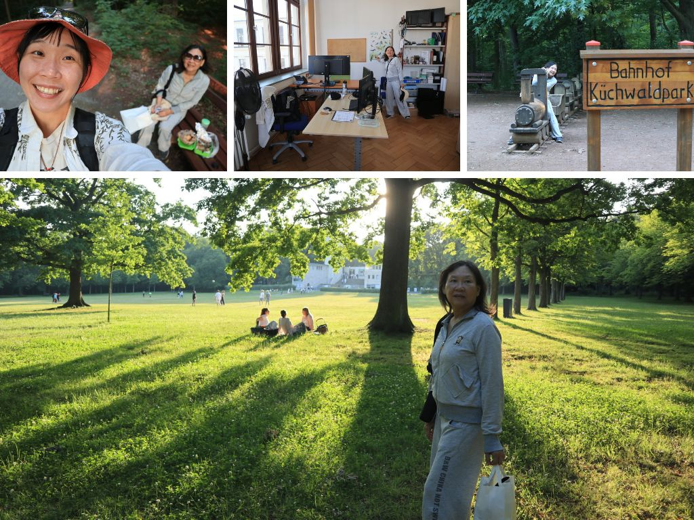
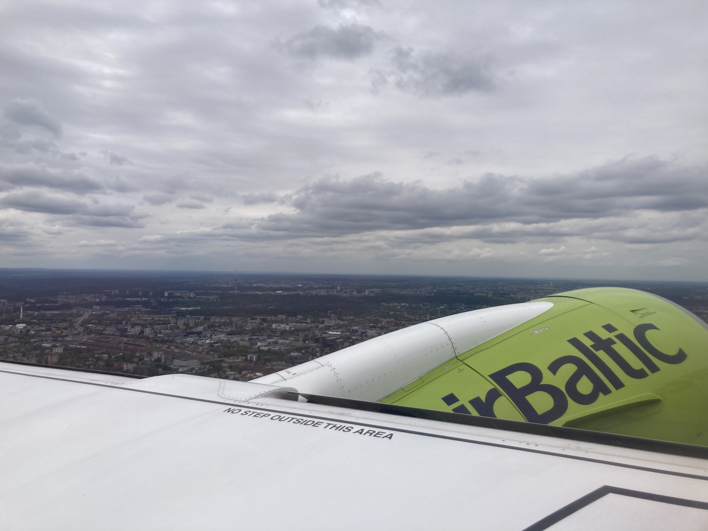
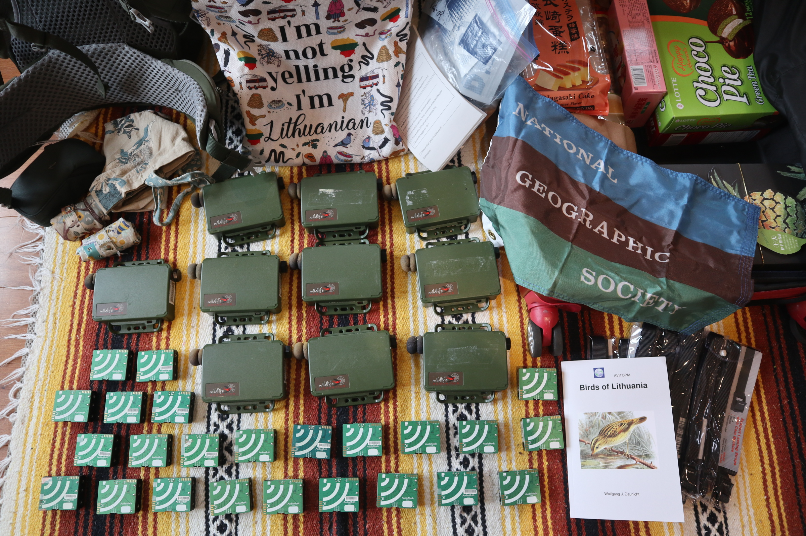
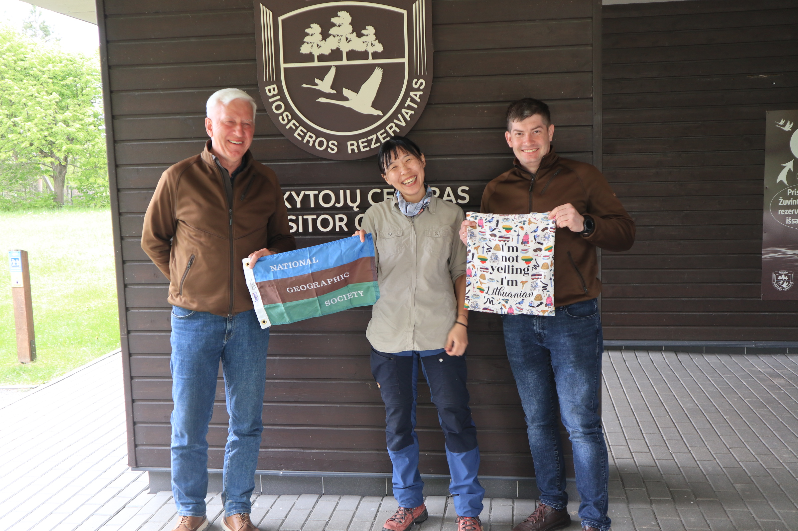

### 夏至，芭蕾舞畫畫與歌劇院 (June 21 Sat.)

夏至這一天，如預期的行程滿檔，在餐桌上放了好久的節目單，今天共有 Makers United 和 TANZ festival 兩個慶典要參加。話說過到這個星期，已經再也不能明白歐洲人到底要怎麼在夏天工作的，這麼多好玩的慶典與活動。每個周末都是滿滿的行程。

Berlin - Hut festival - Stuttgart - Leipzig/KOSMOS - Dresden/Makers United/TANZ/Prague - Stuttgart - Dublin

非常炎熱的一天，早上十點在 Rotor Tome 廣場有 TANZ 的芭蕾舞教學，和數百人共同在廣場上跳舞。接下來去逛隔壁的 Makers United，包含了許多傳統的手作元素 (繪畫、編織、裁縫、木工、拼圖、印刷、黏土、全像圖投影)，還有許多新興的科技 (3D 列印、機器人、虛擬實境、操作系統、遊戲設計)。其中一個很喜歡的遊戲是 3D 方塊，在立體的空間中要將木盒子放置在相對應的空間上，很挑戰合作與空間概念；還有一個是將所有人的繪畫作品拼成拼圖；棕梠葉的編織作品。最後晚上再去 Theater Plaza 以完美的歌劇作為結尾。每每的夏至、好睡的一晚。

### Saxon Switzerland National Park，一路叮叮叮的行程 (June 20 Fri.)

昨天剛和 Stefan 還有 Felix 開完會，太累太心寒，程式開發這種事情就是沒有完美、沒有做完的一天，真的開完會後讓我下定決心，與其再花一天的時間好好 polish functions 不如把握機會和媽媽去爬山! 

話說有點難過，媽媽的德國之旅就這樣地到了一半了，沒想到時間過得這麼快...下次能和媽媽這樣住在一起旅行，不知道會是甚麼時候了呢。

這趟跟媽媽一起出去非常的快樂!!我們兩個都沒去過 Dresden 的 Saxon Switzerland National Park，是到路上了才在認真查到底要怎麼去，竟然還是在要搭 S1 的路上才了解原來是個 O 行路線。媽媽很認真的做了午餐、早上七點半出門。排隊排到昏頭、真的有覺得媽媽的體力很不錯，這樣爬也不會累，但看到媽媽爬山突然有點小難過，好希望媽媽的體力可以一直都這麼好、一直開心樂觀。

回程還有河邊的櫻桃吃到飽!!回到 Chemnitz 時還看到了免費個歌劇彩排，是有沒有這麼幸福，我跟嬤嬤說，我們真的是一路叮叮叮賺到!!

### 陶藝班 with Maha & Payun (June 19 Thur.)

從剛到辦公室認識 Maha 之後，就一直有約要去陶藝工作室，就在一個月過後(!?) 終於約成功啦! 非常漂亮乾淨的場地，有基本的盤子、杯子、還有更進階的動物、蛋架。我最後選了一個茶包架盤，媽媽選了一個咖啡杯。

媽媽好勇敢我則是甚麼都小心翼翼的。真的太小心畫了反而是甚麼都畫不成功。一直看周圍的人，我是到這時才意識到我已經好久好久沒有畫畫了。真的很需要大膽的畫，再去體驗一下那種畫錯了也沒有關係的感受。

當天竟然還後悔到作惡夢，一直在想下次去還可以畫甚麼，是有沒有這麼想要證明自己 XDD 但至少可以留給媽媽一個漂亮的紀念品，感到非常開心!

### 大大片的草皮與媽媽的天才晚餐 (June 18 Wed.)

可以這樣每天下班後跟媽媽一起度過有好長陽光的傍晚，真的很幸福。

跟加拿大的兩個 ARU 研究生開會開到六點，直接跟媽媽約了要去學校後面的大片森林散步，天才媽媽說"我來準備晚餐"，當媽媽這樣說的時候，就會有最棒的晚餐出現!! 茄子與肉還有馬鈴薯。好吃!

### 學校後面的貓頭鷹 (June 17 Tue.)

生吃小雞

### 游泳日與、一起下廚 (June 16 Mon.)

沒有很標準的 beet root soup。超級無敵重，好多馬鈴薯。

### 在音樂節的印刷攤位上，學會後悔 (June 15 Sun.)

跟 Max 一起去音樂節，遇到了這個 Green Peace 印刷的攤位

### Stella & Derek 在 Leipzig (June 14 Sat.)

媽媽到達的第四天我們在早餐就大吵一架，誰都不理誰。她就說為什麼我一直念一直念。媽媽有一直嘗試找我講話但我都無法。

一直到見到 Stella & Derek 才又被溫暖了起來。Derek 說，就算媽媽真的都每天早上六點起床煮飯，也要好好地跟他說~

### 鈺婷來啦 - 早到的桌球 Kosmos 音樂節 (June 12 Thur.)

第二次攀岩!!!

### 市中心廣場散步 (June 11 Wed.)

回家第一餐是媽媽煮的義大利麵(炒青菜加上蘑菇和羊肉)，非常好吃!!從今天開始再也沒有下廚了哈!

### 媽媽來了，搭了十個小時的火車才到家 (June 10 Tue.)

簡單的晚餐、火車上的興奮

隔天早上五點叫我起床!? 說已經 11 點啦!

### 生日在 Stuttgart (June 9 Mon.)

birthday morning with rubab cake and tree cake- lunch with dad - afternoon coffee with mom - backyard exploration massage evening (Monday)

### Stuttgart 長周末 (June 5 Thur.)

過了一周一個人的幽幽閒閒的生活，上個周末好不容易將生活打理好，這周就要出遠門，到 Stuttgart 找 Philippa 和 Felicitas! 剛剛好遇到德國的第二個長周末!

搭了好久的車、轉車、三分鐘、還好的 Doner。

後山坡的廢墟、隻隻作響的床、
Gemestic (Friday), 

planting - coffee in the garden - sweet - cook the beet root soup (Saturday)

raining in the morning - wine festival - tennis team and Bea - massage evening (Sunday)

### Chemnitz 學校運動會 (June 2 Wed.)

再度跟台灣人一起行動參加運動會，總共有 11 個關卡，要積分。有室內活動像是穿布袋跳躍、平衡腳踏車、矇眼足球；室外的有真人手足 (好玩)、高爾夫球、平衡木走路、橄欖球、沙灘跑步、丟飛盤、平板式棒球、丟籃球。

結果我到橄欖球整個不想動

打棒球的時候被嫌棄反應慢 (!?)

為什麼沒有桌球。薇恩說她以前是短跑校隊的!

### 在德國的第一次攀岩 (June 3 Tue.)

約到 Max, Josef, Raja 一起去攀岩場小試身手，超級高的屋頂還有超級不可置信的確保機制

### 藝術小鎮、與暴雨中結束的嘉年華 (June 1 Sun.)

昨天晚上一如往常的，猶豫不決的症頭讓我花了大概一個小時坐在電腦前，決定明天要做甚麼，結果還是把決定丟給明天早上的心情 XD 早上去了小鎮的另一間咖啡廳工作(就是不甘願只待在家工作)，在市中心，稍微貴了一些，Chai Latte 也沒有特別之處。

會留在 Chamnitz 就是為了這個超好玩的 Hut festival! 結果果然不失所望 (大心)，小小的市中心放了八個表演舞台，每半個小時會有一組表演者來表演，音樂種類的有雙人樂團、多人樂團、唱歌、舞蹈、街頭打擊音樂；雜技性質的有體操、彈簧床雜耍、火舞、魔術、皮偶戲等等。除了表演之外還有少不了的攤販，不論是小吃或是文創商品，都有極高的多樣性!! 不論是宣傳、指引、動線規劃、跟攤販安排都非常之專業! 這個嘉年華邀請到的表演者都是 PRO 等級的!

最後一個表演看的是 Trampoline Show by ARAMELO，看了兩次了還是覺得天啊也太厲害!!整個表情、動作、跟熟練度都不是蓋的! 最後大會突然廣播因為發布了 weather warning 所有活動結束，請觀眾馬上離場 (我本來還嚇到，想說是發生甚麼事了)。不到十分鐘內就起大風 (桌椅都被吹翻、玻璃杯碎一地)，還有星球的裝置藝術也差點飛走；大風完直接暴雨就來，又因為交通堵塞的原因 2 號電車一直不來，我跟兩位奶奶在暴雨中相依為命。最後還是平安到家，結束這一生一次體驗的 hut festival。

### Chemnitz Hat festival (May 31 Sat.)

有幸到達 Chemnitz 的第二個周末就是長周末! 連續四天的連假，剛好遇上 Hat festival。

第一天在家好好的休息，花了一整個早上睡覺(?)然後終於有時間把家裡好好地整頓一下，洗了幾趟衣服、丟垃圾、整理環境掃地拖地再把客廳好好打理一番，來了一周了終於可以把行李箱放走，好好整理認識家裡後心裡非常踏實。下午再去市中心旁邊的火車森林走了一回，很可愛的都會公園。

第二天去 Freiberg 的咖啡廳工作 (一直想來這個小鎮很久了)，有個很可愛的舊城區還有老舊的圍牆。非常舒適的咖啡廳，有插座、網路、還有無限的座位。下午回到 Chemnitz 再跟薇恩還有博約一起逛逛 hat festival，那個氣氛之好!! 還有找到一位台灣的火舞表演者，到最後還高舉台灣國旗，是有沒有這麼感動。

第三天在家稍微工作，之後一樣還是去了台灣人的野餐烤肉聚會，這個聚會就沒有前幾天的那麼順心，這次大約有 12 個台灣人，覺得平均年齡都太年輕了(年紀已老)，很多話題都搭不上來，也沒有共同的興趣，一起待了一個下午，就匆匆回家休息。

最後一天，明天再說哈哈，但是應該是要好好工作的，想要去其他城市看看。

### 連假前火鍋小聚 (May 28 Wed.)

才剛來到德國一周，就遇到少有的假期 Ascension Day (聽說德國一年只有 11 個國定假日)，也有人說是父親節。但其實當地人都不太在意，只知道是放假就大家開開心心的聚了一個晚上。跟這裡的台灣人一起吃吃火鍋、唱唱歌、還有聊聊德國當地的政治，真的好久沒有這麼放鬆有趣的飯局。非常的開心。

小鎮的生活很愜意，大家都住在步行可以到達的距離，讓我想念起集集的生活，那個也是走走路就可以到所有人的家的時光。

PS. 今天雨超大又超冷，到達博約家的時候整個人都濕了。

### 小鎮躲避球大賽 (May 27 Tue.)

因為 Stefan 的介紹而認識了博約，之後接連的認識了一群台灣人，之後又在莫名的躲避球六缺一加入了躲避球大賽!! 小鎮生活就是可以這麼有趣哈哈哈!! 

那個心跳加快的感覺好久沒體驗，而且在德國的躲避球規則不一樣，一次有六顆球在場上，看到眼花撩亂 XDD 又害怕又愛玩，在場邊看超刺激的隊伍打都覺得非常的過癮，自己在場上就超抖，那個六顆球同時飛行的刺激真的太難得。

### 台灣人在柏林、與冷戰的三千人地下避難所 (May 25 Sun.)

第二天和 Tammy 還有 Shu (書紋) 參加了一個 walking tour，冷戰時期的柏林有許多地下 bunker，大多是從二戰時期沿用改進而來，只是冷戰時期的防禦主要變成針對核武，像是 Air lock 等等就是針對帶有輻射污染的灰塵，過濾的空氣、沖洗系統還有加厚的水泥牆等等。

我們參觀的第二個 bunker ，是比較新的計畫，而且竟然就是在一個 S bahn 車站裡面! 真的太誇張，有點像是在台北捷運站某站，打開某道密門之後突然出現了一整個防空洞，可以容納三千人之多 (但只有 0.8 的柏林人口)，有床、廚房、醫護室、還有為了防止互相傷害的考量，所以廚房裡沒有刀叉，只有湯匙。防空洞可以維持可居住狀態，兩周的時間。

我們都說，如果到時候真的到了這樣災難性的時刻，我們都寧願成為先離開的那些人，畢竟那種時刻，可能活著才是折磨。

這趟短短的柏林之旅，覺得又多認識了鈺婷一些，每次聊天都有新的認識，還有新認識了書紋，覺得好幸福。

### 進城尋水大戰 (May 24 Sat.)

說起來其實有點好笑，本來在德國的第一周要邀鈺婷來小鎮玩耍，殊不知，我們家竟然停水了! 從上周三就開始斷斷續續，一開始是沒熱水 (本來還以為是我暖氣開太強)，這個還行，就燒個熱水還是可以洗澡；沒想到隔天直接變成冷熱水都沒有。只好馬上打電話給 Tammy (人家還正在包粽子)，改成我周末到她在柏林的家 (一直跟人家改來改去也真的是很不好意思)。

出發前終於取得 Deutschlandticket，一路搭車都搭的非常的順心。到了柏林先去逛了東德博物館，在博物館島走走晃晃、吃了咖哩香腸、再去布蘭登堡門、猶太紀念碑、柏林圍牆、還有超級超級好吃的德國豬腳 (Domke Nino Fleischerei)，是間肉舖!!!

- 小朋友學算術的時候，都會有戰爭的例子，像是士兵的數量、手榴彈的數量、砲彈的速度、角度等等。

- 當年的柏林圍牆擋的不只是人、還有民主的自由。許多人不擇手段的，不論是地下通道、熱氣球、利用體育或特殊身分取得特權，就是想要到西邊的生活。

- 蘇聯的統治就如在各地一樣，利用階級清洗來壓制社會上的多元想法，許多牢房強迫政治犯認罪，也有許多遣送西伯利亞的刑責。

- 蘇聯大量開發工業，使得當時的東德空氣污染極其嚴重，像是 Chemnitz 當地的煙囪就是當時燃煤的重要地點。

### 全世界最漂亮的游泳池 (May 23 Fri.)

週四生理期來，本來想要去游泳的計畫只好暫停到週五，繼週三認識 Stefan，週四有認識了另一位和藹的伊朗人 Maha，她有令人安心的媽媽氣息，馬上就約好兩周後要一起去做陶土工藝(笑)。

雖然剛剛好是生理期的當下，還是忍不住地想要去拜訪這裡的泳池，一身精力需要好好的消耗。果然不讓人失望的，這個歐洲泳池立馬登上目前拜訪過最喜歡的泳池!! 入場只需要 3 歐元，剛進去的時候會拿到一個類似手表的感應器，感應器可以進到更衣室、使用置物櫃，這裡的場地乾溼分明，更衣室過後會有淋浴間，再來就是泳池本人。換洗衣物、毛巾、拖鞋還有淋浴要用到的東西都可以帶進泳池。泳池裡面沒有甚麼氯的味道，而且最重要的是超級乾淨又很少人!

這個真的是太豪華了，有種在羅馬浴場游泳的古代感，百年前建造的泳池，是目前在小鎮最喜歡的地方。

### 上工 - 全世界的 BirdNET 就靠這個房間了 (May 21 Wed.)

來到辦公室的週三，遇到了負責開發 python package 的 Stefan。話說，我目前遇到的所有 BirdNET 成員，Max、Raja、Thomas、Stefan，這幾個人都超好笑的!做 computer science 的是有沒有這麼幽默。

他也是個即將畢業的 PhD，笑起來很爽朗，是整間房間會隨之振動的大笑。我們一起午餐，才發現原來午餐旁邊的小房間放的就是 BirdNET 的主機，吹著冷氣的黑色主機們每個都有自己的名字，像是 Blue Jay、Eagle、Swan，還有 Cardinal 等等。這裡的電腦比我想像的還要小，房間也沒有我想像的黑暗與神秘，看起來就像是鐵櫃裡的電腦主機們。我的想像力都被電影的畫面取代了。

我注意到有台電腦有兩個貼紙。

"為什麼只有這台有兩個名字?" 我問。

"阿，Nicht berühren 是不要碰的意思" 全場大笑。

PS. 沒有拍到小房間的照片，這個房間是大家開會跟午餐的地方，小房間就在旁邊。在這間房間的時光裡，有好多都是全場男生，只有我一個女生；或是全場德文，只有我一個聽不懂。

### Tour of Chemnitz - 狗狗冰淇淋與 Capital of culture (May 20 Tue.)

短暫征服了稍嫌髒亂的新窩，好好的睡了一覺，隔天早上十點 Max 約了在樓下接我。突然有種莫名的溫馨感，一年前在 conference 上見面的夥伴，現在竟然就在他的地盤成為工作夥伴。他帶我一起搭 TRAM、走到 TU 的辦公室。他一路上跟我介紹怎麼搭車、怎麼買食物、怎麼拿到鑰匙。

到了辦公室之後，他指了指我的座位，竟然是跟 Stefan 坐在同個辦公室嗎，整個有靠近偶像之後小鹿亂撞的興奮。我們在雜亂的辦公室裡清空了一張桌面、搬了兩台螢幕接上 docking station。不到幾小時就是有聲有色的 working station 了。中途去開了一場全德文的會議，讓我心想... what did I sign up for. 

下午四點左右 Raja 和 Nala 來辦公室，和 Max 四個人一起逛了 Chemnitz 市中心一圈，小小的市中心，有歌劇廣場、紅塔、燃煤煙囪、城堡湖、還有市政大樓，他們說 Chamnitz 差不多就是這樣了。湖邊的冰淇淋，一人一支，狗狗沒有，開心果冰淇淋滴在右腳的小白鞋，開始記錄在德國的日子們。

PS. 不得不說 Max 真的是個很大喇喇地男孩，會粗心大意 (像是之前的 pick up by train、帶路的時候都帶我走側門之類的)，但總是誠意十足。

### 空降德國小鎮 - we will pick you up (May 19 Mon.)

從 Vilnius 到 Chemnitz 的當天戲劇性十足。前一晚 Ausra 就說好了早上要做 Cottage cheese bun 然後中午來烤 cat fish 跟蕎麥，說是要送行前都要把孩子們餵的飽飽的。她說 "It is really nice to have a kid at home." 我笑著，其實很幸福呢，能被當成孩子一樣照顧著。

然後就停電了。

Ausra 算準十二點要出門，九點半就已經開始切馬鈴薯、烤魚，沒想到一年一次的停電就這樣被我遇到，真的是太好笑了，剛來立陶宛的時候就停電，要離開的時候再停。好巧不巧的，剛剛好 11:45 電又來，"At least the fish?" 她閃爍著雙眼，好像是媽媽有了電、有了廚房，就像有了魔法師的超能力。最後的場景是我忙著吃魚、Rimas 忙著幫我搬行李到車上 (苦笑)。

從立陶宛到達德國一路順暢，降落霧茫茫柏林，最後要到車站前半小時，才發現 Max 和 Raja 說要來車站接我，指的是要一起搭大眾交通運輸工具，最後還是請 Tama 開了大車來(超級幸運的剛剛好)，而因為車載著一道門(真的門)，所以又馬上跟兩人到別。

兩個人氣喘吁吁的搬著行李箱到了五樓 (真的幸好有 Tama 一起)，有點髒亂的床，但也是安心的睡了。

### 出發日

今年夏天和 National Geographic 國家地理頻道合作，將到立陶宛的 Zuvintas Biosphere 自然保留區和 Curonian Spit 庫爾斯國家公園，進行立陶宛鳥類錄音的計畫。這次的計畫包含了兩個國家公園、三十四台錄音機的架設，以及個別鳥類物種的聲音採集。

平時聽立陶宛先生聊他的國家；這個對台灣非常友善、同樣與大國為鄰的國家，不論在文化、歷史、飲食、節慶、民族性格等都獨樹一幟。這次的旅行書單，由游堯茹的《走進立陶宛的世界》開始，廣泛的認識立陶宛，之後由歷史的角度切入，包含張明珠的《波羅地海三小國史 - 獨立與自由的交響詩》、與波蘭作家亞當．密茨凱維奇的《塔杜施先生》長篇詩集，最後由提摩希．史奈德的《血色大地》，來看切切實實形塑立陶宛的血淚歷史。

當然還有必備的 Birds of Lithuania。

非常幸運的能有這個機會與國家地理頻道合作，以鳥類研究、鳥音採集的機會來認識這個令人好奇的國家，感謝立陶宛當地的 collaborator Tomas、Modestas、還有 Povilas。感謝立陶宛先生的家人們。感謝 National Geographic Early Career Grant 資助這項研究計劃，並大方地提供需要的研究設備。同時感謝 Birds Canada 提供 SongMini。

期待以鳥兒的聲音為媒介，細細聆聽所有立陶宛將訴說的故事。

PS. 候機櫃台 69 號。Derek 爺爺開著白色的電動新車送我到機場，這兩周的準備期間有著朦朧的感覺，聯絡立陶宛的家人、合作夥伴、安排錄音器材、德國的住宿、工作、還有活動時程。有一直忙到出門的感覺，出了門之後就可以放下一切。

### 只存活了 15 秒的 Tick

在 Zuvintas 做野外調查，儘管是到很原始的森林也不用像在加拿大一樣擔心大型野生動物，在這裡最大的哺乳類動物是 Elk (但他們的 Elk 指的比較像是北美的 Moose，需要再確認物種)，再來就是野豬、山貓、狐狸、野兔，還有很北美很相似的 Beaver 和 Otter。

有趣的是，對人體最危險的生物並不是超大型的哺乳類動物，而是小到超難觀察的Ticks (蜱，中文發音ㄆ一ˊ)。Ticks 是一種吸血的蛛型鋼節肢動物，體型大約像台灣的小黑蚊一樣。蜱蟲主要棲息在草地、樹林中，在數十公尺之外就可以藉由二氧化碳濃度的變化「嗅」到宿主的靠近，在宿主接觸到植披的時候攀附到衣物上，並找尋皮膚較薄，不易被搔動的部位進行吸食。

被吸血並不是主要的危險，而是吸血的過程中會將攜帶著的病毒送到人體內。最著名的大概就是萊姆病 (Lime disease)，還有很致命的埃里希氏體病 (Tick-borne encephalitis)，直接影響人的中樞神經系統。

在出發前我就已經知道 tick 的危險，如果事先打疫苗是可以減緩發病的機率，但是加拿大並沒有提供該 tick 相關的疫苗。所以只能在野外的時候以物理 (穿兩層褲子，並將暴露的皮膚減到最低) 和化學 (防昆蟲噴液) 防治。

不過，在出野外的第一天就被我發現手臂上的 tick，長得跟小黑蚊差不多大，

### 植披氣候帶

### Zuvintas 的演化

### Common Crane 的棲息地

600 多隻年輕的鶴，只會有一隻或是兩隻就比較有可能是 breeding 中的鶴

### White Stork 電線桿

### 開車在立陶宛

### Fieldwork completed in Zuvintas 

突然覺得這張照片裡面的我們好可愛。Arunas 與 Tomas，沒想到完成架設的這天會有這麼強大的滿足感，沒想到 fieldwork 也可以有這麼多 unpredicted situation，但最後也都能開心順利。

一開始在 Vilnius 崩潰，發現原來要在立陶宛買到 200+ 鋰電池是多麼困難的事情、上路之後才發現立陶宛的道路標誌怎麼這麼多不認識的、還有到樣區才發現原來當地也會有人偷研究設備 (但最後我們還藏到擔心自己找不到)! 因為語言的關係，一開始還在想他們是真的了解我想要做的事情嗎。

Arunas 就這樣帶著我走了兩天，一開始見面他就告訴我，他對聲音監測沒有興趣 (後來才知道原來 2023 年他們就設過錄音機想要找 Blue Throat，但當時沒有人會大量的分析資料，所以那時候收的資料都沒有人用，他覺得很可惜)。到後來，我介紹了他 BirdNET 讓他看了我過去用聲音做的有趣研究，他每到樣區都會熱情地跟我說故事，鳥的故事、他的故事、立陶宛的故事、Zuvintas 的故事。Tomas 就是很率直又好笑，最後竟然還問我，妳是真的可以付全額的住宿費嗎(笑)。

再滿足不過了! 好朋友們兩個月後見啦! 

