### I 出發之前

從歐洲落地溫哥華，7/31 到 8/11 總共有十天的時間可以準備工作坊、演講、跟一個攤位的從無到有。整個十天都把自己關在家裡認真衝刺(還有曉萌來家裡一起吃 borscht 晚餐和分享 Karums，撫慰我思念歐洲的心情)。短短的幾天內就見了 Stella、Derek、Peter、曉萌，當然還有 Gintas 晚一天班機隔天就重感冒的陪伴(我一直害怕會被傳染，現在這個重要關頭真的不能生病啊!)

特別是訂購 Amazon 還有影印卡片這些特別需要考慮時間的任務，必須要好好仔細安排而且不能要求完美，夠好了就要出去印了。

這幾天成為 Tai Basil 的 lunch special 常客。因為之後還要讓別人來家裡住，所以也不敢把東西四散，整個都在緊張的狀態，創造力大爆發。

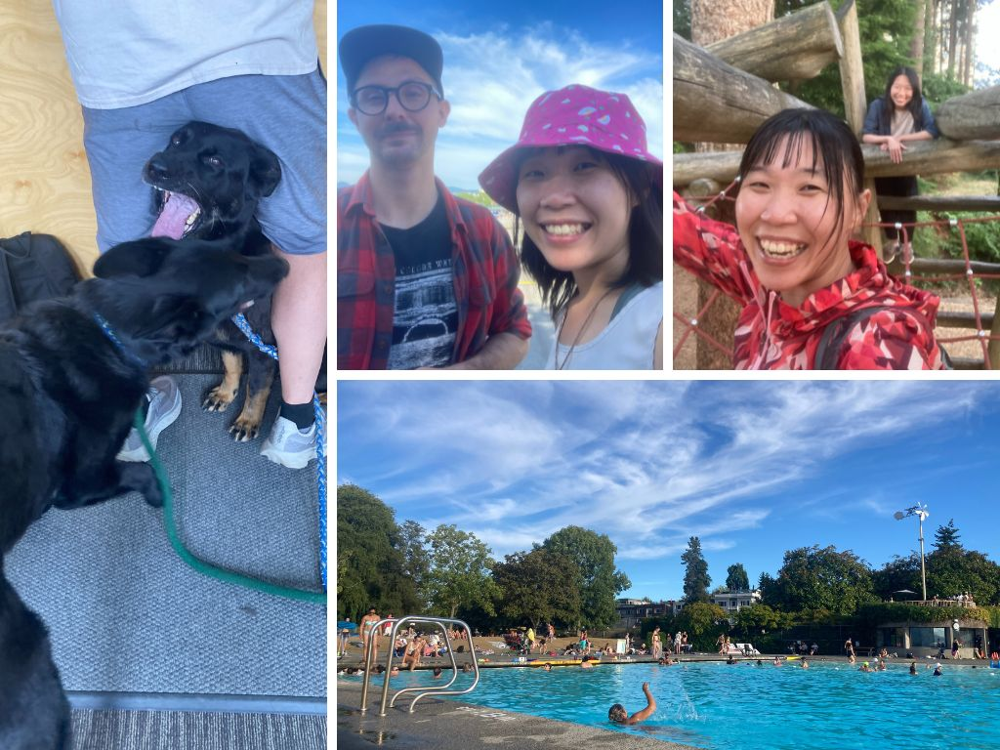

### II 小攤位的構想

真的是不到臨頭不會開始準備。回來第二天見面約了曉萌，問到"所以那個 art booth 想得如何了"，我整個無法解釋 (笑)，太多想法太多版本以及可能性了! 最後決定直接動手做了，發現許多用語言無法解釋的感覺，反而以互動更能夠直接體現感受到。同時還要考慮到我人不會有太多時間在攤位上，所以要是可以自己存活、自己呼吸、自己解釋自己的攤位(大笑)。

測量好攤位的尺寸，在客廳鋪上地毯，決定要展出三個部分:

1. Artwork demonstration: 總共會展出過去的素描、壓克力水彩、還有 infographic 的作品(比較大，在視覺上會很有吸引力)。需要有架卡片的架子。

2. Photo wall: 在桌子後面架了一片 poster board，在上面放從 2017 到 2025 的 Birdn Journey，每年選 7 到 8 張照片，並在每張照片下寫 1 ~ 2 句故事。用麻繩、木夾以及圖釘固定。聯絡了 Mercy 與 Kirsty 幫忙借到了一面 poster board。

3. Spinning wheel for your story: 這個 idea 是 Gintas 想到的!! 用轉輪的方式選出主題，寫下故事後留在攤位上跟大家分享，本來想到的版本像是交換故事啊、指定故事啊，後來都覺得太麻煩了哈哈哈! 而且到最後一刻才決定了，用回復故事的方式將每個創作和故事結合在一起，覺得非常完美的結合耶! 需要的設備有小轉輪、漂亮的紙跟筆、還有展示用的麻繩跟木夾。

4. General decoration: 個人名片、名片架、還有 package 的貼紙、然後是深藍色毯子、桌墊、跟藍藍的餐墊當裝飾

出發 Saskatoon 前，當地政府發布了 Air Quality warning，說是 High risk，戴上了很多 N95 口罩。那個行李完美的飽滿，能順利裝進所有物品也是令人驚艷。

.jpg>)

### III The land of living sky

到達 Saskatoon 當天煙霧漸散，驅車從機場到 USask 的路上有點忐忑。畢竟是第三次來到這個地方，第一次和笑語跟麗貞有完美的冬季回憶，然而第二次卻是讓我很想要忘記的、複雜的經驗。但是不變的是 Saskatoon 的美麗!

那個天空也太美了吧!在車上看著天空，就想到了好像有這個說法，說 Saskatoon is "the land of living sky"。司機點點頭，說沒錯。校園裡的一切也是好熟悉，地鼠的尖叫、喜鵲到處飛，還有綠地以及溫暖的陽光，熟悉(又讓人一直迷路的)地下通道。

.jpg>)

### IV Swag preparation

到達的第一天、見到的第一個人就是 Hannah (大心)! 我們一起去了幫紀念品裝箱的 volunteer shift (話說我一半故意的忘記 sign up，只能任人擺佈的被分配工作 XD)。看到自己親手設計的 bag、utensil、cup、還有 tshirt & buff 的瞬間，覺得也太美了吧!!! (尖叫)

尤其是那個 t-shirt 的底色根本是完美的呈現啊! 超乎我預期的，Navy blue 比 Indigo blue 的底色還更適合淺色的印刷，而且品質其實還不錯耶! 幸好有拿到樣本時候的無限挑剔! 這次安排 merch 的任務大成功!

.jpg>)

### V BirdNET workshop

這次會議的重頭戲!!當初興致高昂地邀了 Jenn 一起辦了 BirdNET 的 workshop，兩個人都是臨時抱佛腳類型，到了最後關頭都還在一起趕工，出發前幾天的 zoom call 基本上都是"我還沒準備好耶，妳呢?" 兩個人都非常的歡愉和靈機應變啊 XD (應該是我比較緊張)，

在12號 (工作坊前一天) 我和 Jenn 還有 Jorden 空下了一整天一起到圖書館練習，還找了機會一起到河邊走走、看到 White Pelican。到了下午再和 Jenn 一起去了 SCO-SOC council gathering，見了好多網友。

但最後成果極佳! 從 Introduction 開始，到 GUI & Raven，最後是 BirdNET in R。好幸運的 Jenn 願意幫忙一間扛下 GUI & Raven 讓我輕鬆了超級多，而且可以好好地專心在 BirdNET in R 的部分!! 真的是太感謝了! 教學的時候、很順暢的時候真的會成就感極高，但我好像在 R 的部分丟掉了太多人了(掩面)，最後還是以溫馨收場阿。

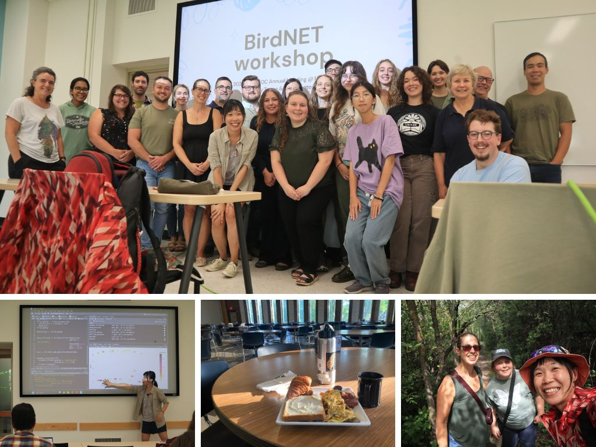

### VI Art booth 跟到處都是自己的設計

工作坊之後的下午，整個空下來就為了裝置 art booth! 太興奮了!! 回到宿舍稍作休息、打包好之後，再度前往會場，結果一路上都有印的好漂亮的 logo 來引領道路，是有沒有這麼感動ㄚㄚㄚ (泣) 這應該是我的設計事業最高峰了吧!

和 Mercy 一起扛了 poster board 到會場，自己選了一個最喜歡的位置，廠商附的桌布被我拿來當布置 (就是堅持要用自己的桌布) Mercy 說，這樣的話大家都是黑色的只有妳是藍的(笑) XD 發現光是在布置自己的 booth，本身就是一種藝術創作、即興發揮。四處走動以各個角度觀看、感受、思考。

就跟在畫畫的時候一樣，其實創作花最多時間的是盯著自己的作品好好的感受。好難形容的美妙感覺，邊感受、邊讓作品慢慢地成形。Hannah 在百忙之中還來幫我架設，真的好感人嗚嗚，她剛做完 6 個小時的標本累倒不行 XD

.jpg>)

### VII 像颱風天的 bird walk & 生物聲學 seminar

除了被 sign up 到 swag arrangment 之外，還有 early bird walk! 我還是被 Hannah 提醒才知道的，好不想被提醒阿 XD 不過因為有 Steffi、Hannah 不論如何都要到場。

一早七點集合好想睡阿，而且我前一天 opening reception 才跟好多人講話整個失聲，重點是一早才 12 度，我一點保暖衣物都沒有，最後是跟 Jenn 借了長褲；跟 Steffi 借了毛衣 XD 真的是太好笑了吧! 當天的 bird walk 真的很像颱風天! 風好大好冷，但我在那裏感覺到很清爽，

堅決地吃了早餐、回宿舍洗澡把自己變漂亮一些後，再去給了一場 Seminar talk，整天都按照預設值的待在 bioacoustic symposium，真的很爽快耶!覺得最有趣的 talk 都在下半場，包含 individual identification 要多參照 ARU 的資料、song types、還有 song type pattern。

Barbara Frei 提到了為什麼聲音的特徵值對 performance 不會有影響；另一個人問到了 training data 的影響。讓我很想要跟 Jenn 合作寫一篇 paper，講 training data 對同種物種，因為不同的 training data 而有不同區域的表現差異。

.jpg>)

### VIII 大合照

我是負責照相的，所以相片裡找不到我滴! (攝於第二天的 keynote 之後)

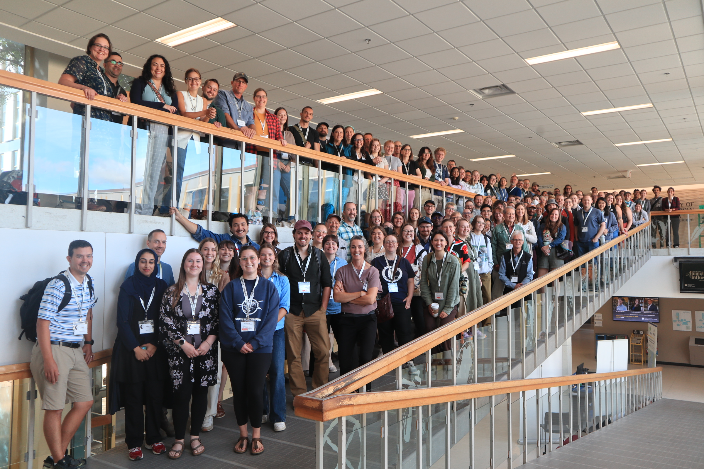

### IX 終於有自己的時間可以慢慢聽演講跟顧攤位惹

不知不覺的就到了正式開會的第二天，前幾天都在奔波，行程滿滿滿，直到今天終於有機會可以自己選自己想要聽的主題、到處跑跳去聽別人的分享! 

Catie - how migration bird take oxygen when they are travelling high in altitude and with low air pressure

Christy - conservation of grassland bird

Karen - snowy owl migration

Steffi - practical tips for open science in ornithology

在攤位的時間也遇到了好多來拜訪故事集的人們，像是 Kara，聽到她提到她和她的 supervisor 的故事的時候，都能感覺到她的眼眶泛淚。阿，很感人阿...看到這麼多故事被寫下來，我也覺得好感動。已經聽到好多人說，妳的作品好漂亮。

-1.jpg>)

### X Join SCO-SOC council 

今年的大是真的數不完，其中很振奮人心的，大概就是加入了 SCO-SOC 的 council 了! 雖然還不知道加入 council 之後確切的任務為和，但是能被選入加拿大鳥會裡的 council 感覺還是很不可思議。一年以來跟這群人一起工作、在這場會議中擔任了小小的鏍絲釘，成就感十足呢。

.jpg>)

### XI 故事的回覆

擺攤的一大任務，就是要回覆溫暖的故事們。剛剛讀到以前的筆記"開會已經很累了，主辦單位永遠有辦法讓你更累"，這次就是自己讓自己累的吧!

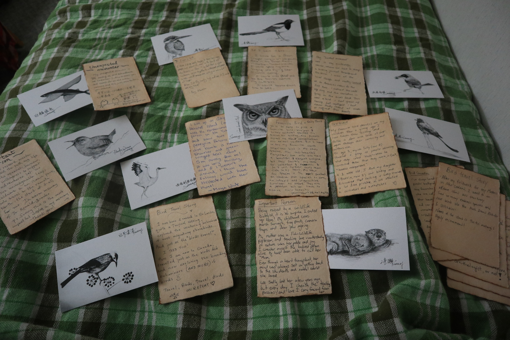

### XIII Chaplin lake field trip 還有 Christy 也太溫馨了吧

Christy 在開會完的最後一天，帶著一群人到 Chaplin Lake，這裡很像是 Saskatchewan 的七股鹽田，每年春季都會吸引成千上萬隻的水鳥遷徙中途停靠。這裡的地形也很危險，鹽田的土壤就像是 quick sand，是會把人拖進沼澤的，因此 Christy 特地警告大家絕對不能走出道路以外。

這趟 conference 也更認識了 Christy，好可以想像當初笑語跟麗貞在這裡的生活可以多采多姿! Saskatoon 真是個好地方!

-1.jpg>)

### My beloved friends

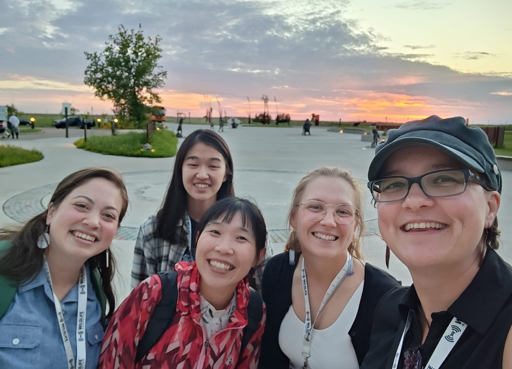

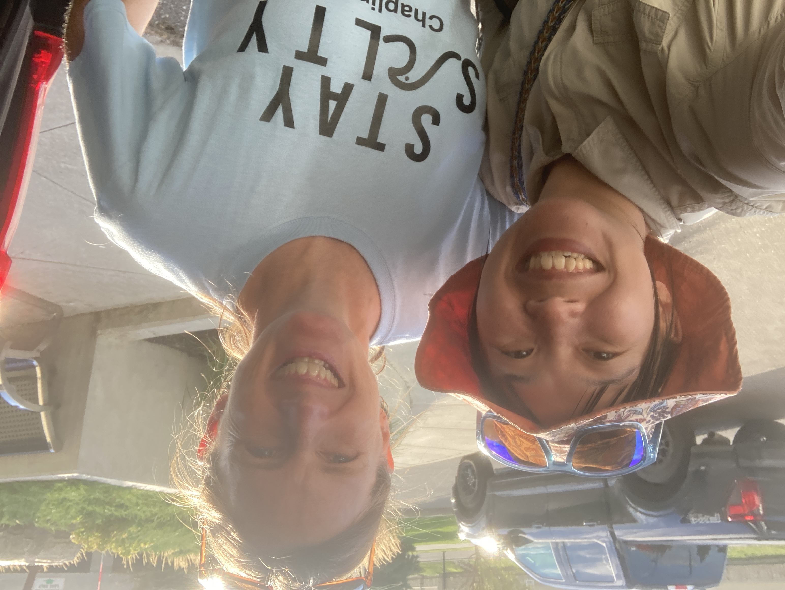

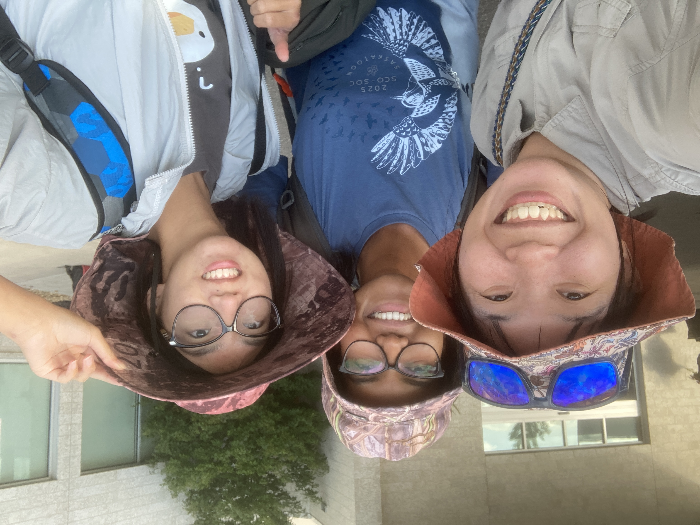

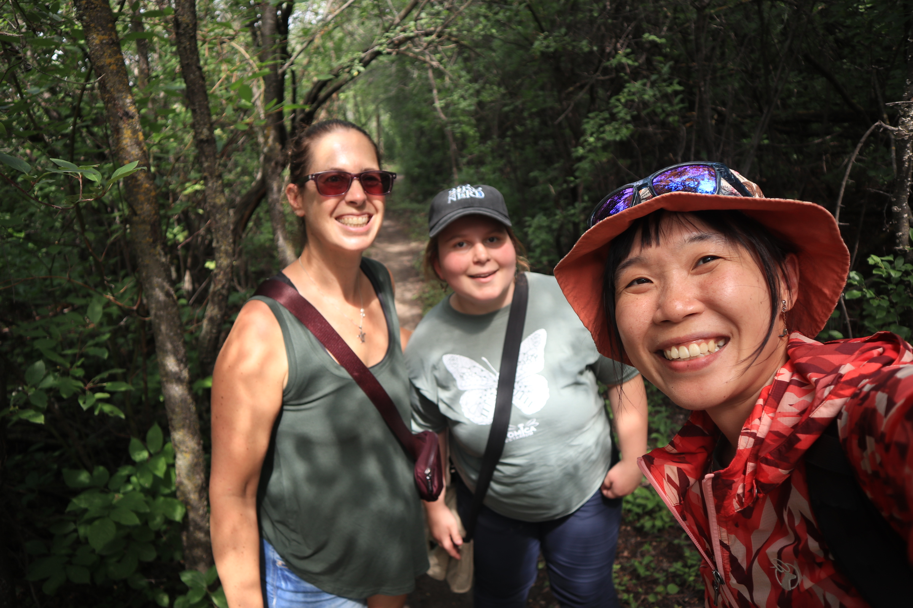

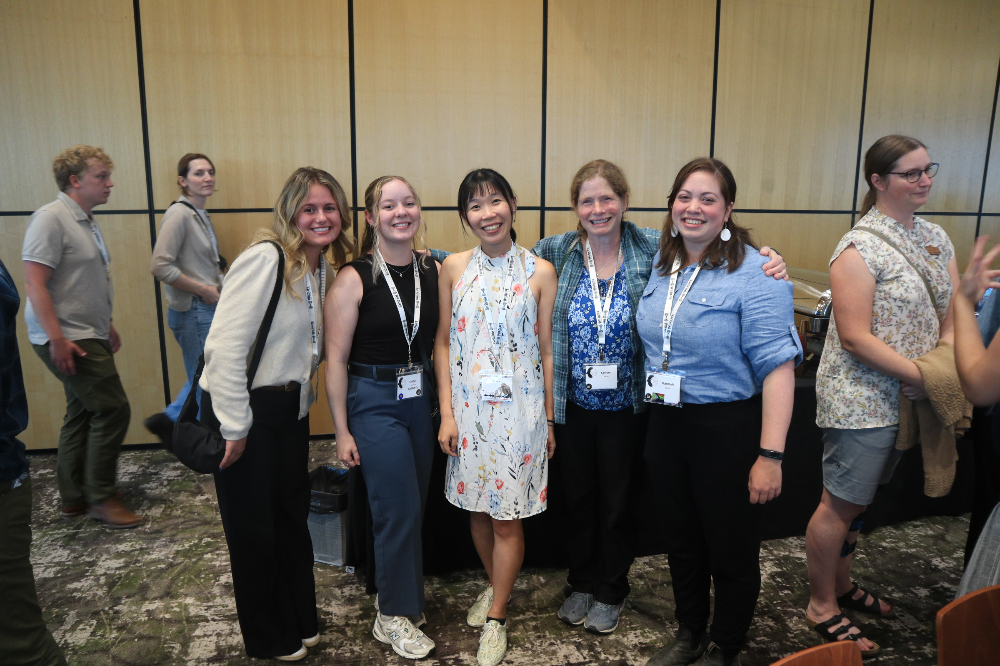

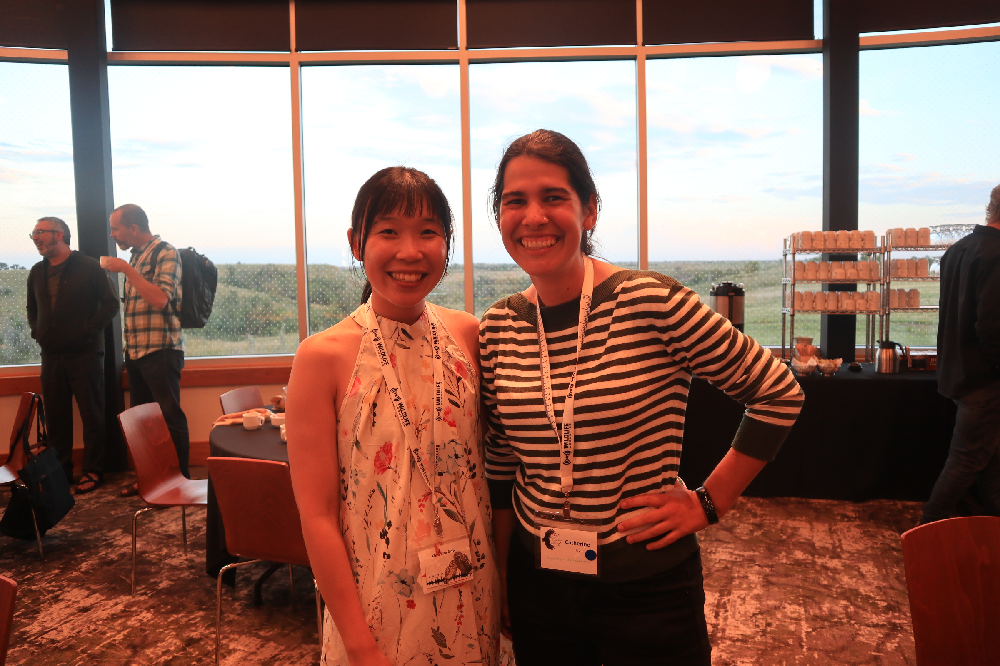

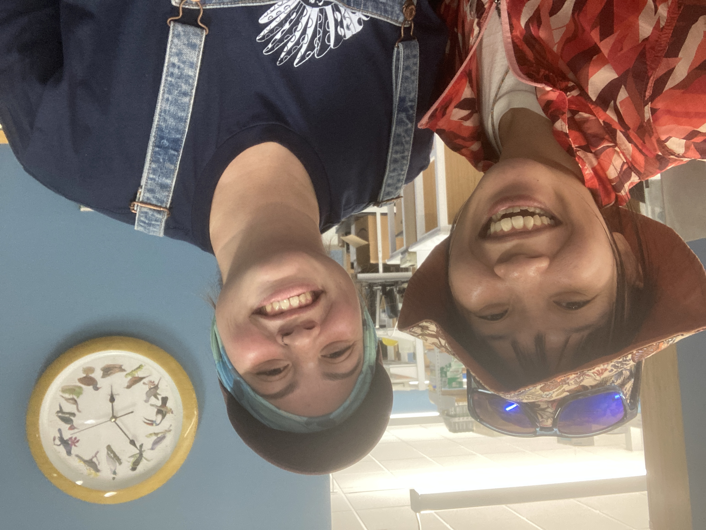

