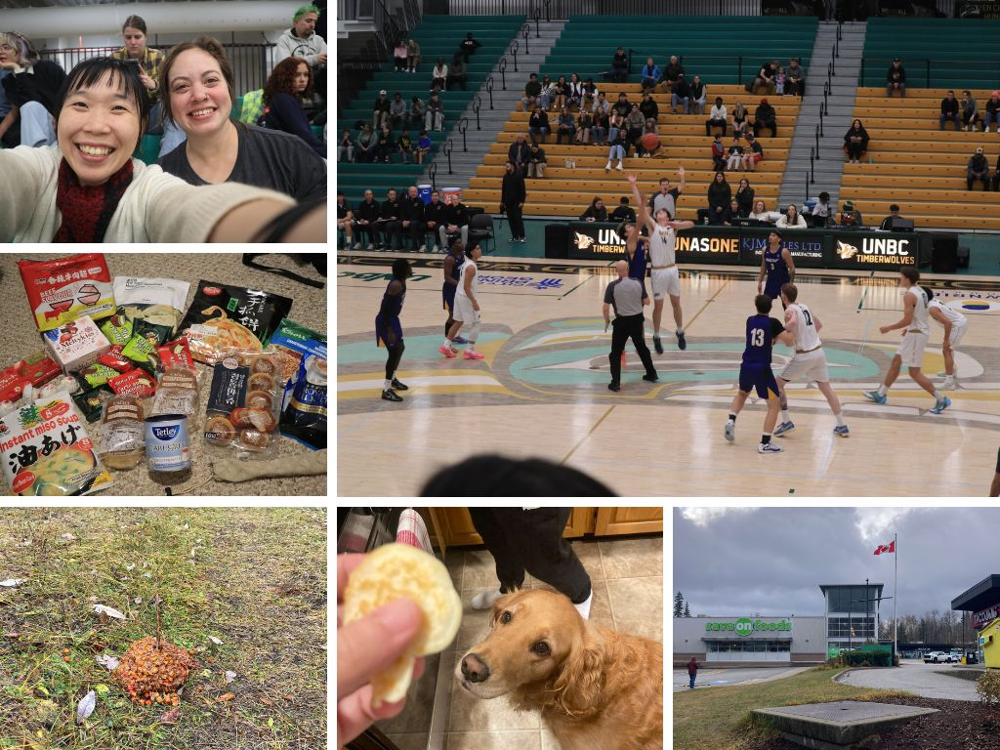
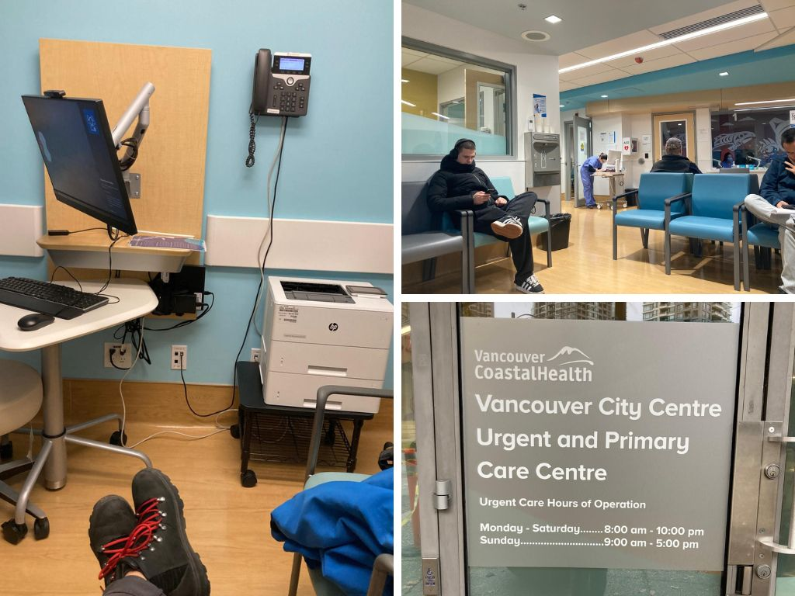
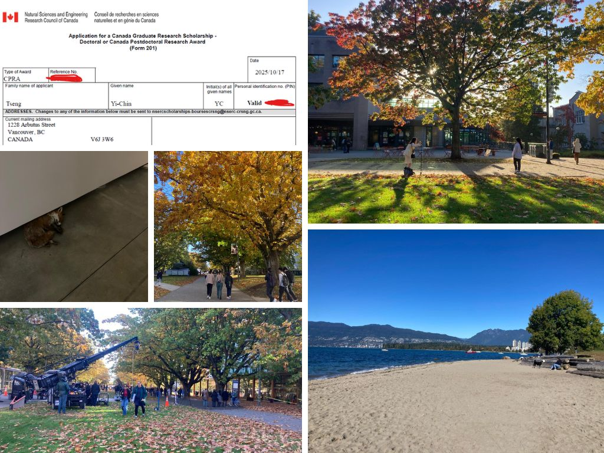
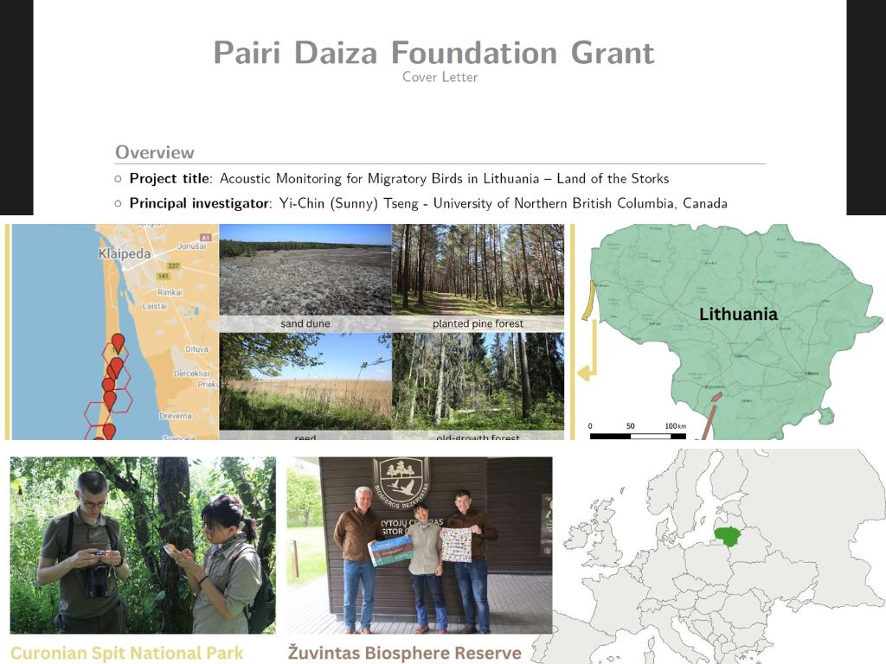
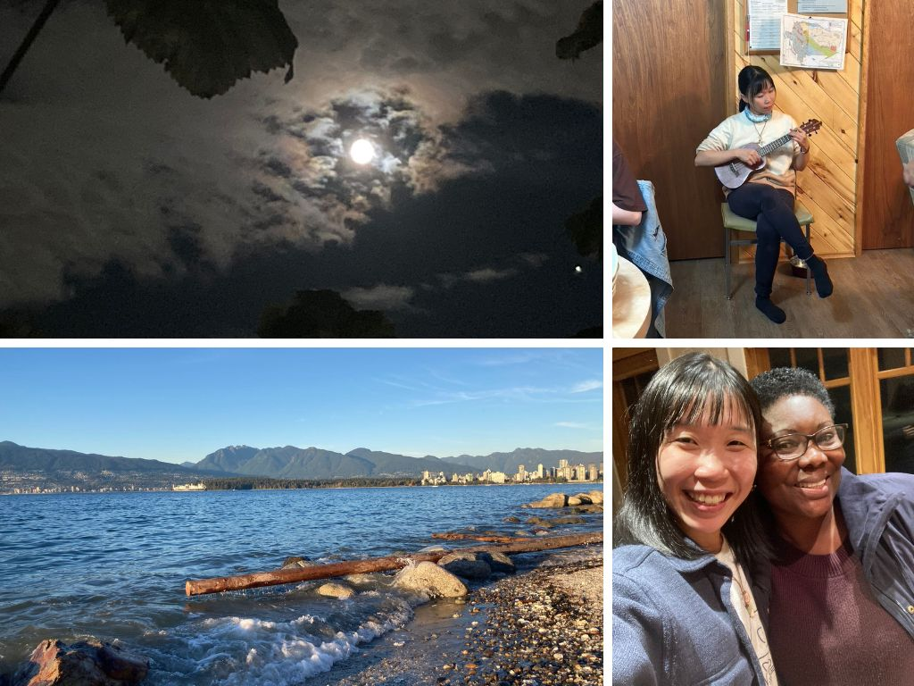
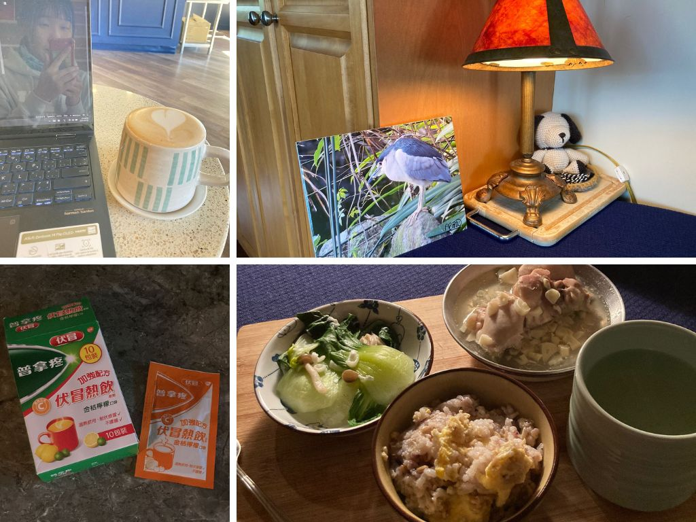
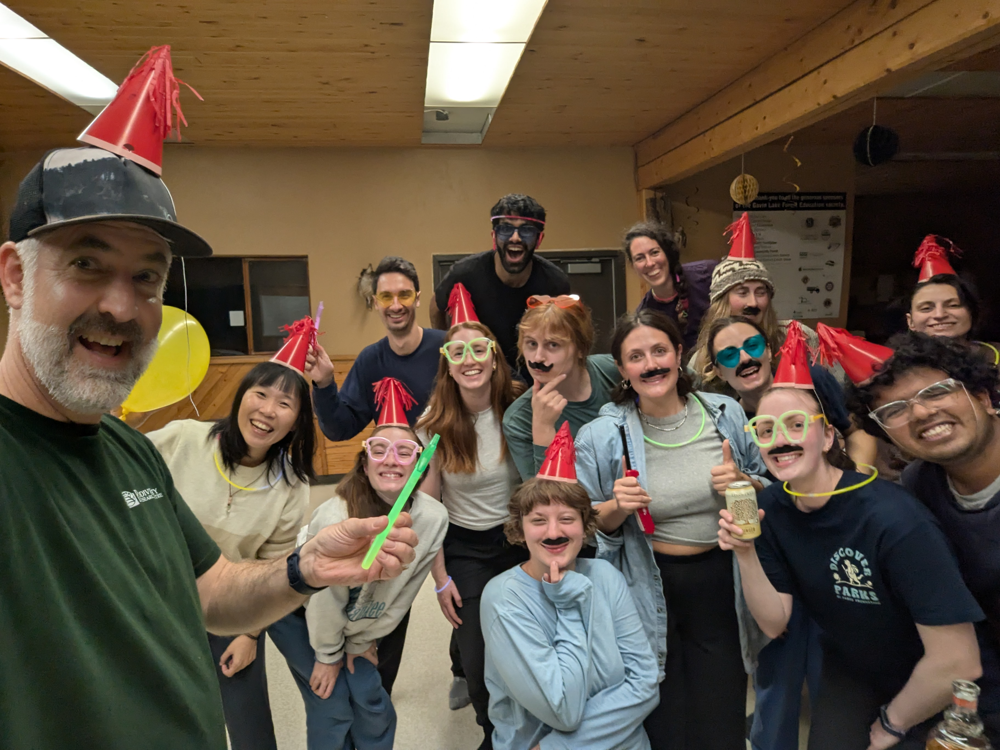
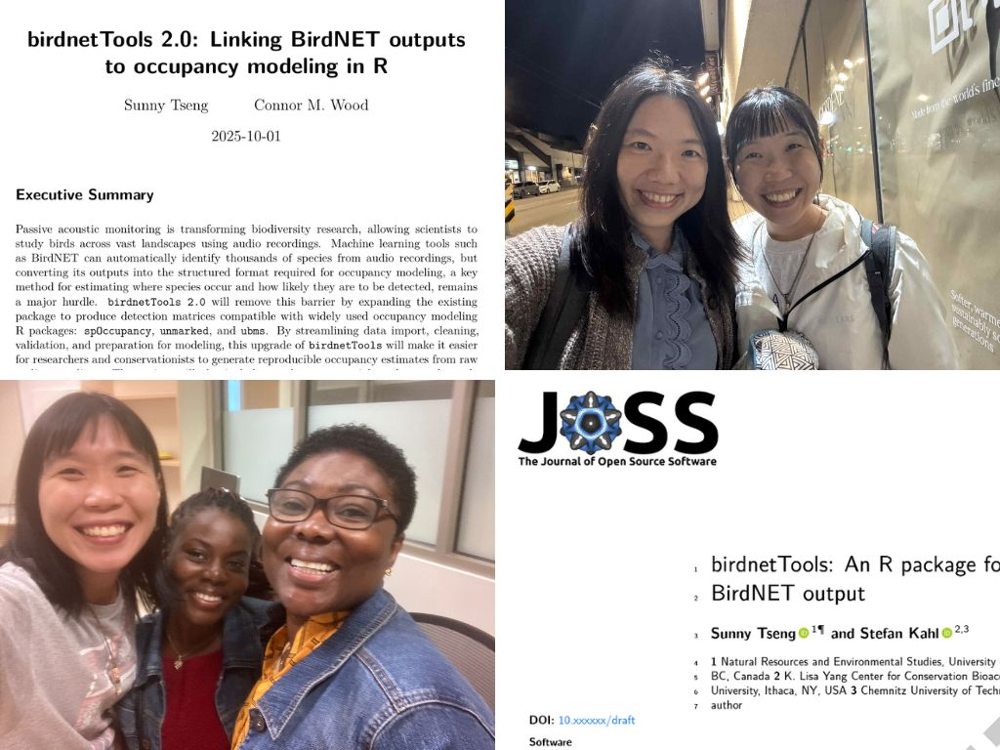

### 北方生活 Day 1 - 酸甜苦辣與甜蜜，共同交織的城鎮 - Oct.26

睽違一年半的再度回到 PG 了，真的好久、好久、久到竟然快忘記 Colin 家到底在哪裡、忘記機場在市中心的西邊、忘記冷到發抖感覺、忘記每個人家都會有狗狗。Colin 把我接回家的路上，暗暗的、冷冷的，在車內就聞的到瀰漫於整個城市的木工廠味道。

周末 Colin 的家人來吃鬆餅早餐，帶了 Maya 一起來，真的是可愛的鬆餅怪物，水汪汪的大眼睛也太迷人了! 中午走路去 Grocery shopping，一路上都在想會不會有熊，果然下午跟 Hannah 在 Forest for the world 散步就看到非常新鮮的熊大便! 趕緊掉頭。後來去看了臨場感超級刺激的籃球賽，UNBC vs UBC，天啊也太好看了吧!! ((尖叫)) 雖然我們兩個都看不懂規則，但我也是超級投入，該歡呼的該起立的都沒有少、投入到 Hannah 都要叫我冷靜點(笑)。

很幸福的第一天，變成觀光景點的 PG 真的很好玩，完全不一樣了，有好多想要嘗試的事情、Sports center、新開的泳池、JPRF、UNBC 校園，還有想要見所有在這裡的朋友們，回來一周根本就太短了。在車上還在跟 Colin 聊到，現在回到 PG 的心情滿是雀躍，跟當初毅然決然離開的我、毫不留情的回頭就搬到溫哥華的我...回想當初在這裡待的一年的時光，都還是會覺得可怕，我還記得我當初有多厭惡這個城鎮、多辛苦地在冰冷孤單的生活中找到火光。但現在回想起來，真的很幸運在人生中有過那一年，讓我去體驗到身心困苦最的生活，究竟可以長甚麼樣子。更重要的是，知道自己可以在這樣的生活中找到溫暖與希望。許多技能 (饅頭、編織、植物、寒冬) 還有體驗 (心理諮商)，都是從這裡開始的。

印象很深的一次，在冬天的某個早上，要出去室外的時候，我看著雪深及膝的冰雪，把玻璃門都擋到打不開了，我想，如果我能在這種地方身心安適的生活著，那我一定也能適應所有生命將迎來的變動。

### 腰又酸又麻直接去看醫生 - Oct.20

週日有一整天的行程，去上完 Hip-hop grooving 之後，簡單和 Gintas 聊聊天、再去 YMCA 找 Ashley 打壁球再來一起看最後一集的中文怪物! (好好看)

在 YMCA 的時候就一直跟 Ashley 抱怨左邊的腰好痠，可能是生理期要來了，沒想到打完球、看完電視晚上要回家的時候，竟然腰痠到連走路都困難，就像是有人在左腰放了葡萄柚一樣這麼痠，坐立難安，直想趕快回家好好的拉筋，真的是酸痛到太恐怖了。發現有兩個動作可以好好地拉到那個部位，一個是直立在沙發旁，雙腳打直，以手撐沙發，讓身體呈九十度，右膝蓋微彎，就可以拉到左後臀的肌肉；另一個動作是躺著，雙膝微屈靠近身體，左小腿交錯於右大腿上，再用雙手將右腿拉進身體。這兩個都效用極好!

但當天晚上還是痛到睡不著，Gintas 跟我都超擔心的，還在想是不是椎間盤突出，因為拉筋到最後還有麻，只有神經受到壓迫才會有麻的症狀出現。

隔天一早直奔 Walk-in Clinic! 其實是滿心期待哈哈哈，一直好想要持續解鎖加拿大的醫療系統，超級有效率耶!我八點到十點就看完醫生結束。從領號碼牌倒掛號、到護士測量基本資訊、醫生問診，都很順暢!有幾個跟台灣的看醫生程序很不一樣的事，護士會在掛號之後一一叫號幫妳做初步的問診跟血壓、血氧測量，如果需要的話她也可以請病人去驗尿抽血，護士在這個時候先給了我止痛藥；醫生問診的時候，不是妳進去診間，而是他們會先把妳放在一間空房間，等醫生有空了會來一間一間看!超酷的! (不過我坐在那裏好久都開始拿筆電工作了)。

最後醫生說多練核心，應該只是簡單的拉到，肌肉腫脹造成的神經壓迫，等腫脹消了之後就會緩解。如果是椎間盤突出那個神經壓迫會到整隻腳。歡呼!!是個非常順利美好的就醫體驗!

### 交完 NSERC 終於可以好好睡覺惹 - Oct.17

真的是! 交完 NSSERC 之後的人生一大清爽! 其實也不是這個申請多難、要花多長的時間，我覺得好像是自己其實沒有這麼喜歡自己寫的東西一直被改，而且最重要的是，在最後關頭還並不是寫自己一開始設想的立陶宛計畫，所以還在來不及思考、沒有時間思考的狀況下，就已經必須要說服自己去完成目前已經可以談到的條件 (雖然是如願所嘗的滿足了我對鳥類聲學、還有地點的需求)。大概就是這樣吧，跟寫立陶宛計畫的申請熱情度很不一樣，這次申請的科學性高上很多，也用到了許多我科學上的訓練，其實我是很喜歡這部分的。

不過看看這個秋天的天氣!!如此美好的天氣啊我竟然在美好的九月都在趕稿 XD 而且花了好多時間在生病感冒跟在家工作，偶爾出門的路上還是會看到美美美的美景。然後想起單調的心情也許只是因為陰雨綿綿的偶發事件，想起其實有很多新鮮好玩的事情可以嘗試、想起世界很大、想起生活有這麼多精彩奔放的可能性!

### 立陶宛計畫 2026 funding 水獺先生太感人、交件被邀稿 - Oct.15

Google calendar 上一條一條紅紅的 deadline 慢慢被消滅了，今天這條特別令人感到興奮與開心! 是要申請明年再回去立陶宛的計畫!

這樣一想，想回去立陶宛有好多機會可以申請，這次的研究經費、機器的經費、還有到時候的語言學校的經費，真的是各種機會耶! 這次的申請有個小突槌，太晚才跟水獺先生要推薦信了，獲得我整個 PhD 生涯中第一句 "This is really unprofessional."，雖然我已經盡全力挽救像是請 ChatGPT 幫忙打草稿之類的，後來 Ken 還是非常圓潤的神救援!!我看到推薦信的時候整個快哭了，真的很想要給 Ken 一個大擁抱，真的總是幫忙來得及時。

另一個有趣的是交稿的時候，收件的 Eli 說看了我的網站好想要邀我幫忙做 visual design。我說，可以邀我來做研究嗎 XD 我一直被 Gintas 笑，每次我去發表研究，結果大家都反倒來邀我做 art design，太好笑。

### 最近好多節日 - Oct.11

上週一是中秋、昨天是雙十節、這周一是加拿大的感恩節。但這周過得非常的安靜，主要是流感的恢復期一直延續到了現在，頭痛頭暈，大部分都是在家工作；還有雨季也開始了，天黑得很快，心情也變得比較單調一些。

代辦事項還是一樣滿滿的，主要是 NSERC 和 Killam 的申請到了最後的衝刺階段，花了很多時間讀了新的研究主題，也終於寫出了一個合乎 Barbara 還有 Matt 期待的主題 (之前建議的 Canada-wide inventory 默默藏在心裡)。除了這個之外，還是開心地寫了漂亮的 proposal 給立陶宛的錄音計畫。做研究真的很像創作者，要寫企劃找經費，我覺得我很享受寫 proposal 的過程，特別是寫那種很漂亮又自由的 proposal，很喜歡 Lithuania proposal 也是這樣的吧，可以很獨立、沒有人會來跟我說哪裡要改。論文方面沒甚麼進度哈哈哈。

Stella 在週四跟女兒一起來了，她說我煮飯有進步。Larissa 寄給我這張照片，她說我在照片裡好寧靜，就在大家都在喧鬧的場合裡，只有我一個人在靜靜地享受自己的琴聲。Eric 的五週舞蹈工作坊在周五結束了，好慶幸當初有去跳舞。

### 十月五號，天氣晴朗的，終於開始下筆寫字 - Oct.5

想寫下這系列的筆記已經好一陣子了，從九月開學到現在都一直呈現混亂且忙碌的狀態。八月底的時候去了台灣節，還記得在當時跟 Ashley 和 Jasmine 說博士班有多幸福，很可以維持 work life balance 又可以完成小夢想。說完這段話的兩周後(九月中旬)，忙碌混亂的程度到達顛峰，開始出現了情緒的震盪，覺得壓力好大，TA、postdoc、PhD thesis progress、birdnetTools & Lithuania project。有被情緒動盪的程度驚艷到，也覺得真的應該要好好的書寫。

昨天在書中讀到的，原來這樣的現象叫做"快樂過勞"，就是對每件事情都充滿熱情與興趣，很難捨棄其中的項目，但很明顯的這些項目已經超過了一個人、一段時間內所可以負荷的工作量。

先從最近的開始寫起好了，週五起床的時候發現感冒了，應該是從 retreat 帶回來的流感，很不舒服，頭昏昏喉嚨痛還有流鼻水。已經是照三餐喝了伏冒熱飲減緩症狀，昨天跟媽媽聊天，才想到阿，應該要趁著這個機會好好地適應一下加拿大的醫療系統，不然我在這裡第八年了，還是好依賴台灣。

感冒的時候特別虛弱想家，自己煮了蛋稀飯，但是好難吃嗚嗚(笑)，用了五榖米，加特別多的水進電鍋煮，電鍋要跳起來的時候倒了兩顆蛋的蛋液，電鍋上面同時蒸了蒜頭雞。結果只有蒜頭雞可以下嚥，那個飯比較像是煮失敗、太潮濕的飯，根本不像稀飯阿(哭)。想念媽媽都會用便當盒煮稀飯給我吃，暖暖的，只有白飯、蛋、還有鹽，就可以馬上安撫脆弱的需要陪伴的心。

說道安撫，就要說對 Gintas 的生氣。Gintas 知道我感冒後說要帶食物跟我喜歡的零食來給我，結果竟然做了焗烤茄子還加辣。我說阿一般生並不都是要吃清淡的食物嗎? 結果他當天說太累了沒來，當天熬夜、隔天還一路睡到中午，帶來的零食也是千篇一律的 Choco Pie。真的好生氣，我一直氣到現在都不想跟他說話。在感冒這麼不舒服的狀況下，我第一個想到的是不想傳染給他；而他呢，想到的就是維持他原本的生活習慣 (還反問我，為什麼他不能睡到中午)，覺得多買個糖果餅乾來就很了不起了嗎? 而且還是老樣子，連照顧人都是以他自己的角度出發，有想過我是喜歡被怎麼樣照顧的嗎? 明明知道我的文化背景卻還是用"他以為我喜歡的食物"來照顧，這不是很不體貼嗎?

今天天氣好好，試了一家新的茶/咖啡廳叫做 Ele Cafe。

### 往回寫的，WildCo retreat - Sep.30

怎麼說呢，讓人又愛又害怕的經驗，如果不是 WildCo 的大家，我可能無法如此順利的享受我的 PhD 生活吧，能與這群人接觸真的很幸運與幸福，讓我能夠在沉浸於工作中依然保持著人群的連結。另一方面，我也再次的、毫無疑問的感受到了在歡樂人群中的孤獨感，很輕細很微妙，但我感受的到。

還是滿滿的感激，能在忙碌快速壅擠的生活中，特別是學術圈這樣快速前進的世界裡，在逃離 PG 回到 Vancouver 之後，能有一群願意互相聆聽的夥伴們。身為 Visiting student，我也不知道這樣的地位到底在別人心中是怎麼樣的，Maddy 一開始笑說我是 Adopted student，我也是笑笑地覺得有道理。直到最近 visiting student 的 status expired，連鑰匙、門禁卡等等都要重新申請，才感覺到沒有一個身分地位真的會讓人好不舒服。我算是 lab 的成員之一嗎? 

### 往回寫的，和 Cornell 越來越近的合作 - Sep.25

要說九月完成的、工作上的大事，就是和 Stefan 一起寫的 JOSS 文章還有和 Connor 合寫的 ISC grant proposal 了! 雖然說是一起寫，但是兩個大部分都是我在主導拉 (笑)。和曉萌聊到這個，她說學術界其實蠻常見的，久了就會習慣。

與 Stefan 的 Journal of Open Source Software 算是幫夏天的工作給了一個完善的結尾；而與 Connor 一起的 proposal 則是幫忙接續這個令人興奮的工作。當然過程中還有 Jasmine 與 Stella，多年好友的重逢，好貼心好令人溫暖。

