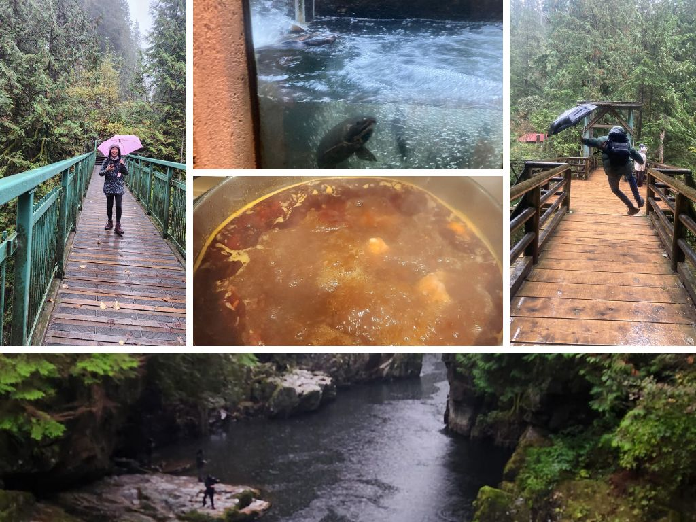

### # 第 102 周 - Capilano river 鮭魚洄游週 - 2025 Oct.19

蝦! 竟然不知不覺就錯過了第一百週惹! 不過從第 102 週在開始接上也是很可愛的! 精確來說，從第一次見面以來，是 101 週又 5 天 (712 天)，時間過得好快阿。

一起從歐洲回來之後又經歷了好多事情，Gintas 真的是萬般的照顧跟體貼。像是剛回來的時候需要去他們家住、Saskatoon 的開會、後來的台灣週、開學之後的崩潰、壓力很大的時候貼心的食物們、還有感冒時後終於了解的粥的重要性。

這週他主動提議要一起去 hiking，剛剛好就選在雨很大的週末!真的好幸運的，我們還是照樣去了，一路上聊著火鍋、被窩、電影等等的，身體都被淋濕了但心暖暖的! 最大的驚喜是竟然看到鮭魚洄游了! 在 Capilano river 大壩旁邊有個小小的魚梯，看到成群的鮭魚就這樣扭動身體、跳躍過大約 30 公分高的魚梯! 很驚人啊! 那個一定要回到自己的出生地產卵的衝動，還有扭動的魚兒跳超級高的!

最後 Gintas 回家煮了一整鍋的 Korean spicy soup、我則是去幫忙 Stealla & Derek 消化他們感恩 party 剩下的火雞湯，也太好惹吧!!

