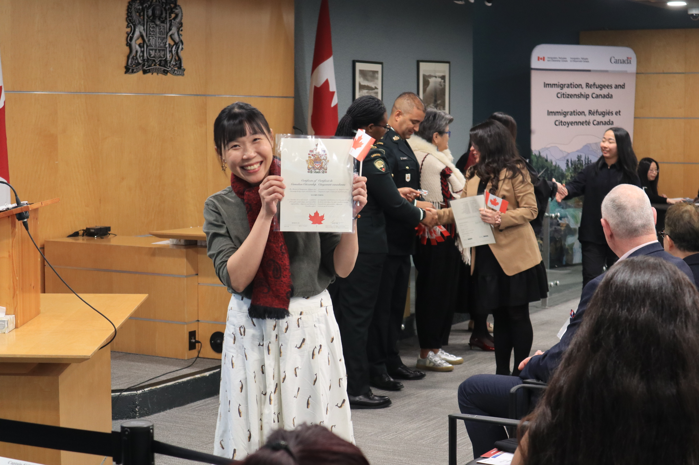
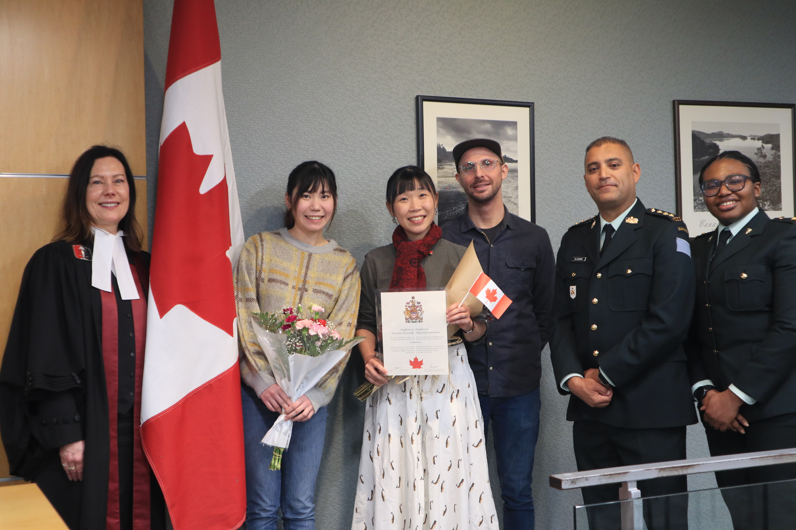
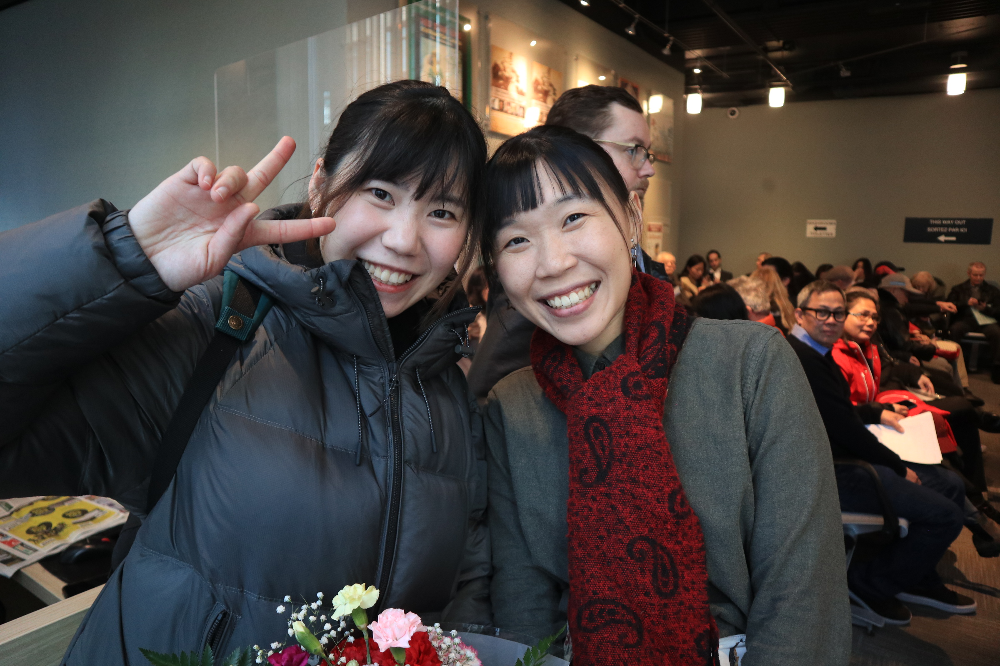
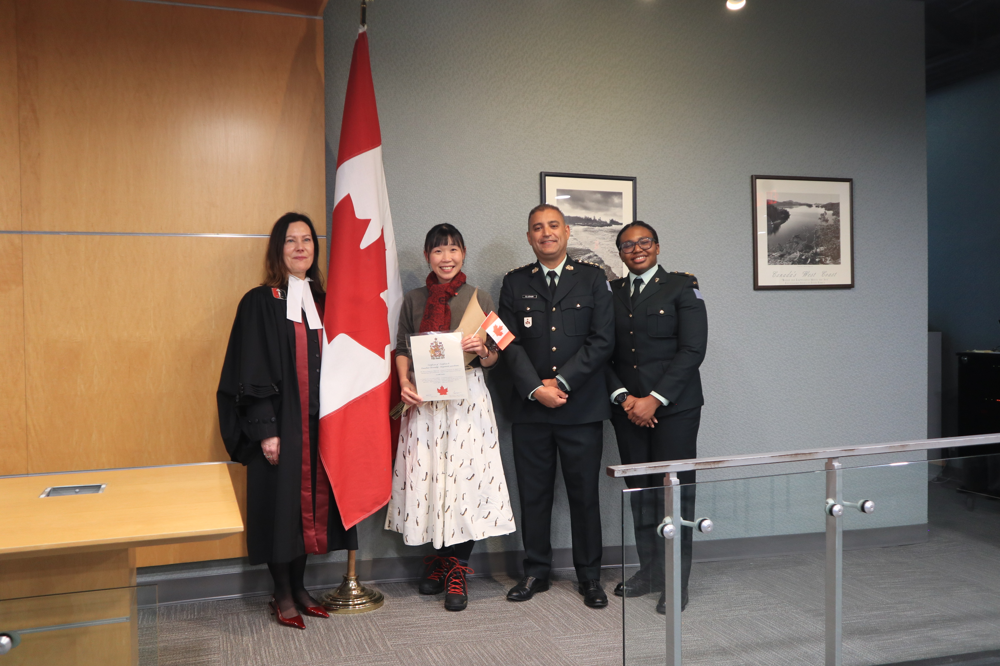

### 故事的開始

"Now, you are officially a proud Canadian." 台上的法官，揮舞著手中小小的加拿大國旗，對著台下 68 位剛宣誓完的、新鮮出爐的 Canadian citizen 微笑祝福。舉著右手，我剛鄭重的復頌完對於國家的宣誓詞。

"Welcome Home"，是有沒有這麼催淚。

在典禮當天特地戴上了婆婆留下來的圍巾(在婆婆的告別式那天收拾衣物留下來的)，想要提醒自己，獲得新的身分，代表的不是脫離過去的故事，而是我的那些寶貴的經驗、文化、還有回憶，被一個新的地方接受了:而我也在這個我所喜愛的地方，持續地創造新的故事、回憶、與新的價值。

公民典禮前一天邊燙衣服邊無限巡迴撥放加拿大國歌(狗狗 Kibo 表示...是要唱多少遍)。對國家還有國王的宣誓詞也是對著 Kibo 練習了好多次。謝謝有 Royce、Gintas 還有 Peter 一起到會場來，回家後還有 Stella 和 Derek 剛從日本降落回來的祝福。走在路上捧著花束的我、在家切蛋糕的我、還有享受著暖暖冬陽的我，在這天真地感覺到滿滿的、簡單的幸福。

### 申請公民的時辰

（2025）
- 2/7 線上送出申請
- 2/19 收到通知，確認收到公民申請(AOR)
- 2/27 收到通知，申請已登錄於政府系統，並已經開始審核
- 3/18 收到通知，必須在一個月內完成公民考試（最後一項需求）
- 4/12 通過線上測驗，直接去樓上喝咖啡慶祝，這時候可以看到系統的進度還在審核中
- 11/7 收到通知，所有審核已通過，分發到 virtual ceremony，當天立即回信要求轉換為實體 ceremony，當天收到回信，確認更改典禮形式，日期會再通知
- 11/25 收到申請護照通知（pilot program），當下還以為是詐騙，後來才知道是加速護照申請的管道，可以在正式成為公民之前就申請好護照，成為公民之後馬上就可以審核
- 12/5 完成護照申請

（2026）
- 1/5 收到公民典禮時間
- 1/23 加拿大公民典禮

### 典禮當天的各種美麗照片

.jpeg>) 

 

