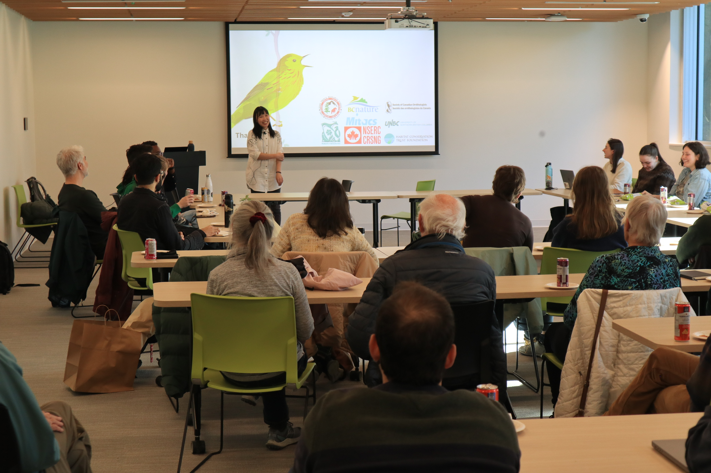
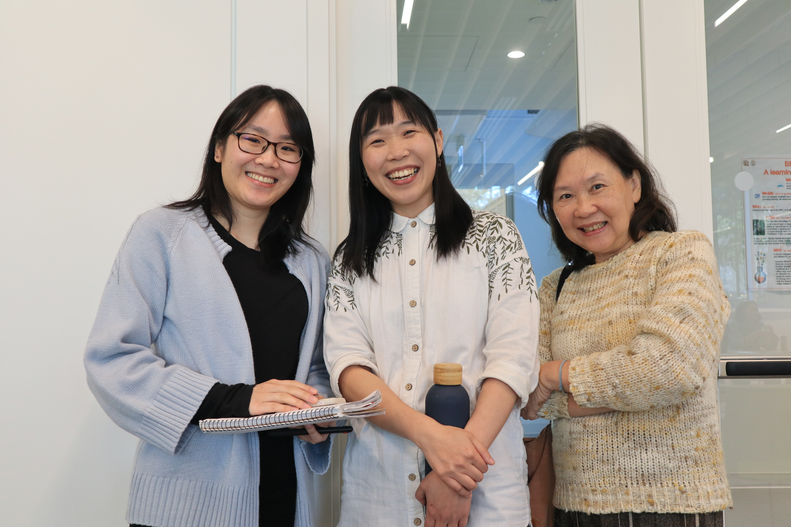
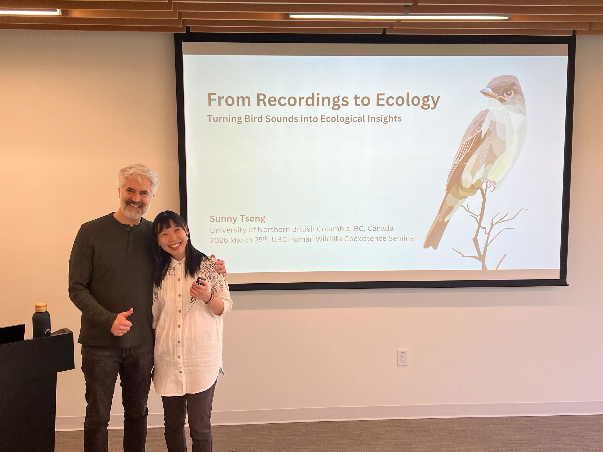
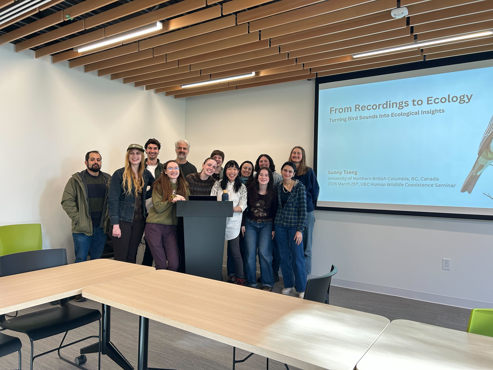
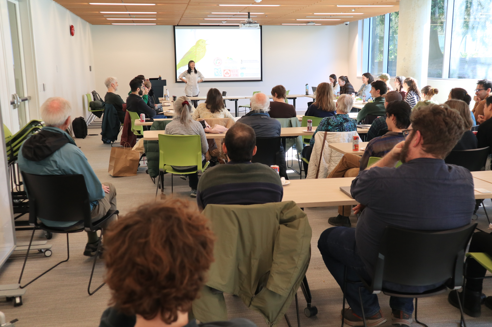

## The UBC defence (i.e., defence practice)

At the moment I put down these notes, it is 4 days after the defense practice in UBC, and 3 days before the “official” defense on April 1st. The sun is shining into my room, while I am packing all the thick clothes ready to fly to cold Prince George tomorrow early morning.

It was a phenomenal event last Wednesday (Mar. 25), the day I will always remember with a full room of people. It warms my heart, not only for the opportunity to reflect on the research work I have done in the past few years, but also the fact that I could share such a journey with everyone in the room: WildCo people, Gaynor’s lab, Ildiko, Chris, Liam, Maya, Peter, Stella, Derek, Mandy, Bev, Mom and Gintas, and cute Kibo (!), and more people than I can individually list.

I can still remember the smiles, the nodding, the faces, and the eyes that I saw while presenting on the stage. For the past few years, I have interacted with all of you, in ways big or small, and how fortunate I am to have this opportunity to stand here sharing some of the things I learned. And I have grown so much as well! I remember that, about 10 years ago, I was a person who would cry from speaking English in front of people… now I am actually enjoying standing on the stage!

“Raising a child takes a village, and I think finishing a PhD takes at least half of the village.” It’s not easy to go through the past few years—graduate school has (a lot of) fun parts and also hard times, probably just like all other journeys. There were also moments when I thought I would not finish this PhD (maybe I should wait until after the official defence to say this). Aside from science itself, being able to know and work with so many cool and fun people is one of my favorite things about staying in academia.

The past month preparing for this defense gave me so much time for reflection and appreciation. It was a truly emotional period of time—a mixture of excitement for finishing a big task, the sadness of closing a chapter of life, the joy of seeing all the work coming together, and the imposter syndrome of not achieving more. These emotions could sometimes be overwhelming, but the more I thought about it, the more I see how nice it is to have such a time to “focus” only on one thing—preparing the final celebration of your degree.

Full of gratitude, I look forward to making the April Fool’s Day defence a great event with everyone and enjoying every moment when it comes.

I was thinking really hard about the questions raised from the audience! Such a great discussion! 

## The actual defence itself 真正的口試

寫下這些文字的我正在飛回台灣的高空上，太平洋群島中俄羅斯的南端，昏昏沉沉的，剛把自己從睡醒的混沌狀態整理成可以見人的模式。雖然是這樣的昏沉、還是在飛機上，但竟然是這個月以來，第一次有自己的時間好好的靜下心來寫寫東西。

媽媽來加拿大四周。第一周我忙著準備給 ECCC 和 WildCo lab 的練習；第二周我們給了 UBC seminar；第三周，我們飛到 Prince George 給了真的口試；最後一周忙著各種 gathering, party, coffee chat，接連去了辦公室四天，跟 Cole 說再見，還把辦公室清乾淨了。

回到口試那週。到 PG 口試真的壓力很大，口試本身就夠讓人操煩了，還要想著 travel 的安排，買兩個人的機票、準備住宿交聽、頭兩天的食物 (沒有車的狀況下在 PG 很難行動)、天氣 (擔心媽媽的衣物或鞋子不夠)，等等的各種狀況。但這都是我自己選的，我想要親自的去體驗這樣重要的場合，反正一生就這樣一次。

媽媽也是備戰狀態，先煮好了三大盆食物(咖哩的炒青菜、飯、炒飯)，分別裝成三大盒冰到冷凍庫，我們一起合用了一個大行李箱，竟然也被我們裝到 21 公斤，雪靴、冰爪、食物(將近十包的泡麵、零食、媽媽的手藝)。在我看來是很緊張的旅程，媽媽說，就把它當作去露營吧! 有甚麼狀況我們會想到方法的。

口試前一天跟 Gintas 約了線上測試當天的電腦系統，空蕩蕩的房間，我覺得自己好像要辦演唱會的歌手，到場彩排、調整作息、調整飲食、期望在演出當天有最佳的狀態，還有設備也都完美呈現，不只自己要享受，也想要讓觀眾都好好的享受。(Gintas 說，如果真的是歌手，那妳這些設備完全不用擔心地啦! 他們會有很多人原來協助妳)。所以沒有歌手等級的待遇，但我希望有演唱會等級的感動。

用一個字說明那幾天的身心狀態，大概就是 emotional。無時無刻都可以掉淚的狀態，覺得能走到這一步真的有太多人太多故事了，很感謝所有的傷心的、澎湃的、溫暖的、還有衝擊的際遇，也謝謝自己還是堅持的走到最後，才可以好好享受最後這場盛宴。很累壓力很大，但我還是站在這裡了。

口試當天最開心的收穫是 Zoe 和 Justin，超享受 Zoe 的果斷、跟 Justin 的智慧。討論起來真的是太過癮了! Joe, Dexter, Ken 則是排排站坐在左邊。還有現場將近 20 個觀眾 (大部分都是 JPRF 的)。還有 Roger 跟 Colin! 

其實還是有些扼腕的地方，第一個是鏡頭的調整，在線上跟在現場的 examiner 講話時，我如果可以有多的腦細胞去調整分享螢幕、還有鏡頭 zoom 的話就好了。另一個是照片，給了媽媽相機，但一直沒有拍到好的角度 QAQ 我就說了要坐上面了，媽媽還是選了一個側邊的位置，所以當天其實沒有太多好的照片。

結束後的感覺是好累、超級累、超級無敵累...。只想要好好的花點時間一個人靜一靜、好好休息讀本好書、一覺到天亮。
