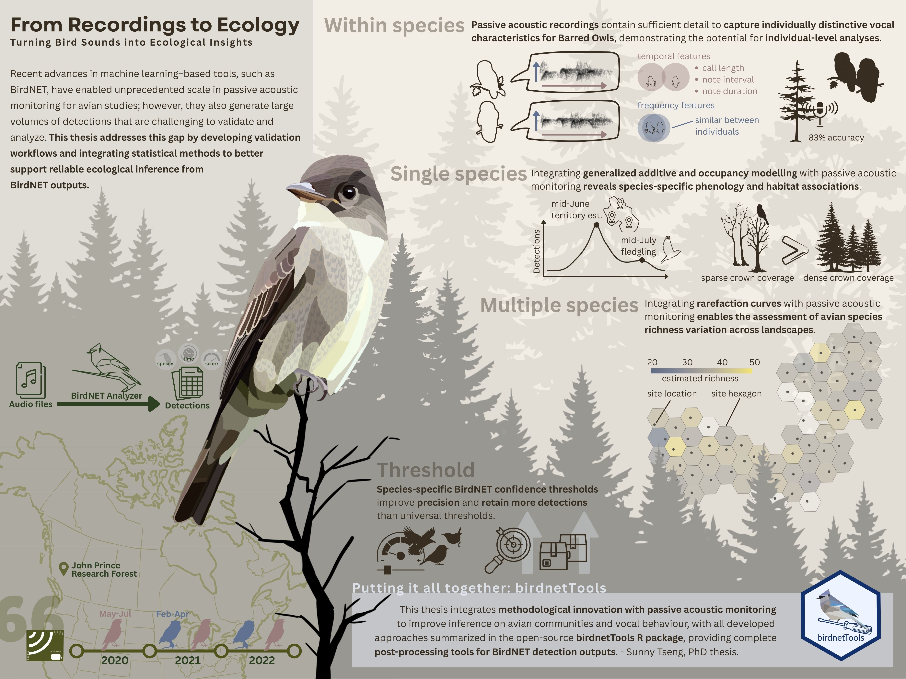

Hello! Thank you so much for your interest in attending my PhD defence — it’s truly an exciting milestone for me. This repository will serve as the main hub for all related information, and I will keep it updated. 

The official defence will take place at University of Northern British Columbia (UNBC) in Prince George (hybrid format). To share this special moment with friends and colleagues in Vancouver, where I spent most of my PhD, there will be an in-person practice session at University of British Columbia (UBC). 

## 🎙️ Defence practice - March 25 (In person)
Although it’s called a defence practice, I am really treating it as the *UBC version* of my defence. I spent most of my PhD in UBC Vancouver, which holds so many meaningful memories for me. I would love to use this opportunity to celebrate this special milestone with everyone here.

- Form: **In person**
- Time: **March 25 (Wed) 3:30 - 5pm (PT)**
- Location: **RM1024 Multipurpose Room, UBC Biodiversity Research Center, Vancouver**

## 🐦 Defence - April 1 (Hybrid)
The official defence will be held at *UNBC* and will follow the formal defence procedures, including my PhD supervisor, committee members, and external examiner. Please come join me on the April fools' day! (I promise this defence announcement is not a prank!) 

- Form: **Hybrid** 
- Time: **April 1 (Wed) 9am - 12pm (PT)** 
- In person location: **RM1079, UNBC Senate Chamber, Prince George**
- Virtual location: **Teams Meeting ([meeting link](https://teams.microsoft.com/l/meetup-join/19%3ameeting_ODEzZDZlN2UtNGM2YS00MzVkLTk2M2MtMDY0YTBkYmM2ZTBl%40thread.v2/0?context=%7b%22Tid%22%3a%22a7ee9abb-4885-492e-b331-a6fa051a39bb%22%2c%22Oid%22%3a%227048092a-e933-4d4e-822d-e8a8637c6c03%22%7d)**)

- Time zone calculation fairy 🧚: 
  - New York: 12pm (noon)
  - Berlin: 6pm
  - Vilnius: 7pm
  - Taiwan: April 2nd, 12am (mid-night)
  - Melbourn: April 2nd, 3am

## Thesis abstract

## Materials 

All the defence materials, including slides and the full thesis, will be shared on this Github repo: https://github.com/SunnyTseng/PhD-defence-preparation

## Look forward to sharing this special event together!

