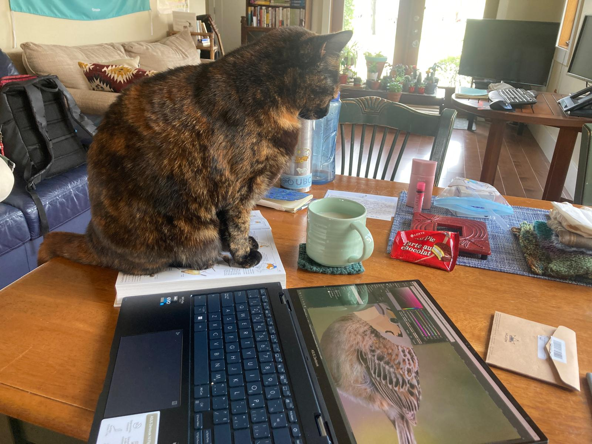

### Be Kind

偶然在讀 palmerpenguin 和 blogdown 幾個成功 R package 的討論，探討為什麼某些工具會這麼的成功，而某些儘管是技術高超的工程師負責，但開發出來的工具卻不太有人用，讀到一句話是這樣的: 

> There are three ways to ultimate success. The first way is to be kind. The second way is to be kind. The third way is to be kind.

大概的譯文是「有三種方法可以引領至最終的成功，就是體貼、體貼、再體貼」。這句話直接打到我的心頭上。仔細想想，就以 R 語言來做例子，我日常生活中最常使用的 package，像 palmerpenguin 以及 bcmap，其實就是資料集 package，開發的技術難度其實不高，但他們卻有幾千幾萬次的下載使用，很大一部份是因為他們有非常良善的動機，並以體貼的方式來設計套件，低門檻、好使用、並讓利用這項工具成為一個成就感很高、且舒適的經驗。

拓展這個概念到人際關係，就學術圈為例，在這個小圈圈裡的聰明人非常的多 (真的非常非常的多)，若要要比成就、比知識、比學習速度，真的會永遠找得到更聰明、頭銜更高、做事更有效率的人，光想到這樣就會令人退卻，覺得自己超渺小。但仔細想想，真的會讓我很想要合作，或是成為好朋友的人，多半不是因為他們的外在成就很厲害，而是因為他們「人很好」，精確來說，就是可以讓我感覺相處起來或是合作起來是舒適的。

反過來想，如果能嘗試讓自己成為相處起來舒適的人呢。Be Kind。

反過來想，如果能讓自己開發的 package 使用起來更舒適呢。Be Kind。

可以應用在 package development 的體貼有兩個面向，第一個是體貼夥伴，在 rOpenSci 裡面大部分都是 volunteer 的成員，像我的 mentor 就是完全志願的付出他的時間來教我，還有幾乎所有在同個 program 的夥伴，都是志願付出他們的時間在互相幫忙增進彼此技能，但志願不等同於免費，建立在強大善意的一個計畫裡，更需要好好的珍惜、尊重與感謝。尊重對方的時間、也感謝彼此的交流與共同成長。

另一個體貼的面向，是體貼使用者。在開發工具的時候把使用的經驗放在第一位，像是:「這樣的視覺化配色是好的嗎、使用者的眼睛會太累嗎、這會需要太多額外的 dependency 嗎、這個資料集放在哪個路徑比較合乎邏輯」。這個概念對我來說蠻有啟發性的，我現在已經開始相信，一個工具可以取得、或使用的容易程度，甚至都比工具的效率還來的更重要。

這是在聽完一場 coding 討論裡，默默的被一位我很尊敬的 programmer 所啟發的想法。簡單的 murmur，後續還想寫一些關於內在成就與外在成就的討論 (微笑)。然後找不到貓貓看 code 的照片，就以貓貓看我畫鳥的照片來代替。

### 外在成就與內在成就

- the original goal of being in the program

### 好好休息

- switch task, exercise well, eat well and sleep well

### 勇敢溝通

- example from the BECO collaboration